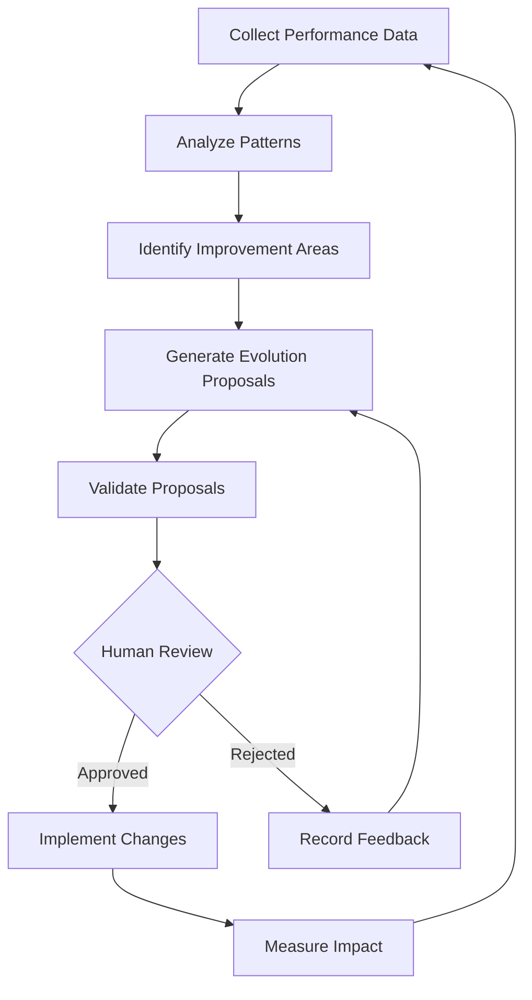

# Evolution Algorithm Overview

## Core Concept

The Evolution Algorithm enables agents to improve over time based on performance metrics, user feedback, and environmental changes. It follows a structured process of:

1. **Observation** - Collecting performance data and feedback
2. **Analysis** - Identifying patterns and improvement opportunities
3. **Generation** - Creating evolution proposals
4. **Validation** - Verifying proposed changes meet requirements
5. **Implementation** - Applying approved changes to the agent

## Algorithm Flow



## Key Components

- **Performance Analyzer**: Evaluates agent effectiveness across metrics
- **Pattern Detector**: Identifies recurring issues and opportunities
- **Proposal Generator**: Creates specific evolution recommendations
- **Validation Engine**: Tests proposals against requirements
- **Human Review Interface**: Enables human oversight of evolution
- **Implementation Engine**: Applies approved changes to agents

## Decision Making Framework

The algorithm uses a multi-factor utility function to prioritize evolution proposals:

```
Utility = (Performance_Impact × 0.4) + 
         (User_Satisfaction × 0.3) + 
         (Implementation_Ease × 0.2) + 
         (Risk_Factor × 0.1)
```

Where each factor is normalized to a 0-1 scale. Proposals with utility > 0.7 are recommended for human review.
