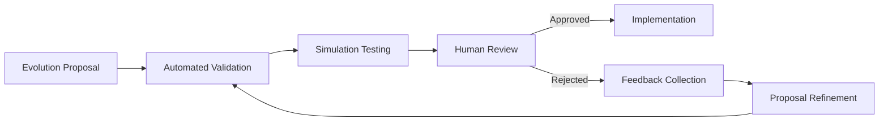

# Evolution Validation and Implementation

## Overview

This document details the process of validating evolution proposals and implementing approved changes. This phase ensures that only high-quality, safe improvements are applied to agents.

## Validation Process



## Automated Validation

Each proposal undergoes automated checks before human review:

```python
async def validate_proposal(proposal):
    """Validate an evolution proposal through automated checks."""
    validation_results = {
        "syntax_check": await validate_syntax(proposal),
        "security_check": await validate_security(proposal),
        "compatibility_check": await validate_compatibility(proposal),
        "performance_estimate": await estimate_performance_impact(proposal),
        "simulation_results": await run_simulation(proposal)
    }
    
    validation_results["passed"] = all([
        validation_results["syntax_check"]["passed"],
        validation_results["security_check"]["passed"],
        validation_results["compatibility_check"]["passed"],
        validation_results["simulation_results"]["success"]
    ])
    
    return validation_results
```

### Validation Checks

```python
async def validate_syntax(proposal):
    """Check proposal syntax against agent schema."""
    errors = []
    
    # Check prompt template syntax
    if "prompt_templates" in proposal["changes"]:
        for template_name, template in proposal["changes"]["prompt_templates"].items():
            template_errors = validate_prompt_template(template)
            if template_errors:
                errors.append({
                    "type": "prompt_template_error",
                    "template": template_name,
                    "errors": template_errors
                })
    
    # Check capability parameter schema
    if "capability_parameters" in proposal["changes"]:
        for capability, schema in proposal["changes"]["capability_parameters"].items():
            schema_errors = validate_parameter_schema(schema)
            if schema_errors:
                errors.append({
                    "type": "parameter_schema_error",
                    "capability": capability,
                    "errors": schema_errors
                })
    
    return {
        "passed": len(errors) == 0,
        "errors": errors
    }
```

## Simulation Testing

Before human review, proposals are tested in a simulated environment:

```python
async def run_simulation(proposal, test_scenarios=None):
    """Run simulation tests for an evolution proposal."""
    agent_id = proposal["agent_id"]
    
    # Create simulation environment
    sim_env = await simulation_service.create_environment(agent_id)
    
    # Apply proposed changes to simulation agent
    sim_agent_id = await simulation_service.create_agent_variant(
        agent_id=agent_id,
        changes=proposal["changes"]
    )
    
    # Get test scenarios (default or provided)
    scenarios = test_scenarios or await generate_test_scenarios(agent_id, proposal)
    
    # Run test scenarios
    results = []
    for scenario in scenarios:
        scenario_result = await simulation_service.run_scenario(
            sim_agent_id=sim_agent_id,
            scenario=scenario
        )
        results.append(scenario_result)
    
    # Analyze results
    baseline_results = await get_baseline_results(agent_id, scenarios)
    comparison = compare_simulation_results(results, baseline_results)
    
    return {
        "success": comparison["overall_improvement"] > 0,
        "improvement_score": comparison["overall_improvement"],
        "metrics": comparison["metrics"],
        "scenario_results": results,
        "baseline_results": baseline_results
    }
```

## Human Review

Proposals with successful validation are submitted for human review:

```python
async def submit_for_review(proposal, validation_results):
    """Submit proposal for human review."""
    review_request = {
        "proposal_id": proposal["id"],
        "agent_id": proposal["agent_id"],
        "title": proposal["title"],
        "description": proposal["description"],
        "changes_summary": summarize_changes(proposal["changes"]),
        "detailed_changes": format_changes_for_review(proposal["changes"]),
        "validation_results": validation_results,
        "evidence": proposal["evidence"],
        "priority": proposal["priority"],
        "created_at": proposal["created_at"],
        "status": "pending_review"
    }
    
    # Assign to appropriate reviewers
    reviewers = await determine_reviewers(proposal)
    
    # Create review workflow
    workflow_id = await review_service.create_workflow(
        review_type="evolution_proposal",
        content=review_request,
        reviewers=reviewers,
        required_approvals=min(2, len(reviewers))
    )
    
    # Update proposal status
    await update_proposal_status(proposal["id"], "in_review", {"workflow_id": workflow_id})
    
    return workflow_id
```

## Implementation

Once approved, changes are applied to the agent:

```python
async def implement_evolution(proposal_id):
    """Implement an approved evolution proposal."""
    # Get proposal
    proposal = await get_proposal(proposal_id)
    
    # Verify approval status
    review_status = await review_service.get_workflow_status(proposal["workflow_id"])
    if review_status["status"] != "approved":
        raise PermissionError("Cannot implement unapproved proposal")
    
    # Create implementation plan
    implementation_plan = await create_implementation_plan(proposal)
    
    # Execute plan with transaction support
    async with transaction_manager.start_transaction() as transaction:
        try:
            # Apply changes
            for step in implementation_plan:
                await execute_implementation_step(step, transaction)
            
            # Record implementation
            await record_implementation(
                proposal_id=proposal_id,
                implementation_id=generate_id(),
                implemented_by=review_status["approved_by"],
                implemented_at=datetime.now().isoformat(),
                status="success"
            )
            
            # Notify stakeholders
            await notification_service.notify_implementation(
                proposal_id=proposal_id,
                agent_id=proposal["agent_id"],
                status="success"
            )
            
        except Exception as e:
            # Rollback handled by transaction context manager
            await record_implementation_failure(
                proposal_id=proposal_id,
                error=str(e),
                status="failed"
            )
            
            # Notify stakeholders of failure
            await notification_service.notify_implementation(
                proposal_id=proposal_id,
                agent_id=proposal["agent_id"],
                status="failed",
                error=str(e)
            )
            raise
    
    # Update agent version
    await agent_service.increment_version(
        agent_id=proposal["agent_id"],
        change_type="evolution",
        change_description=proposal["title"],
        proposal_id=proposal_id
    )
    
    return {
        "status": "success",
        "agent_id": proposal["agent_id"],
        "proposal_id": proposal_id,
        "implemented_at": datetime.now().isoformat()
    }
```

## Implementation Steps

Different types of changes require specific implementation logic:

```python
async def execute_implementation_step(step, transaction):
    """Execute a single implementation step."""
    step_type = step["type"]
    
    if step_type == "update_prompt_template":
        await prompt_service.update_template(
            template_id=step["template_id"],
            template_content=step["content"],
            transaction=transaction
        )
    
    elif step_type == "update_capability_parameters":
        await capability_service.update_parameters(
            capability_id=step["capability_id"],
            parameters=step["parameters"],
            transaction=transaction
        )
    
    elif step_type == "add_capability":
        await agent_service.add_capability(
            agent_id=step["agent_id"],
            capability_id=step["capability_id"],
            configuration=step["configuration"],
            transaction=transaction
        )
    
    elif step_type == "update_memory_query":
        await memory_service.update_query_template(
            template_id=step["template_id"],
            query_template=step["query_template"],
            transaction=transaction
        )
    
    elif step_type == "update_workflow":
        await workflow_service.update_workflow(
            workflow_id=step["workflow_id"],
            workflow=step["workflow"],
            transaction=transaction
        )
    
    else:
        raise ValueError(f"Unknown implementation step type: {step_type}")
```

## Post-Implementation Monitoring

After implementation, the system monitors the impact:

```python
async def monitor_evolution_impact(implementation_id, monitoring_period=24*60*60):
    """Monitor the impact of an implemented evolution."""
    implementation = await get_implementation(implementation_id)
    proposal = await get_proposal(implementation["proposal_id"])
    agent_id = proposal["agent_id"]
    
    # Record pre-implementation baseline if not already recorded
    if "pre_metrics" not in implementation:
        pre_metrics = await metrics_service.get_agent_metrics(
            agent_id=agent_id,
            time_period=monitoring_period,
            end_time=implementation["implemented_at"]
        )
        
        await update_implementation(
            implementation_id=implementation_id,
            updates={"pre_metrics": pre_metrics}
        )
    
    # Get post-implementation metrics
    post_metrics = await metrics_service.get_agent_metrics(
        agent_id=agent_id,
        time_period=monitoring_period,
        start_time=implementation["implemented_at"]
    )
    
    # Compare metrics
    comparison = compare_metrics(
        implementation["pre_metrics"],
        post_metrics
    )
    
    # Record results
    await update_implementation(
        implementation_id=implementation_id,
        updates={
            "post_metrics": post_metrics,
            "impact_assessment": {
                "overall_impact": comparison["overall_impact"],
                "metric_changes": comparison["changes"],
                "successful": comparison["overall_impact"] > 0
            }
        }
    )
    
    # If negative impact, alert for possible rollback
    if comparison["overall_impact"] < -0.1:  # Significant negative impact
        await alert_service.create_alert(
            type="evolution_negative_impact",
            severity="high",
            content={
                "implementation_id": implementation_id,
                "proposal_id": implementation["proposal_id"],
                "agent_id": agent_id,
                "impact_score": comparison["overall_impact"],
                "metrics": comparison["changes"]
            }
        )
    
    return {
        "implementation_id": implementation_id,
        "impact": comparison["overall_impact"],
        "metric_changes": comparison["changes"]
    }
```

## Testing Implementation

```python
def test_evolution_implementation():
    """Test the implementation of an evolution proposal."""
    # Arrange
    proposal = create_test_proposal()
    agent_id = proposal["agent_id"]
    
    # Get agent state before
    agent_before = agent_service.get_agent(agent_id)
    
    # Act
    result = implementation_service.implement_evolution(proposal["id"])
    
    # Assert
    assert result["status"] == "success"
    
    # Get agent state after
    agent_after = agent_service.get_agent(agent_id)
    
    # Verify changes were applied
    if "prompt_templates" in proposal["changes"]:
        for template_name, template in proposal["changes"]["prompt_templates"].items():
            assert agent_after["prompt_templates"][template_name] == template
    
    # Verify version increment
    assert agent_after["version"] > agent_before["version"]
    
    # Verify implementation record
    implementation = implementation_service.get_implementation_by_proposal(proposal["id"])
    assert implementation["status"] == "success"
    
    # Cleanup
    agent_service.revert_to_version(agent_id, agent_before["version"])
```
