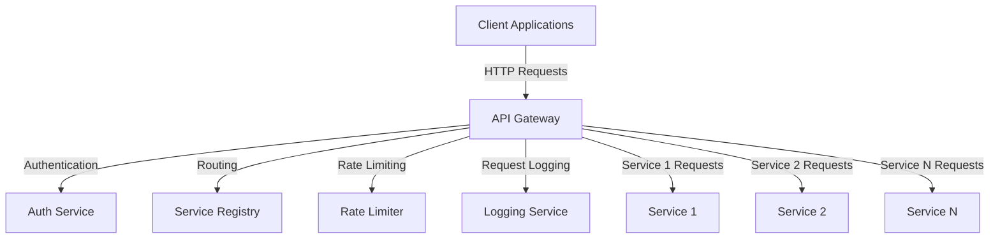

# API Gateway and Request Handling

## Overview

This document details the API Gateway pattern implemented in the Agent Orchestration Platform, providing a unified entry point for all client requests while managing cross-cutting concerns such as authentication, rate limiting, and request routing.

## API Gateway Architecture



## Core Concepts

The API Gateway provides:

1. **Unified entry point** for all client requests
2. **Request routing** to appropriate backend services
3. **Cross-cutting concerns** handling (auth, logging, rate limiting)
4. **Protocol translation** between clients and internal services
5. **Request/response transformation** for backward compatibility
6. **API versioning** to manage API evolution
7. **Service discovery** integration for dynamic routing

## API Gateway Implementation

```python
from typing import Dict, Any, Optional, List, Callable, Awaitable
from enum import Enum
import time
import logging
import asyncio
from pydantic import BaseModel
from fastapi import FastAPI, Request, Response, Depends, HTTPException, status
from fastapi.security import OAuth2PasswordBearer, OAuth2PasswordRequestForm
from fastapi.middleware.cors import CORSMiddleware
from starlette.middleware.base import BaseHTTPMiddleware

# Type definitions
RequestHandler = Callable[[Request], Awaitable[Response]]
Middleware = Callable[[Request, RequestHandler], Awaitable[Response]]

class RouteType(Enum):
    """Type of route for API gateway."""
    
    PROXY = "proxy"  # Proxy requests to another service
    REDIRECT = "redirect"  # Redirect requests to another URL
    AGGREGATE = "aggregate"  # Aggregate responses from multiple services
    TRANSFORM = "transform"  # Transform request/response
    DIRECT = "direct"  # Handle request directly

class RateLimitType(Enum):
    """Type of rate limiting."""
    
    IP = "ip"  # Limit by IP address
    USER = "user"  # Limit by user ID
    CLIENT = "client"  # Limit by client ID
    ENDPOINT = "endpoint"  # Limit by endpoint

class ApiVersion(Enum):
    """API version."""
    
    V1 = "v1"
    V2 = "v2"
    V3 = "v3"

class RouteConfig(BaseModel):
    """Configuration for an API gateway route."""
    
    path: str
    target_service: Optional[str] = None
    target_path: Optional[str] = None
    route_type: RouteType
    methods: List[str] = ["GET", "POST", "PUT", "DELETE"]
    version: ApiVersion = ApiVersion.V1
    auth_required: bool = True
    rate_limit: Optional[Dict[str, Any]] = None
    timeout: int = 30
    caching: Optional[Dict[str, Any]] = None
    transform: Optional[Dict[str, Callable]] = None

class ApiGatewayConfig(BaseModel):
    """Configuration for the API gateway."""
    
    routes: List[RouteConfig]
    cors_origins: List[str] = ["*"]
    default_timeout: int = 30
    enable_rate_limiting: bool = True
    enable_auth: bool = True
    enable_logging: bool = True
    log_level: str = "INFO"

class RateLimiter:
    """Rate limiter for API requests."""
    
    def __init__(self, limit: int, window: int):
        """Initialize rate limiter.
        
        Args:
            limit: Maximum number of requests in the window
            window: Time window in seconds
        """
        self.limit = limit
        self.window = window
        self.requests: Dict[str, List[float]] = {}
    
    def check(self, key: str) -> bool:
        """Check if request is within rate limit.
        
        Args:
            key: Key to check (e.g., IP, user ID)
            
        Returns:
            True if request is allowed, False otherwise
        """
        now = time.time()
        
        # Create key if not exists
        if key not in self.requests:
            self.requests[key] = []
        
        # Remove old requests
        self.requests[key] = [t for t in self.requests[key] if now - t < self.window]
        
        # Check limit
        if len(self.requests[key]) >= self.limit:
            return False
        
        # Add current request
        self.requests[key].append(now)
        return True
    
    def cleanup(self):
        """Clean up old requests."""
        now = time.time()
        
        # Remove old requests for all keys
        for key in list(self.requests.keys()):
            self.requests[key] = [t for t in self.requests[key] if now - t < self.window]
            
            # Remove empty keys
            if not self.requests[key]:
                del self.requests[key]

class ApiGatewayMiddleware(BaseHTTPMiddleware):
    """Middleware for API gateway."""
    
    def __init__(
        self,
        app,
        config: ApiGatewayConfig,
        auth_service,
        service_registry,
        logging_service
    ):
        """Initialize API gateway middleware.
        
        Args:
            app: ASGI application
            config: API gateway configuration
            auth_service: Authentication service
            service_registry: Service registry
            logging_service: Logging service
        """
        super().__init__(app)
        self.config = config
        self.auth_service = auth_service
        self.service_registry = service_registry
        self.logging_service = logging_service
        
        # Create rate limiters
        self.rate_limiters = {}
        if config.enable_rate_limiting:
            for route in config.routes:
                if route.rate_limit:
                    key = f"{route.path}:{route.version.value}"
                    limit = route.rate_limit.get("limit", 100)
                    window = route.rate_limit.get("window", 60)
                    self.rate_limiters[key] = RateLimiter(limit, window)
    
    async def dispatch(self, request: Request, call_next) -> Response:
        """Dispatch request to middleware chain.
        
        Args:
            request: HTTP request
            call_next: Next middleware
            
        Returns:
            HTTP response
        """
        path = request.url.path
        method = request.method
        
        # Find matching route
        route = self._find_route(path, method)
        if not route:
            # No matching route, pass to next middleware
            return await call_next(request)
        
        # Log request
        if self.config.enable_logging:
            self.logging_service.log_request(request, route)
        
        # Check authentication
        if route.auth_required and self.config.enable_auth:
            auth_result = await self.auth_service.authenticate(request)
            if not auth_result.authenticated:
                return Response(
                    content={"error": "Unauthorized"},
                    status_code=status.HTTP_401_UNAUTHORIZED,
                    media_type="application/json"
                )
        
        # Check rate limiting
        if self.config.enable_rate_limiting and route.rate_limit:
            key = f"{route.path}:{route.version.value}"
            limiter = self.rate_limiters.get(key)
            
            if limiter:
                rate_limit_key = self._get_rate_limit_key(request, route.rate_limit.get("type", RateLimitType.IP))
                
                if not limiter.check(rate_limit_key):
                    return Response(
                        content={"error": "Rate limit exceeded"},
                        status_code=status.HTTP_429_TOO_MANY_REQUESTS,
                        media_type="application/json"
                    )
        
        # Process request based on route type
        try:
            if route.route_type == RouteType.PROXY:
                return await self._handle_proxy(request, route)
            elif route.route_type == RouteType.REDIRECT:
                return self._handle_redirect(request, route)
            elif route.route_type == RouteType.AGGREGATE:
                return await self._handle_aggregate(request, route)
            elif route.route_type == RouteType.TRANSFORM:
                return await self._handle_transform(request, route, call_next)
            elif route.route_type == RouteType.DIRECT:
                # Pass to next middleware (endpoint handlers)
                return await call_next(request)
        except Exception as e:
            # Log error
            if self.config.enable_logging:
                self.logging_service.log_error(request, e)
            
            # Return error response
            return Response(
                content={"error": str(e)},
                status_code=status.HTTP_500_INTERNAL_SERVER_ERROR,
                media_type="application/json"
            )
    
    def _find_route(self, path: str, method: str) -> Optional[RouteConfig]:
        """Find matching route for path and method.
        
        Args:
            path: Request path
            method: Request method
            
        Returns:
            Matching route or None
        """
        for route in self.config.routes:
            if self._path_matches(path, route.path) and method in route.methods:
                return route
        
        return None
    
    def _path_matches(self, request_path: str, route_path: str) -> bool:
        """Check if request path matches route path.
        
        Args:
            request_path: Request path
            route_path: Route path (may contain placeholders)
            
        Returns:
            True if matches, False otherwise
        """
        # TODO: Implement proper path matching with placeholders
        # For now, basic string comparison
        return request_path == route_path
    
    def _get_rate_limit_key(self, request: Request, limit_type: RateLimitType) -> str:
        """Get key for rate limiting.
        
        Args:
            request: HTTP request
            limit_type: Type of rate limiting
            
        Returns:
            Rate limit key
        """
        if limit_type == RateLimitType.IP:
            return request.client.host
        elif limit_type == RateLimitType.USER:
            # Get user ID from request (e.g., from token)
            return "user:unknown"  # TODO: Extract user ID
        elif limit_type == RateLimitType.CLIENT:
            # Get client ID from request
            return "client:unknown"  # TODO: Extract client ID
        elif limit_type == RateLimitType.ENDPOINT:
            return f"endpoint:{request.url.path}"
        
        return "unknown"
    
    async def _handle_proxy(self, request: Request, route: RouteConfig) -> Response:
        """Handle proxy route type.
        
        Args:
            request: HTTP request
            route: Route configuration
            
        Returns:
            HTTP response
        """
        # Get target service
        service = await self.service_registry.resolve(route.target_service)
        
        # Prepare request for target service
        target_path = route.target_path or request.url.path
        
        # Call target service
        try:
            response = await service.handle_request(
                method=request.method,
                path=target_path,
                headers=dict(request.headers),
                query_params=dict(request.query_params),
                body=await request.body(),
                timeout=route.timeout or self.config.default_timeout
            )
            
            # Return response
            return Response(
                content=response.body,
                status_code=response.status_code,
                headers=response.headers,
                media_type=response.media_type
            )
        except Exception as e:
            # Log error
            if self.config.enable_logging:
                self.logging_service.log_error(request, e)
            
            # Return error response
            return Response(
                content={"error": str(e)},
                status_code=status.HTTP_500_INTERNAL_SERVER_ERROR,
                media_type="application/json"
            )
    
    def _handle_redirect(self, request: Request, route: RouteConfig) -> Response:
        """Handle redirect route type.
        
        Args:
            request: HTTP request
            route: Route configuration
            
        Returns:
            HTTP response
        """
        # Construct redirect URL
        target_url = route.target_path
        
        # Return redirect response
        headers = {"Location": target_url}
        return Response(
            content="",
            status_code=status.HTTP_302_FOUND,
            headers=headers
        )
    
    async def _handle_aggregate(self, request: Request, route: RouteConfig) -> Response:
        """Handle aggregate route type.
        
        Args:
            request: HTTP request
            route: Route configuration
            
        Returns:
            HTTP response
        """
        # TODO: Implement aggregation of multiple service responses
        return Response(
            content={"error": "Aggregation not implemented"},
            status_code=status.HTTP_501_NOT_IMPLEMENTED,
            media_type="application/json"
        )
    
    async def _handle_transform(self, request: Request, route: RouteConfig, call_next) -> Response:
        """Handle transform route type.
        
        Args:
            request: HTTP request
            route: Route configuration
            call_next: Next middleware
            
        Returns:
            HTTP response
        """
        # Transform request if needed
        if route.transform and "request" in route.transform:
            # TODO: Implement request transformation
            pass
        
        # Call next middleware
        response = await call_next(request)
        
        # Transform response if needed
        if route.transform and "response" in route.transform:
            # TODO: Implement response transformation
            pass
        
        return response
```

## API Gateway Factory

```python
class ApiGatewayFactory:
    """Factory for creating API gateway applications."""
    
    @staticmethod
    def create_gateway(config: ApiGatewayConfig) -> FastAPI:
        """Create API gateway application.
        
        Args:
            config: API gateway configuration
            
        Returns:
            FastAPI application
        """
        # Create FastAPI application
        app = FastAPI(
            title="Agent Orchestration Platform API",
            description="API Gateway for the Agent Orchestration Platform",
            version="1.0.0"
        )
        
        # Configure CORS
        app.add_middleware(
            CORSMiddleware,
            allow_origins=config.cors_origins,
            allow_credentials=True,
            allow_methods=["*"],
            allow_headers=["*"],
        )
        
        # Get required services
        from agent_orchestration.service_registry import ServiceRegistry
        registry = ServiceRegistry()
        
        auth_service = registry.resolve("AuthService")
        logging_service = registry.resolve("LoggingService")
        
        # Add API gateway middleware
        app.add_middleware(
            ApiGatewayMiddleware,
            config=config,
            auth_service=auth_service,
            service_registry=registry,
            logging_service=logging_service
        )
        
        # Register routes
        for route in config.routes:
            if route.route_type == RouteType.DIRECT:
                ApiGatewayFactory._register_direct_route(app, route)
        
        return app
    
    @staticmethod
    def _register_direct_route(app: FastAPI, route: RouteConfig):
        """Register direct route handler.
        
        Args:
            app: FastAPI application
            route: Route configuration
        """
        # Get dependencies
        dependencies = []
        
        # Add authentication dependency if required
        if route.auth_required:
            oauth2_scheme = OAuth2PasswordBearer(tokenUrl="token")
            dependencies.append(Depends(oauth2_scheme))
        
        # Define endpoint function
        async def handle_request(request: Request):
            # Get handler
            from agent_orchestration.handlers import get_handler
            handler = get_handler(route.path, route.version.value)
            
            # Call handler
            return await handler(request)
        
        # Register endpoint with FastAPI
        for method in route.methods:
            if method == "GET":
                app.get(route.path, dependencies=dependencies)(handle_request)
            elif method == "POST":
                app.post(route.path, dependencies=dependencies)(handle_request)
            elif method == "PUT":
                app.put(route.path, dependencies=dependencies)(handle_request)
            elif method == "DELETE":
                app.delete(route.path, dependencies=dependencies)(handle_request)
```

## Authentication and Rate Limiting

```python
from datetime import datetime, timedelta
from typing import Dict, Any, Optional
import jwt
from pydantic import BaseModel
from fastapi import Depends, HTTPException, status
from fastapi.security import OAuth2PasswordBearer, OAuth2PasswordRequestForm

# Auth models
class TokenData(BaseModel):
    """Data for JWT token."""
    
    username: str
    scopes: List[str] = []
    exp: datetime

class User(BaseModel):
    """User model."""
    
    username: str
    email: Optional[str] = None
    disabled: bool = False
    scopes: List[str] = []

class AuthResult(BaseModel):
    """Result of authentication."""
    
    authenticated: bool
    user: Optional[User] = None
    error: Optional[str] = None

class AuthService:
    """Service for authentication and authorization."""
    
    def __init__(self, config_service, user_repository):
        """Initialize authentication service.
        
        Args:
            config_service: Configuration service
            user_repository: User repository
        """
        self.config_service = config_service
        self.user_repository = user_repository
        self.secret_key = config_service.get_secret("jwt_secret")
        self.algorithm = "HS256"
        self.token_expire_minutes = 30
    
    async def authenticate(self, request: Request) -> AuthResult:
        """Authenticate request.
        
        Args:
            request: HTTP request
            
        Returns:
            Authentication result
        """
        # Check for token in headers
        auth_header = request.headers.get("Authorization")
        if not auth_header or not auth_header.startswith("Bearer "):
            return AuthResult(authenticated=False, error="Missing or invalid token")
        
        # Extract token
        token = auth_header.replace("Bearer ", "")
        
        # Validate token
        try:
            payload = jwt.decode(token, self.secret_key, algorithms=[self.algorithm])
            username = payload.get("sub")
            if username is None:
                return AuthResult(authenticated=False, error="Invalid token payload")
            
            # Check token expiration
            exp = payload.get("exp")
            if exp is None or datetime.fromtimestamp(exp) < datetime.now():
                return AuthResult(authenticated=False, error="Token expired")
            
            # Get user
            user = await self.user_repository.get_user(username)
            if user is None:
                return AuthResult(authenticated=False, error="User not found")
            
            if user.disabled:
                return AuthResult(authenticated=False, error="User disabled")
            
            # Check scopes
            token_scopes = payload.get("scopes", [])
            
            # Path-based scope check can be done here
            # ...
            
            return AuthResult(authenticated=True, user=user)
            
        except jwt.JWTError:
            return AuthResult(authenticated=False, error="Invalid token")
    
    def create_access_token(self, data: Dict[str, Any]) -> str:
        """Create JWT access token.
        
        Args:
            data: Token data
            
        Returns:
            JWT token
        """
        to_encode = data.copy()
        
        # Set expiration
        expire = datetime.now() + timedelta(minutes=self.token_expire_minutes)
        to_encode.update({"exp": expire})
        
        # Encode token
        return jwt.encode(to_encode, self.secret_key, algorithm=self.algorithm)
    
    async def get_current_user(self, token: str) -> User:
        """Get current user from token.
        
        Args:
            token: JWT token
            
        Returns:
            User
            
        Raises:
            HTTPException: If token invalid or user not found
        """
        try:
            # Decode token
            payload = jwt.decode(token, self.secret_key, algorithms=[self.algorithm])
            username = payload.get("sub")
            if username is None:
                raise HTTPException(
                    status_code=status.HTTP_401_UNAUTHORIZED,
                    detail="Invalid token payload",
                    headers={"WWW-Authenticate": "Bearer"},
                )
            
            # Create token data
            token_data = TokenData(
                username=username,
                scopes=payload.get("scopes", []),
                exp=datetime.fromtimestamp(payload.get("exp"))
            )
        except jwt.JWTError:
            raise HTTPException(
                status_code=status.HTTP_401_UNAUTHORIZED,
                detail="Invalid token",
                headers={"WWW-Authenticate": "Bearer"},
            )
        
        # Get user
        user = await self.user_repository.get_user(token_data.username)
        if user is None:
            raise HTTPException(
                status_code=status.HTTP_401_UNAUTHORIZED,
                detail="User not found",
                headers={"WWW-Authenticate": "Bearer"},
            )
        
        if user.disabled:
            raise HTTPException(
                status_code=status.HTTP_401_UNAUTHORIZED,
                detail="User disabled",
                headers={"WWW-Authenticate": "Bearer"},
            )
        
        return user
```

## Route Configuration Examples

```python
from agent_orchestration.api.gateway import RouteConfig, RouteType, ApiVersion, RateLimitType

# Define routes
routes = [
    # Direct route for health check
    RouteConfig(
        path="/health",
        route_type=RouteType.DIRECT,
        methods=["GET"],
        auth_required=False
    ),
    
    # Proxy route for memory service
    RouteConfig(
        path="/api/v1/memories",
        target_service="MemoryService",
        target_path="/memories",
        route_type=RouteType.PROXY,
        version=ApiVersion.V1,
        rate_limit={
            "type": RateLimitType.USER,
            "limit": 100,
            "window": 60
        }
    ),
    
    # Proxy route for MCP service
    RouteConfig(
        path="/api/v1/conversations",
        target_service="MCPService",
        target_path="/conversations",
        route_type=RouteType.PROXY,
        version=ApiVersion.V1,
        rate_limit={
            "type": RateLimitType.USER,
            "limit": 50,
            "window": 60
        }
    ),
    
    # Aggregate route for dashboard
    RouteConfig(
        path="/api/v1/dashboard",
        route_type=RouteType.AGGREGATE,
        version=ApiVersion.V1
    ),
    
    # Transform route for backward compatibility
    RouteConfig(
        path="/api/v1/legacy/search",
        target_service="SearchService",
        target_path="/api/v2/search",
        route_type=RouteType.TRANSFORM,
        version=ApiVersion.V1,
        transform={
            "request": legacy_to_v2_search_transform,
            "response": v2_to_legacy_search_transform
        }
    ),
    
    # Redirect route for documentation
    RouteConfig(
        path="/docs/api",
        target_path="/redoc",
        route_type=RouteType.REDIRECT,
        auth_required=False
    )
]

# Create gateway configuration
gateway_config = ApiGatewayConfig(
    routes=routes,
    cors_origins=["http://localhost:3000", "https://app.agent-platform.com"],
    enable_rate_limiting=True,
    enable_auth=True,
    enable_logging=True
)
```

## API Gateway Integration with FastAPI

```python
from fastapi import FastAPI, Request, Depends, HTTPException
from agent_orchestration.api.gateway import ApiGatewayFactory, ApiGatewayConfig
from agent_orchestration.service_registry import ServiceRegistry

# Create FastAPI application
app = FastAPI()

# Initialize service registry
registry = ServiceRegistry()

@app.on_event("startup")
async def startup():
    """Initialize services on startup."""
    # Bootstrap services
    from agent_orchestration.bootstrap import ServiceBootstrapper
    bootstrapper = ServiceBootstrapper(registry)
    bootstrapper.bootstrap()
    
    # Start services
    await registry.start_all()

@app.on_event("shutdown")
async def shutdown():
    """Shutdown services."""
    await registry.stop_all()

# Load gateway configuration
from agent_orchestration.config import ConfigurationService
config_service = registry.resolve("ConfigurationService")
gateway_config = config_service.get_config("api_gateway")

# Configure API gateway
gateway = ApiGatewayFactory.create_gateway(gateway_config)

# Mount gateway under /api prefix
app.mount("/api", gateway)

# Authentication routes
@app.post("/token")
async def login(form_data: OAuth2PasswordRequestForm = Depends()):
    """Login endpoint."""
    auth_service = registry.resolve("AuthService")
    user = await auth_service.authenticate_user(form_data.username, form_data.password)
    
    if not user:
        raise HTTPException(
            status_code=status.HTTP_401_UNAUTHORIZED,
            detail="Incorrect username or password",
            headers={"WWW-Authenticate": "Bearer"},
        )
    
    # Create access token
    access_token = auth_service.create_access_token(
        data={"sub": user.username, "scopes": user.scopes}
    )
    
    return {"access_token": access_token, "token_type": "bearer"}
```

## Best Practices

1. **API Gateway Design**
   - Use versioned APIs to manage backward compatibility
   - Implement consistent error handling across all endpoints
   - Document APIs using OpenAPI/Swagger
   - Use meaningful HTTP status codes and error messages

2. **Security**
   - Implement proper authentication and authorization
   - Use OAuth2 or JWT for token-based authentication
   - Rotate secrets regularly
   - Implement rate limiting to prevent abuse
   - Use HTTPS for all production endpoints

3. **Performance**
   - Implement caching for frequently accessed resources
   - Monitor and optimize response times
   - Use asynchronous handlers for I/O-bound operations
   - Implement pagination for collection endpoints

4. **Monitoring and Observability**
   - Log request/response metrics for monitoring
   - Implement health check endpoints
   - Track API usage and errors
   - Set up alerts for unusual patterns

5. **API Evolution**
   - Design for extensibility
   - Maintain backward compatibility
   - Use feature flags for gradual rollout
   - Document API changes and deprecations

## API Gateway Testing

```python
import pytest
from fastapi.testclient import TestClient
from agent_orchestration.api.gateway import ApiGatewayFactory, ApiGatewayConfig, RouteConfig, RouteType

@pytest.fixture
def mock_services():
    """Fixture for mocked services."""
    from unittest.mock import MagicMock
    
    # Mock service registry
    registry = MagicMock()
    
    # Mock auth service
    auth_service = MagicMock()
    auth_service.authenticate.return_value = AuthResult(authenticated=True)
    
    # Mock logging service
    logging_service = MagicMock()
    
    # Register mocks
    registry.resolve.side_effect = lambda name: {
        "AuthService": auth_service,
        "LoggingService": logging_service
    }.get(name)
    
    return registry, auth_service, logging_service

@pytest.fixture
def api_gateway(mock_services):
    """Fixture for API gateway."""
    registry, _, _ = mock_services
    
    # Create configuration
    config = ApiGatewayConfig(
        routes=[
            RouteConfig(
                path="/test",
                route_type=RouteType.DIRECT,
                methods=["GET"],
                auth_required=False
            ),
            RouteConfig(
                path="/secure",
                route_type=RouteType.DIRECT,
                methods=["GET"],
                auth_required=True
            )
        ]
    )
    
    # Create gateway
    gateway = ApiGatewayFactory.create_gateway(config)
    
    # Add test handler
    @gateway.get("/test")
    async def test_handler():
        return {"status": "ok"}
    
    @gateway.get("/secure")
    async def secure_handler():
        return {"status": "secure"}
    
    return gateway

@pytest.fixture
def client(api_gateway):
    """Fixture for test client."""
    return TestClient(api_gateway)

def test_public_endpoint(client):
    """Test public endpoint access."""
    response = client.get("/test")
    assert response.status_code == 200
    assert response.json() == {"status": "ok"}

def test_secure_endpoint_without_token(client, mock_services):
    """Test secure endpoint without token."""
    _, auth_service, _ = mock_services
    
    # Configure auth service to reject
    auth_service.authenticate.return_value = AuthResult(
        authenticated=False,
        error="Missing token"
    )
    
    response = client.get("/secure")
    assert response.status_code == 401

def test_secure_endpoint_with_token(client, mock_services):
    """Test secure endpoint with token."""
    _, auth_service, _ = mock_services
    
    # Configure auth service to accept
    auth_service.authenticate.return_value = AuthResult(
        authenticated=True,
        user=User(username="test")
    )
    
    response = client.get(
        "/secure",
        headers={"Authorization": "Bearer test_token"}
    )
    assert response.status_code == 200
    assert response.json() == {"status": "secure"}

def test_rate_limiting(client, mock_services):
    """Test rate limiting."""
    # TODO: Implement rate limiting test
    pass
```
