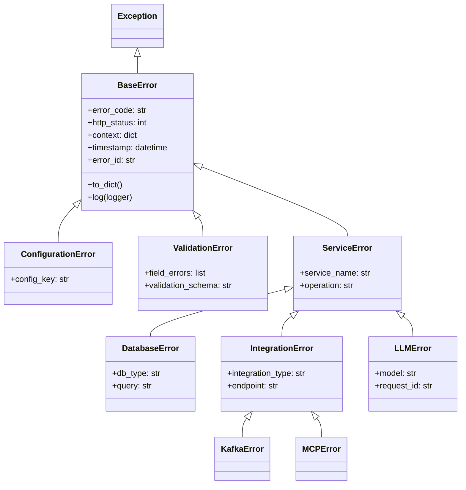

# Hierarchical Error Handling Framework

## Overview

This document details the hierarchical error handling framework implemented across the Agent Orchestration Platform, ensuring consistent error management, appropriate propagation, and clear reporting.

## Error Hierarchy



## Error Base Class

```python
import uuid
from datetime import datetime
from typing import Dict, Any, Optional, List
import logging
import traceback
import json

class BaseError(Exception):
    """Base class for all application errors.
    
    Provides consistent error handling, formatting, and logging.
    """
    
    def __init__(
        self,
        message: str,
        error_code: str = "INTERNAL_ERROR",
        http_status: int = 500,
        context: Optional[Dict[str, Any]] = None,
        cause: Optional[Exception] = None
    ):
        """Initialize the base error.
        
        Args:
            message: Human-readable error message
            error_code: Machine-readable error code
            http_status: HTTP status code for API responses
            context: Additional context for the error
            cause: Original exception that caused this error
        """
        super().__init__(message)
        self.message = message
        self.error_code = error_code
        self.http_status = http_status
        self.context = context or {}
        self.cause = cause
        self.timestamp = datetime.utcnow()
        self.error_id = str(uuid.uuid4())
        
        # Capture stack trace
        self.stack_trace = traceback.format_exc()
        
        # Extract cause chain
        self.cause_chain = self._extract_cause_chain(cause)
    
    def to_dict(self, include_debug_info: bool = False) -> Dict[str, Any]:
        """Convert error to dictionary for serialization.
        
        Args:
            include_debug_info: Whether to include debug information
            
        Returns:
            Dictionary representation of the error
        """
        error_dict = {
            "error_id": self.error_id,
            "timestamp": self.timestamp.isoformat(),
            "error_code": self.error_code,
            "message": self.message,
            "http_status": self.http_status
        }
        
        # Include context if available
        if self.context:
            error_dict["context"] = self.context
        
        # Include debug info if requested
        if include_debug_info:
            error_dict["debug_info"] = {
                "error_type": self.__class__.__name__,
                "stack_trace": self.stack_trace
            }
            
            if self.cause_chain:
                error_dict["debug_info"]["cause_chain"] = self.cause_chain
        
        return error_dict
    
    def log(self, logger: logging.Logger, level: str = "error") -> None:
        """Log the error with appropriate level and context.
        
        Args:
            logger: Logger to use
            level: Logging level (debug, info, warning, error, critical)
        """
        log_method = getattr(logger, level.lower())
        
        # Create structured log entry
        log_entry = {
            "event": "error",
            "error_id": self.error_id,
            "error_type": self.__class__.__name__,
            "error_code": self.error_code,
            "message": self.message
        }
        
        # Add context if available
        if self.context:
            log_entry["context"] = self.context
        
        # Log as JSON
        log_method(json.dumps(log_entry))
        
        # Log stack trace at debug level
        logger.debug(f"Stack trace for error {self.error_id}:\n{self.stack_trace}")
    
    def _extract_cause_chain(self, cause: Optional[Exception]) -> List[Dict[str, str]]:
        """Extract the chain of causes from an exception.
        
        Args:
            cause: Original exception
            
        Returns:
            List of cause information dictionaries
        """
        if not cause:
            return []
            
        cause_chain = []
        current = cause
        
        while current:
            cause_chain.append({
                "type": current.__class__.__name__,
                "message": str(current)
            })
            
            # Get next cause in chain
            current = getattr(current, "__cause__", None)
        
        return cause_chain
```

## Domain-Specific Error Classes

```python
class ConfigurationError(BaseError):
    """Error related to configuration issues."""
    
    def __init__(
        self,
        message: str,
        config_key: Optional[str] = None,
        cause: Optional[Exception] = None
    ):
        """Initialize configuration error.
        
        Args:
            message: Error message
            config_key: The configuration key that caused the error
            cause: Original exception
        """
        context = {"config_key": config_key} if config_key else {}
        
        super().__init__(
            message=message,
            error_code="CONFIGURATION_ERROR",
            http_status=500,
            context=context,
            cause=cause
        )
        self.config_key = config_key


class ValidationError(BaseError):
    """Error related to validation failures."""
    
    def __init__(
        self,
        message: str,
        field_errors: Optional[List[Dict[str, Any]]] = None,
        validation_schema: Optional[str] = None,
        cause: Optional[Exception] = None
    ):
        """Initialize validation error.
        
        Args:
            message: Error message
            field_errors: List of field-specific errors
            validation_schema: Name of the validation schema
            cause: Original exception
        """
        context = {}
        if field_errors:
            context["field_errors"] = field_errors
        if validation_schema:
            context["validation_schema"] = validation_schema
        
        super().__init__(
            message=message,
            error_code="VALIDATION_ERROR",
            http_status=400,  # Bad Request
            context=context,
            cause=cause
        )
        self.field_errors = field_errors or []
        self.validation_schema = validation_schema


class ServiceError(BaseError):
    """Error related to service operations."""
    
    def __init__(
        self,
        message: str,
        service_name: str,
        operation: Optional[str] = None,
        error_code: str = "SERVICE_ERROR",
        http_status: int = 500,
        cause: Optional[Exception] = None
    ):
        """Initialize service error.
        
        Args:
            message: Error message
            service_name: Name of the service where the error occurred
            operation: Operation that failed
            error_code: Error code
            http_status: HTTP status code
            cause: Original exception
        """
        context = {
            "service_name": service_name
        }
        
        if operation:
            context["operation"] = operation
        
        super().__init__(
            message=message,
            error_code=error_code,
            http_status=http_status,
            context=context,
            cause=cause
        )
        self.service_name = service_name
        self.operation = operation


class DatabaseError(ServiceError):
    """Error related to database operations."""
    
    def __init__(
        self,
        message: str,
        db_type: str,
        operation: str,
        query: Optional[str] = None,
        cause: Optional[Exception] = None
    ):
        """Initialize database error.
        
        Args:
            message: Error message
            db_type: Type of database (postgres, neo4j, etc.)
            operation: Database operation that failed
            query: The query that failed
            cause: Original exception
        """
        context = {
            "db_type": db_type
        }
        
        if query:
            # Sanitize query to remove sensitive information
            context["query"] = self._sanitize_query(query)
        
        super().__init__(
            message=message,
            service_name=f"{db_type}_database",
            operation=operation,
            error_code="DATABASE_ERROR",
            http_status=500,
            cause=cause
        )
        self.db_type = db_type
        self.query = query
    
    def _sanitize_query(self, query: str) -> str:
        """Sanitize a query to remove sensitive information.
        
        Args:
            query: Original query
            
        Returns:
            Sanitized query
        """
        # This is a simple example - in practice, implement proper query sanitization
        return query


class IntegrationError(ServiceError):
    """Error related to external integrations."""
    
    def __init__(
        self,
        message: str,
        integration_type: str,
        endpoint: Optional[str] = None,
        operation: Optional[str] = None,
        status_code: Optional[int] = None,
        cause: Optional[Exception] = None
    ):
        """Initialize integration error.
        
        Args:
            message: Error message
            integration_type: Type of integration (kafka, http, etc.)
            endpoint: Integration endpoint
            operation: Operation that failed
            status_code: HTTP status code or other status
            cause: Original exception
        """
        context = {
            "integration_type": integration_type
        }
        
        if endpoint:
            context["endpoint"] = endpoint
            
        if status_code:
            context["status_code"] = status_code
        
        super().__init__(
            message=message,
            service_name=f"{integration_type}_integration",
            operation=operation,
            error_code="INTEGRATION_ERROR",
            http_status=502,  # Bad Gateway
            cause=cause
        )
        self.integration_type = integration_type
        self.endpoint = endpoint
        self.status_code = status_code


class LLMError(ServiceError):
    """Error related to language model operations."""
    
    def __init__(
        self,
        message: str,
        model: str,
        operation: str,
        request_id: Optional[str] = None,
        cause: Optional[Exception] = None
    ):
        """Initialize LLM error.
        
        Args:
            message: Error message
            model: Language model name
            operation: Operation that failed
            request_id: ID of the LLM request
            cause: Original exception
        """
        context = {
            "model": model
        }
        
        if request_id:
            context["request_id"] = request_id
        
        super().__init__(
            message=message,
            service_name="llm_service",
            operation=operation,
            error_code="LLM_ERROR",
            http_status=500,
            cause=cause
        )
        self.model = model
        self.request_id = request_id
```

## Error Handler Middleware

```python
from fastapi import Request, Response
from fastapi.responses import JSONResponse
import logging

logger = logging.getLogger(__name__)

async def error_handler_middleware(request: Request, call_next):
    """Middleware to handle errors consistently across the application.
    
    Args:
        request: FastAPI request
        call_next: Next middleware in chain
        
    Returns:
        Response with appropriate error handling
    """
    try:
        # Process the request
        return await call_next(request)
    
    except BaseError as e:
        # Application-specific error with proper handling
        # Log the error
        e.log(logger)
        
        # Determine if debug info should be included
        include_debug = _should_include_debug(request)
        
        # Create error response
        return JSONResponse(
            status_code=e.http_status,
            content=e.to_dict(include_debug_info=include_debug)
        )
        
    except Exception as e:
        # Unexpected error - wrap in BaseError
        error = BaseError(
            message="An unexpected error occurred",
            error_code="INTERNAL_ERROR",
            http_status=500,
            cause=e
        )
        
        # Log the error
        error.log(logger, level="critical")
        
        # Determine if debug info should be included
        include_debug = _should_include_debug(request)
        
        # Create error response
        return JSONResponse(
            status_code=500,
            content=error.to_dict(include_debug_info=include_debug)
        )

def _should_include_debug(request: Request) -> bool:
    """Determine if debug information should be included in response.
    
    Args:
        request: FastAPI request
        
    Returns:
        True if debug info should be included
    """
    # Include debug info in development environments
    if request.app.debug:
        return True
        
    # Include debug info for specific clients or with debug header
    if "X-Debug" in request.headers:
        return True
        
    return False
```

## Error Handling with Pydantic

```python
from pydantic import BaseModel, Field, validator, ValidationError as PydanticValidationError
from typing import List, Optional, Dict, Any

class ErrorResponse(BaseModel):
    """Model for error responses."""
    
    error_id: str = Field(..., description="Unique identifier for the error")
    timestamp: str = Field(..., description="ISO-8601 timestamp of when the error occurred")
    error_code: str = Field(..., description="Machine-readable error code")
    message: str = Field(..., description="Human-readable error message")
    http_status: int = Field(..., description="HTTP status code")
    context: Optional[Dict[str, Any]] = Field(None, description="Additional context for the error")
    debug_info: Optional[Dict[str, Any]] = Field(None, description="Debug information")

class ErrorField(BaseModel):
    """Model for field-specific validation errors."""
    
    field: str = Field(..., description="Field name that had the error")
    message: str = Field(..., description="Error message for the field")
    type: str = Field(..., description="Type of validation error")
    value: Optional[Any] = Field(None, description="Value that caused the error")

class ValidationErrorResponse(ErrorResponse):
    """Model for validation error responses."""
    
    field_errors: List[ErrorField] = Field(default_factory=list, description="Field-specific errors")

def handle_pydantic_validation_error(error: PydanticValidationError) -> ValidationError:
    """Convert a Pydantic validation error to our application ValidationError.
    
    Args:
        error: Pydantic validation error
        
    Returns:
        Application ValidationError
    """
    # Extract field errors
    field_errors = []
    for err in error.errors():
        field_path = ".".join(str(loc) for loc in err["loc"])
        field_errors.append({
            "field": field_path,
            "message": err["msg"],
            "type": err["type"],
            "value": err.get("input")
        })
    
    # Create application ValidationError
    return ValidationError(
        message="Validation error",
        field_errors=field_errors,
        cause=error
    )
```

## Error Handling in API Layer

```python
from fastapi import APIRouter, HTTPException, Depends
from pydantic import BaseModel, Field

router = APIRouter()

class MemoryRequest(BaseModel):
    """Request model for creating a memory."""
    
    content: str = Field(..., min_length=1, max_length=10000, description="Memory content")
    user_id: str = Field(..., min_length=1, description="User ID")
    tags: List[str] = Field(default_factory=list, description="Memory tags")

@router.post("/memories")
async def create_memory(
    request: MemoryRequest,
    memory_service = Depends(get_memory_service)
):
    """Create a new memory."""
    try:
        # Process the request
        memory = await memory_service.add_memory(
            content=request.content,
            filters={"user_id": request.user_id, "tags": request.tags}
        )
        
        return {"memory_id": memory["memory_id"]}
        
    except ValidationError as e:
        # Validation errors are already structured properly
        raise HTTPException(
            status_code=e.http_status,
            detail=e.to_dict()
        )
        
    except DatabaseError as e:
        # Log the database error
        e.log(logger)
        
        # Return a sanitized error response
        raise HTTPException(
            status_code=e.http_status,
            detail={
                "error_code": e.error_code,
                "message": "Database operation failed. Please try again later."
            }
        )
        
    except BaseError as e:
        # Log the error
        e.log(logger)
        
        # Return the error response
        raise HTTPException(
            status_code=e.http_status,
            detail=e.to_dict(include_debug_info=False)
        )
        
    except Exception as e:
        # Unexpected error - wrap in BaseError
        error = BaseError(
            message="An unexpected error occurred",
            cause=e
        )
        
        # Log the error
        error.log(logger, level="critical")
        
        # Return a generic error response
        raise HTTPException(
            status_code=500,
            detail={
                "error_code": "INTERNAL_ERROR",
                "message": "An unexpected error occurred. Please try again later."
            }
        )
```

## Background Task Error Handling

```python
import asyncio
from functools import wraps
import logging

logger = logging.getLogger(__name__)

def handle_background_errors(func):
    """Decorator for handling errors in background tasks.
    
    Args:
        func: Async function to decorate
        
    Returns:
        Decorated function
    """
    @wraps(func)
    async def wrapper(*args, **kwargs):
        try:
            return await func(*args, **kwargs)
        
        except BaseError as e:
            # Log application error
            e.log(logger)
            
            # Republish to error tracking system
            await publish_error_event(e)
            
        except Exception as e:
            # Wrap in BaseError
            error = BaseError(
                message=f"Unhandled error in background task {func.__name__}",
                error_code="BACKGROUND_TASK_ERROR",
                cause=e,
                context={"args": str(args), "kwargs": str(kwargs)}
            )
            
            # Log the error
            error.log(logger, level="critical")
            
            # Republish to error tracking system
            await publish_error_event(error)
    
    return wrapper

async def publish_error_event(error: BaseError):
    """Publish error to event system for monitoring and alerting.
    
    Args:
        error: Error to publish
    """
    try:
        # Get event publisher from service registry
        event_publisher = get_event_publisher()
        
        # Publish error event
        await event_publisher.publish(
            event_type="error.occurred",
            payload={
                "error_id": error.error_id,
                "error_type": error.__class__.__name__,
                "error_code": error.error_code,
                "message": error.message,
                "timestamp": error.timestamp.isoformat(),
                "context": error.context
            }
        )
    
    except Exception as e:
        # Don't let an error in error publishing cause cascading issues
        logger.critical(f"Failed to publish error event: {e}")
```

## Circuit Breaker for Error Management

```python
import time
from enum import Enum
from typing import Callable, Any, TypeVar, Generic

T = TypeVar('T')

class CircuitState(Enum):
    """Circuit breaker states."""
    
    CLOSED = "CLOSED"  # Normal operation
    OPEN = "OPEN"  # Failing, rejecting requests
    HALF_OPEN = "HALF_OPEN"  # Testing if service is healthy

class CircuitBreaker(Generic[T]):
    """Circuit breaker for error management."""
    
    def __init__(
        self,
        name: str,
        failure_threshold: int = 5,
        reset_timeout: int = 60,
        half_open_max_calls: int = 1
    ):
        """Initialize the circuit breaker.
        
        Args:
            name: Name of the protected resource
            failure_threshold: Number of failures before opening circuit
            reset_timeout: Seconds to wait before attempting reset
            half_open_max_calls: Maximum calls allowed in half-open state
        """
        self.name = name
        self.failure_threshold = failure_threshold
        self.reset_timeout = reset_timeout
        self.half_open_max_calls = half_open_max_calls
        
        self.state = CircuitState.CLOSED
        self.failure_count = 0
        self.last_failure_time = 0
        self.half_open_calls = 0
    
    async def execute(self, func: Callable[..., T], *args, **kwargs) -> T:
        """Execute a function with circuit breaker protection.
        
        Args:
            func: Function to execute
            *args: Arguments for the function
            **kwargs: Keyword arguments for the function
            
        Returns:
            Result of the function
            
        Raises:
            CircuitOpenError: If circuit is open
            Any exceptions from the function
        """
        # Check circuit state
        if self.state == CircuitState.OPEN:
            # Check if reset timeout has elapsed
            if time.time() - self.last_failure_time > self.reset_timeout:
                self._transition_to_half_open()
            else:
                raise CircuitOpenError(f"Circuit for {self.name} is OPEN")
                
        elif self.state == CircuitState.HALF_OPEN:
            # Check if max calls reached
            if self.half_open_calls >= self.half_open_max_calls:
                raise CircuitOpenError(f"Circuit for {self.name} is HALF_OPEN and at max calls")
                
            self.half_open_calls += 1
        
        try:
            # Execute the function
            result = await func(*args, **kwargs)
            
            # Success - reset if half-open
            if self.state == CircuitState.HALF_OPEN:
                self._transition_to_closed()
            elif self.state == CircuitState.CLOSED:
                # Reset failure count on success
                self.failure_count = 0
                
            return result
            
        except Exception as e:
            # Record failure
            self.failure_count += 1
            self.last_failure_time = time.time()
            
            # Check if threshold reached
            if self.state == CircuitState.CLOSED and self.failure_count >= self.failure_threshold:
                self._transition_to_open()
            elif self.state == CircuitState.HALF_OPEN:
                self._transition_to_open()
            
            # Re-raise with context
            if isinstance(e, BaseError):
                e.context.update({"circuit_breaker": self.name, "circuit_state": self.state.value})
                raise
            else:
                raise ServiceError(
                    message=f"Service call failed: {str(e)}",
                    service_name=self.name,
                    error_code="CIRCUIT_BREAKER_ERROR",
                    cause=e
                )
    
    def _transition_to_open(self):
        """Transition to OPEN state."""
        self.state = CircuitState.OPEN
        logger.warning(f"Circuit for {self.name} is now OPEN")
    
    def _transition_to_half_open(self):
        """Transition to HALF_OPEN state."""
        self.state = CircuitState.HALF_OPEN
        self.half_open_calls = 0
        logger.info(f"Circuit for {self.name} is now HALF_OPEN")
    
    def _transition_to_closed(self):
        """Transition to CLOSED state."""
        self.state = CircuitState.CLOSED
        self.failure_count = 0
        self.half_open_calls = 0
        logger.info(f"Circuit for {self.name} is now CLOSED")

class CircuitOpenError(BaseError):
    """Error when a circuit breaker is open."""
    
    def __init__(self, message: str):
        """Initialize circuit open error.
        
        Args:
            message: Error message
        """
        super().__init__(
            message=message,
            error_code="CIRCUIT_OPEN",
            http_status=503  # Service Unavailable
        )
```

## Integration with Monitoring

```python
class ErrorTracker:
    """Service for tracking and analyzing errors."""
    
    def __init__(self, metrics_service, alert_service):
        """Initialize the error tracker.
        
        Args:
            metrics_service: Service for recording metrics
            alert_service: Service for sending alerts
        """
        self.metrics_service = metrics_service
        self.alert_service = alert_service
        
        # Error counts by type
        self.error_counts = {}
        
        # Error rate tracking
        self.error_rates = {}
    
    async def track_error(self, error: BaseError):
        """Track an error for monitoring and alerting.
        
        Args:
            error: Error to track
        """
        # Record error in metrics
        error_type = error.__class__.__name__
        
        await self.metrics_service.increment_counter(
            name="errors_total",
            value=1,
            labels={
                "error_type": error_type,
                "error_code": error.error_code,
                "service_name": error.context.get("service_name", "unknown")
            }
        )
        
        # Update error counts
        if error_type not in self.error_counts:
            self.error_counts[error_type] = 0
        self.error_counts[error_type] += 1
        
        # Check for error thresholds
        await self._check_error_thresholds(error)
        
        # Check for error rate spikes
        await self._check_error_rate_spikes(error)
    
    async def _check_error_thresholds(self, error: BaseError):
        """Check if error counts exceed thresholds.
        
        Args:
            error: Error to check
        """
        error_type = error.__class__.__name__
        
        # Define thresholds for different error types
        thresholds = {
            "LLMError": 10,
            "DatabaseError": 5,
            "IntegrationError": 8,
            "ValidationError": 20,
            "BaseError": 15
        }
        
        # Get threshold for this error type or use default
        threshold = thresholds.get(error_type, thresholds.get("BaseError", 15))
        
        # Check if threshold exceeded
        if self.error_counts.get(error_type, 0) >= threshold:
            # Send alert
            await self.alert_service.send_alert(
                alert_type="error_threshold_exceeded",
                severity="warning",
                details={
                    "error_type": error_type,
                    "error_code": error.error_code,
                    "count": self.error_counts[error_type],
                    "threshold": threshold,
                    "recent_error": {
                        "error_id": error.error_id,
                        "message": error.message
                    }
                }
            )
            
            # Reset count to avoid repeated alerts
            self.error_counts[error_type] = 0
    
    async def _check_error_rate_spikes(self, error: BaseError):
        """Check for sudden spikes in error rates.
        
        Args:
            error: Error to check
        """
        error_type = error.__class__.__name__
        
        # Get current error rate
        error_rate = await self.metrics_service.get_rate(
            name="errors_total",
            labels={
                "error_type": error_type
            },
            window_seconds=60
        )
        
        # Get baseline error rate
        baseline_rate = await self.metrics_service.get_rate(
            name="errors_total",
            labels={
                "error_type": error_type
            },
            window_seconds=3600
        )
        
        # Check for spike
        if error_rate > baseline_rate * 3 and error_rate > 1.0:
            # Send alert
            await self.alert_service.send_alert(
                alert_type="error_rate_spike",
                severity="warning",
                details={
                    "error_type": error_type,
                    "error_code": error.error_code,
                    "current_rate": error_rate,
                    "baseline_rate": baseline_rate,
                    "increase_factor": error_rate / baseline_rate if baseline_rate > 0 else float('inf'),
                    "recent_error": {
                        "error_id": error.error_id,
                        "message": error.message
                    }
                }
            )
```

## Guidelines for Using the Error Framework

1. **Error Creation**
   - Use the most specific error type possible
   - Include relevant context information
   - Set appropriate HTTP status codes
   - Chain exceptions with the `cause` parameter

2. **Error Handling**
   - Handle errors at appropriate levels
   - Log errors consistently using the error's `log()` method
   - Use circuit breakers for external dependencies
   - Return user-friendly error messages

3. **Error Propagation**
   - Wrap low-level errors in domain-specific errors
   - Maintain the error chain with the `cause` parameter
   - Add context as errors propagate up the stack
   - Don't log the same error multiple times

4. **Error Monitoring**
   - Track error metrics for different error types
   - Set up alerts for error thresholds
   - Monitor error rates for anomalies
   - Analyze error patterns for system improvements
