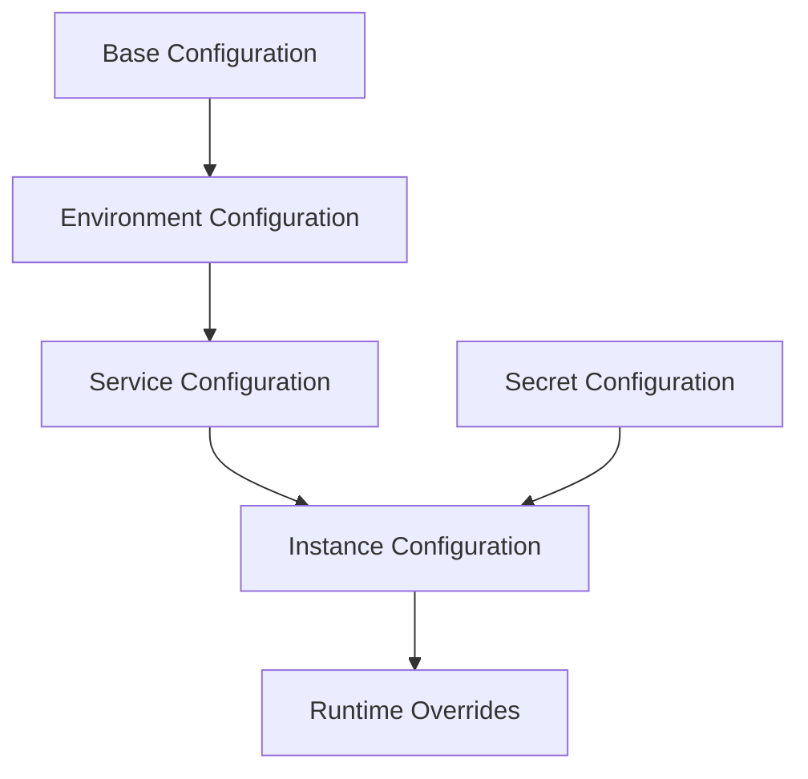

# Hierarchical Configuration Management

## Overview

This document outlines the hierarchical configuration management system implemented across the Agent Orchestration Platform, enabling environment-specific, service-specific, and instance-specific configurations with proper validation and secret management.

## Configuration Hierarchy



## Core Configuration Service

```python
from typing import Dict, Any, Optional, List, Union, Type, TypeVar, Generic
from enum import Enum
import os
import json
import yaml
from pathlib import Path
import logging
from pydantic import BaseModel, Field, create_model, ValidationError
from functools import lru_cache

logger = logging.getLogger(__name__)

class ConfigSource(Enum):
    """Sources of configuration values."""
    
    DEFAULT = "default"
    BASE_FILE = "base_file"
    ENV_FILE = "environment_file"
    SERVICE_FILE = "service_file"
    INSTANCE_FILE = "instance_file"
    ENVIRONMENT_VAR = "environment_variable"
    RUNTIME = "runtime"
    SECRET = "secret"

T = TypeVar('T', bound=BaseModel)

class ConfigValue:
    """Configuration value with metadata."""
    
    def __init__(
        self, 
        value: Any, 
        source: ConfigSource = ConfigSource.DEFAULT,
        source_name: Optional[str] = None
    ):
        """Initialize configuration value.
        
        Args:
            value: The configuration value
            source: Source of the configuration
            source_name: Specific source name (file, env var)
        """
        self.value = value
        self.source = source
        self.source_name = source_name
    
    def __str__(self) -> str:
        """String representation of config value."""
        return f"{self.value} (from {self.source.value}:{self.source_name or 'unknown'})"

class ConfigurationService:
    """Service for managing hierarchical configuration."""
    
    def __init__(
        self,
        config_dir: str,
        environment: str = "development",
        service_name: Optional[str] = None,
        instance_id: Optional[str] = None,
        secret_provider = None
    ):
        """Initialize the configuration service.
        
        Args:
            config_dir: Directory containing configuration files
            environment: Current environment
            service_name: Name of the current service
            instance_id: ID of the current instance
            secret_provider: Provider for secret configuration
        """
        self.config_dir = Path(config_dir)
        self.environment = environment
        self.service_name = service_name
        self.instance_id = instance_id
        self.secret_provider = secret_provider
        
        # Configuration cache
        self._config_models: Dict[str, Type[BaseModel]] = {}
        self._config_values: Dict[str, Dict[str, ConfigValue]] = {}
        self._loaded_files: List[str] = []
        
        # Load base configurations
        self._load_base_configs()
    
    def _load_base_configs(self):
        """Load base configuration files."""
        # Base config
        base_config_path = self.config_dir / "base.yaml"
        if base_config_path.exists():
            self._load_config_file(base_config_path, ConfigSource.BASE_FILE)
        
        # Environment config
        env_config_path = self.config_dir / f"{self.environment}.yaml"
        if env_config_path.exists():
            self._load_config_file(env_config_path, ConfigSource.ENV_FILE)
        
        # Service config
        if self.service_name:
            service_config_path = self.config_dir / f"{self.service_name}.yaml"
            if service_config_path.exists():
                self._load_config_file(service_config_path, ConfigSource.SERVICE_FILE)
            
            # Service-environment config
            service_env_config_path = self.config_dir / f"{self.service_name}.{self.environment}.yaml"
            if service_env_config_path.exists():
                self._load_config_file(service_env_config_path, ConfigSource.SERVICE_FILE)
        
        # Instance config
        if self.instance_id:
            instance_config_path = self.config_dir / f"instance-{self.instance_id}.yaml"
            if instance_config_path.exists():
                self._load_config_file(instance_config_path, ConfigSource.INSTANCE_FILE)
        
        # Load environment variables
        self._load_env_vars()
    
    def _load_config_file(self, file_path: Path, source: ConfigSource):
        """Load a configuration file.
        
        Args:
            file_path: Path to the configuration file
            source: Configuration source
        """
        try:
            if file_path.suffix in ['.yaml', '.yml']:
                with open(file_path, 'r') as file:
                    config_data = yaml.safe_load(file)
            elif file_path.suffix == '.json':
                with open(file_path, 'r') as file:
                    config_data = json.load(file)
            else:
                logger.warning(f"Unsupported configuration file format: {file_path}")
                return
            
            # Flatten configuration
            flat_config = self._flatten_dict(config_data)
            
            # Update configuration values
            for key, value in flat_config.items():
                if key not in self._config_values:
                    self._config_values[key] = {}
                
                self._config_values[key] = ConfigValue(
                    value=value,
                    source=source,
                    source_name=str(file_path)
                )
            
            self._loaded_files.append(str(file_path))
            logger.info(f"Loaded configuration from {file_path}")
            
        except Exception as e:
            logger.error(f"Failed to load configuration file {file_path}: {str(e)}")
    
    def _load_env_vars(self):
        """Load configuration from environment variables."""
        # Look for environment variables with the prefix CONFIG_
        for key, value in os.environ.items():
            if key.startswith('CONFIG_'):
                # Convert to lowercase and replace underscores with dots
                config_key = key[7:].lower().replace('_', '.')
                
                # Update configuration values
                if config_key not in self._config_values:
                    self._config_values[config_key] = {}
                
                self._config_values[config_key] = ConfigValue(
                    value=value,
                    source=ConfigSource.ENVIRONMENT_VAR,
                    source_name=key
                )
    
    def _flatten_dict(self, d: Dict[str, Any], parent_key: str = '', sep: str = '.') -> Dict[str, Any]:
        """Flatten a nested dictionary.
        
        Args:
            d: Dictionary to flatten
            parent_key: Parent key
            sep: Separator for nested keys
            
        Returns:
            Flattened dictionary
        """
        items = []
        for k, v in d.items():
            new_key = f"{parent_key}{sep}{k}" if parent_key else k
            
            if isinstance(v, dict):
                items.extend(self._flatten_dict(v, new_key, sep=sep).items())
            else:
                items.append((new_key, v))
                
        return dict(items)
    
    def _unflatten_dict(self, d: Dict[str, Any], sep: str = '.') -> Dict[str, Any]:
        """Convert a flattened dictionary back to a nested one.
        
        Args:
            d: Flattened dictionary
            sep: Separator for nested keys
            
        Returns:
            Nested dictionary
        """
        result = {}
        
        for key, value in d.items():
            parts = key.split(sep)
            
            # Navigate to the right level in the result dictionary
            current = result
            for part in parts[:-1]:
                if part not in current:
                    current[part] = {}
                current = current[part]
            
            # Set the value
            current[parts[-1]] = value
            
        return result
    
    def register_config_model(self, namespace: str, model: Type[BaseModel]):
        """Register a configuration model for validation.
        
        Args:
            namespace: Configuration namespace
            model: Pydantic model for validation
        """
        self._config_models[namespace] = model
        logger.debug(f"Registered configuration model for namespace: {namespace}")
    
    def get_raw_config(self, key: str) -> Optional[Any]:
        """Get a raw configuration value.
        
        Args:
            key: Configuration key
            
        Returns:
            Configuration value or None if not found
        """
        if key in self._config_values:
            return self._config_values[key].value
        return None
    
    def get_config_with_source(self, key: str) -> Optional[ConfigValue]:
        """Get a configuration value with source information.
        
        Args:
            key: Configuration key
            
        Returns:
            ConfigValue object or None if not found
        """
        return self._config_values.get(key)
    
    def get_namespace_config(self, namespace: str) -> Dict[str, Any]:
        """Get all configuration values in a namespace.
        
        Args:
            namespace: Configuration namespace
            
        Returns:
            Dictionary of configuration values
        """
        # Get all keys in the namespace
        prefix = f"{namespace}."
        result = {}
        
        for key, config_value in self._config_values.items():
            if key.startswith(prefix):
                # Remove prefix from key
                result_key = key[len(prefix):]
                result[result_key] = config_value.value
                
        return result
    
    def get_validated_config(self, namespace: str) -> Optional[BaseModel]:
        """Get and validate configuration for a namespace.
        
        Args:
            namespace: Configuration namespace
            
        Returns:
            Validated configuration model or None if validation fails
        """
        if namespace not in self._config_models:
            logger.warning(f"No configuration model registered for namespace: {namespace}")
            return None
        
        # Get raw configuration for namespace
        config_data = self.get_namespace_config(namespace)
        
        try:
            # Validate using the model
            return self._config_models[namespace](**config_data)
            
        except ValidationError as e:
            logger.error(f"Configuration validation failed for namespace {namespace}: {str(e)}")
            return None
    
    def set_runtime_config(self, key: str, value: Any):
        """Set a configuration value at runtime.
        
        Args:
            key: Configuration key
            value: Configuration value
        """
        self._config_values[key] = ConfigValue(
            value=value,
            source=ConfigSource.RUNTIME,
            source_name="runtime_override"
        )
        
        logger.debug(f"Set runtime configuration {key}={value}")
    
    async def load_secrets(self, namespace: str):
        """Load secrets for a namespace.
        
        Args:
            namespace: Secret namespace
            
        Returns:
            True if secrets were loaded successfully
        """
        if not self.secret_provider:
            logger.warning("No secret provider configured")
            return False
            
        try:
            # Load secrets
            secrets = await self.secret_provider.get_secrets(namespace)
            
            # Update configuration values
            for key, value in secrets.items():
                secret_key = f"{namespace}.{key}"
                
                self._config_values[secret_key] = ConfigValue(
                    value=value,
                    source=ConfigSource.SECRET,
                    source_name=f"secret:{namespace}"
                )
            
            logger.info(f"Loaded secrets for namespace: {namespace}")
            return True
            
        except Exception as e:
            logger.error(f"Failed to load secrets for namespace {namespace}: {str(e)}")
            return False
    
    def reload(self):
        """Reload configuration from all sources."""
        # Clear configuration values but keep registered models
        self._config_values = {}
        self._loaded_files = []
        
        # Reload configuration
        self._load_base_configs()
        
        logger.info("Reloaded configuration")
    
    def get_config_summary(self) -> Dict[str, Any]:
        """Get a summary of the loaded configuration.
        
        Returns:
            Configuration summary
        """
        return {
            "environment": self.environment,
            "service_name": self.service_name,
            "instance_id": self.instance_id,
            "loaded_files": self._loaded_files,
            "registered_models": list(self._config_models.keys()),
            "config_keys_count": len(self._config_values),
            "sources": {
                source.value: sum(1 for v in self._config_values.values() if v.source == source)
                for source in ConfigSource
            }
        }
```

## Configuration Models

```python
from pydantic import BaseModel, Field, validator
from typing import List, Dict, Optional, Any, Union
from enum import Enum

class LoggingConfig(BaseModel):
    """Configuration for logging."""
    
    level: str = Field("INFO", description="Logging level")
    format: str = Field("json", description="Log format (json or text)")
    output_file: Optional[str] = Field(None, description="Output file for logs")
    console_output: bool = Field(True, description="Whether to output logs to console")
    include_trace_id: bool = Field(True, description="Whether to include trace ID in logs")
    sanitize_logs: bool = Field(True, description="Whether to sanitize sensitive data in logs")

class DatabaseConfig(BaseModel):
    """Configuration for database connections."""
    
    type: str = Field(..., description="Database type (postgres, neo4j, etc.)")
    host: str = Field(..., description="Database host")
    port: int = Field(..., description="Database port")
    name: str = Field(..., description="Database name")
    username: str = Field(..., description="Database username")
    password: str = Field("", description="Database password (should be loaded from secrets)")
    pool_size: int = Field(10, description="Connection pool size")
    timeout_seconds: int = Field(30, description="Query timeout in seconds")
    ssl_mode: Optional[str] = Field(None, description="SSL mode")
    
    @validator('type')
    def validate_db_type(cls, v):
        """Validate database type."""
        valid_types = ['postgres', 'neo4j', 'mysql', 'mongodb']
        if v not in valid_types:
            raise ValueError(f"Database type must be one of {valid_types}")
        return v

class LLMProviderConfig(BaseModel):
    """Configuration for an LLM provider."""
    
    name: str = Field(..., description="Provider name")
    api_key: str = Field("", description="API key (should be loaded from secrets)")
    base_url: Optional[str] = Field(None, description="Base URL for API")
    timeout_seconds: int = Field(60, description="Request timeout in seconds")
    default_model: str = Field(..., description="Default model to use")
    max_tokens_default: int = Field(1000, description="Default max tokens")
    models: Dict[str, Dict[str, Any]] = Field(default_factory=dict, description="Model-specific configurations")

class MemoryServiceConfig(BaseModel):
    """Configuration for the Memory Service."""
    
    database: DatabaseConfig
    embedding_model: str = Field("text-embedding-ada-002", description="Embedding model to use")
    vector_dimension: int = Field(1536, description="Dimension of embedding vectors")
    ttl_seconds: Optional[int] = Field(None, description="Time-to-live for memories in seconds")
    max_memories_per_retrieval: int = Field(10, description="Maximum memories to retrieve")
    encryption_enabled: bool = Field(False, description="Whether to encrypt memory content")

class MCPConfig(BaseModel):
    """Configuration for MCP integration."""
    
    api_url: str = Field(..., description="MCP API URL")
    api_key: str = Field("", description="MCP API key (should be loaded from secrets)")
    default_model: str = Field("gpt-4", description="Default model to use")
    conversation_ttl_seconds: int = Field(3600, description="Time-to-live for conversations")
    default_temperature: float = Field(0.7, description="Default temperature")
    cost_tracking_enabled: bool = Field(True, description="Whether to track costs")
    include_memory_context: bool = Field(True, description="Whether to include memory context")

class KafkaConfig(BaseModel):
    """Configuration for Kafka integration."""
    
    bootstrap_servers: List[str] = Field(..., description="Kafka bootstrap servers")
    schema_registry_url: str = Field(..., description="Schema Registry URL")
    consumer_group_id: str = Field(..., description="Consumer group ID")
    auto_offset_reset: str = Field("earliest", description="Auto offset reset")
    enable_auto_commit: bool = Field(True, description="Whether to enable auto commit")
    retry_backoff_ms: int = Field(500, description="Retry backoff in milliseconds")
    max_in_flight_requests_per_connection: int = Field(5, description="Max in-flight requests")
    security_protocol: Optional[str] = Field(None, description="Security protocol")
```

## Feature Flags Integration

```python
class FeatureFlag(Enum):
    """Feature flags for toggling features."""
    
    ENABLE_MEMORY_ENCRYPTION = "memory.encryption.enabled"
    ENABLE_COST_TRACKING = "cost_tracking.enabled"
    ENABLE_AGENT_EVOLUTION = "agent.evolution.enabled"
    ENABLE_STREAMING_RESPONSES = "responses.streaming.enabled"
    ENABLE_CAPABILITY_ISOLATION = "capability.isolation.enabled"

class FeatureFlagService:
    """Service for feature flag management."""
    
    def __init__(self, config_service: ConfigurationService):
        """Initialize the feature flag service.
        
        Args:
            config_service: Configuration service
        """
        self.config_service = config_service
        self.override_flags = {}
        
        # Register for config updates
        # This would usually happen through an event system
    
    def is_enabled(self, feature: Union[FeatureFlag, str], default: bool = False) -> bool:
        """Check if a feature is enabled.
        
        Args:
            feature: Feature flag
            default: Default value if not configured
            
        Returns:
            True if the feature is enabled
        """
        # If we have an override, use it
        if isinstance(feature, FeatureFlag):
            flag_name = feature.value
        else:
            flag_name = feature
            
        if flag_name in self.override_flags:
            return self.override_flags[flag_name]
        
        # Check configuration
        config_key = f"features.{flag_name}"
        raw_value = self.config_service.get_raw_config(config_key)
        
        if raw_value is not None:
            # Convert to boolean
            if isinstance(raw_value, bool):
                return raw_value
            elif isinstance(raw_value, str):
                return raw_value.lower() in ['true', 'yes', '1', 'on']
            elif isinstance(raw_value, int):
                return raw_value > 0
                
        return default
    
    def set_override(self, feature: Union[FeatureFlag, str], enabled: bool):
        """Set a runtime override for a feature flag.
        
        Args:
            feature: Feature flag
            enabled: Whether the feature is enabled
        """
        if isinstance(feature, FeatureFlag):
            flag_name = feature.value
        else:
            flag_name = feature
            
        self.override_flags[flag_name] = enabled
        
        logger.info(f"Feature flag override set: {flag_name}={enabled}")
    
    def clear_override(self, feature: Union[FeatureFlag, str]):
        """Clear a runtime override for a feature flag.
        
        Args:
            feature: Feature flag
        """
        if isinstance(feature, FeatureFlag):
            flag_name = feature.value
        else:
            flag_name = feature
            
        if flag_name in self.override_flags:
            del self.override_flags[flag_name]
            logger.info(f"Feature flag override cleared: {flag_name}")
    
    def clear_all_overrides(self):
        """Clear all runtime overrides."""
        self.override_flags = {}
        logger.info("All feature flag overrides cleared")
```

## Environment-Specific Configuration

Example of environment-specific configuration files:

### `base.yaml`
```yaml
# Base configuration for all environments
app:
  name: Agent Orchestration Platform
  version: 1.0.0

logging:
  level: INFO
  format: json
  console_output: true
  include_trace_id: true
  sanitize_logs: true

database:
  type: postgres
  pool_size: 10
  timeout_seconds: 30

features:
  memory.encryption.enabled: false
  cost_tracking.enabled: true
  agent.evolution.enabled: true
  responses.streaming.enabled: true
  capability.isolation.enabled: false
```

### `development.yaml`
```yaml
# Development environment configuration
logging:
  level: DEBUG

database:
  host: localhost
  port: 5432
  name: agent_platform_dev
  username: dev_user

mcp:
  api_url: http://localhost:8000/mcp
  default_model: gpt-3.5-turbo
  conversation_ttl_seconds: 7200
  default_temperature: 0.7

kafka:
  bootstrap_servers:
    - localhost:9092
  schema_registry_url: http://localhost:8081
  consumer_group_id: agent-platform-dev
```

### `production.yaml`
```yaml
# Production environment configuration
logging:
  level: INFO
  output_file: /var/log/agent_platform.log

database:
  host: db.example.com
  port: 5432
  name: agent_platform_prod
  username: prod_user
  ssl_mode: require

mcp:
  api_url: https://api.example.com/mcp
  default_model: gpt-4
  conversation_ttl_seconds: 3600
  default_temperature: 0.5
  include_memory_context: true

kafka:
  bootstrap_servers:
    - kafka-1.example.com:9092
    - kafka-2.example.com:9092
    - kafka-3.example.com:9092
  schema_registry_url: https://schema-registry.example.com
  consumer_group_id: agent-platform-prod
  security_protocol: SASL_SSL
```

## Secret Management Integration

```python
from abc import ABC, abstractmethod
from typing import Dict, Any, Optional

class SecretProvider(ABC):
    """Abstract base class for secret providers."""
    
    @abstractmethod
    async def get_secrets(self, namespace: str) -> Dict[str, Any]:
        """Get secrets for a namespace.
        
        Args:
            namespace: Secret namespace
            
        Returns:
            Dictionary of secrets
        """
        pass

class VaultSecretProvider(SecretProvider):
    """Secret provider using HashiCorp Vault."""
    
    def __init__(self, vault_url: str, token: str, mount_point: str = "secret"):
        """Initialize the Vault secret provider.
        
        Args:
            vault_url: Vault URL
            token: Vault token
            mount_point: Secret mount point
        """
        import hvac
        
        self.client = hvac.Client(url=vault_url, token=token)
        self.mount_point = mount_point
        
        # Verify connection
        assert self.client.is_authenticated(), "Vault authentication failed"
    
    async def get_secrets(self, namespace: str) -> Dict[str, Any]:
        """Get secrets from Vault.
        
        Args:
            namespace: Secret namespace (path)
            
        Returns:
            Dictionary of secrets
        """
        try:
            # Read secrets from Vault
            result = self.client.secrets.kv.v2.read_secret_version(
                path=namespace,
                mount_point=self.mount_point
            )
            
            # Extract data
            if result and "data" in result and "data" in result["data"]:
                return result["data"]["data"]
                
            return {}
            
        except Exception as e:
            logger.error(f"Failed to get secrets from Vault: {str(e)}")
            raise

class EnvironmentSecretProvider(SecretProvider):
    """Secret provider using environment variables."""
    
    async def get_secrets(self, namespace: str) -> Dict[str, Any]:
        """Get secrets from environment variables.
        
        Args:
            namespace: Secret namespace (prefix)
            
        Returns:
            Dictionary of secrets
        """
        # Look for environment variables with the given prefix
        prefix = f"{namespace.upper()}_"
        secrets = {}
        
        for key, value in os.environ.items():
            if key.startswith(prefix):
                # Remove prefix and convert to lowercase
                secret_key = key[len(prefix):].lower()
                secrets[secret_key] = value
                
        return secrets
```

## Usage Examples

### Basic Configuration Service

```python
# Initialize configuration service
config_service = ConfigurationService(
    config_dir="/etc/agent_platform/config",
    environment="development",
    service_name="memory_service",
    instance_id="memory-1"
)

# Register configuration models
config_service.register_config_model("logging", LoggingConfig)
config_service.register_config_model("database", DatabaseConfig)
config_service.register_config_model("memory", MemoryServiceConfig)

# Get validated configuration
logging_config = config_service.get_validated_config("logging")
if logging_config:
    # Configure logging
    configure_logging(
        level=logging_config.level,
        format=logging_config.format,
        output_file=logging_config.output_file,
        console_output=logging_config.console_output
    )

# Get raw configuration value
max_memories = config_service.get_raw_config("memory.max_memories_per_retrieval")
```

### Feature Flags

```python
# Initialize feature flag service
feature_flags = FeatureFlagService(config_service)

# Check if a feature is enabled
if feature_flags.is_enabled(FeatureFlag.ENABLE_MEMORY_ENCRYPTION):
    # Initialize encryption
    encryption_service.initialize()

# Set a runtime override
feature_flags.set_override(FeatureFlag.ENABLE_STREAMING_RESPONSES, False)
```

### Secret Management

```python
# Initialize secret provider
if os.environ.get("VAULT_TOKEN"):
    # Use Vault for secrets
    secret_provider = VaultSecretProvider(
        vault_url=os.environ.get("VAULT_URL", "http://vault:8200"),
        token=os.environ.get("VAULT_TOKEN")
    )
else:
    # Use environment variables for secrets
    secret_provider = EnvironmentSecretProvider()

# Update configuration service
config_service.secret_provider = secret_provider

# Load secrets
await config_service.load_secrets("database")
await config_service.load_secrets("mcp")

# Now configuration includes secrets
db_config = config_service.get_validated_config("database")
```

## Best Practices

1. **Configuration Namespaces**
   - Use consistent naming conventions (lowercase, dot-separated)
   - Group related configurations under namespaces
   - Document all configuration options

2. **Environment-Specific Configuration**
   - Keep sensitive values out of version control
   - Use different files for different environments
   - Validate configurations before application startup

3. **Feature Flags**
   - Use feature flags for gradual rollouts
   - Set sensible defaults for all flags
   - Document the purpose and usage of each flag

4. **Secret Management**
   - Never hardcode secrets in configuration files
   - Rotate secrets regularly
   - Use appropriate secret storage for each environment

5. **Configuration Validation**
   - Validate all configurations using Pydantic models
   - Provide helpful error messages for misconfiguration
   - Set appropriate defaults when possible
