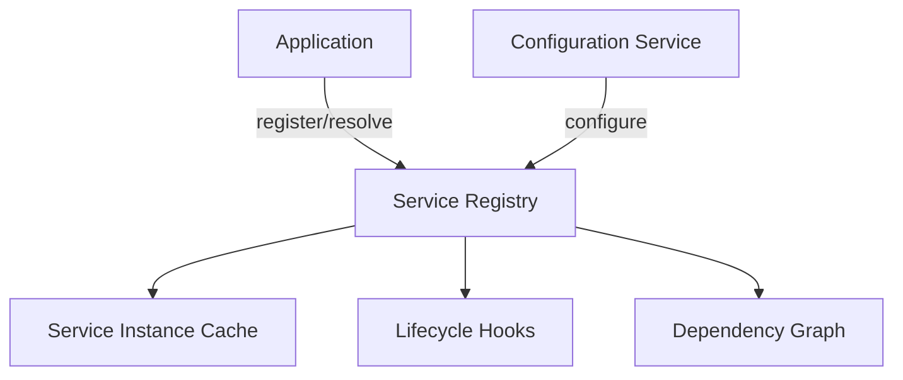

# Service Registry and Dependency Injection

## Overview

This document details the Service Registry pattern implemented in the Agent Orchestration Platform, providing a standardized approach to dependency management, service discovery, and lifecycle management across all platform components.

## Service Registry Architecture



## Core Concepts

The Service Registry provides:

1. **Centralized service management** for all platform components
2. **Dependency injection** to decouple service implementations
3. **Lifecycle management** for proper initialization and shutdown
4. **Lazy initialization** to optimize resource usage
5. **Scoped instances** for request-specific dependencies

## Service Registry Implementation

```python
from typing import Dict, Any, Optional, List, Type, TypeVar, Callable, Set
import inspect
import asyncio
from enum import Enum
import logging
from functools import wraps
import contextvars

logger = logging.getLogger(__name__)

# Type variables for type hints
T = TypeVar('T')
S = TypeVar('S')

class ServiceScope(Enum):
    """Scope for service instances."""
    
    SINGLETON = "singleton"  # One instance for the entire application
    SCOPED = "scoped"  # One instance per scope (e.g., request)
    TRANSIENT = "transient"  # New instance each time

class ServiceLifecycle(Enum):
    """Lifecycle phases for services."""
    
    INITIALIZING = "initializing"
    INITIALIZED = "initialized"
    STARTING = "starting"
    STARTED = "started"
    STOPPING = "stopping"
    STOPPED = "stopped"
    DISPOSING = "disposing"
    DISPOSED = "disposed"
    FAILED = "failed"

# Context variable for current scope
current_scope = contextvars.ContextVar('current_scope', default=None)

class ServiceRegistration:
    """Registration information for a service."""
    
    def __init__(
        self,
        service_type: Type,
        implementation_type: Optional[Type] = None,
        factory: Optional[Callable] = None,
        instance: Optional[Any] = None,
        scope: ServiceScope = ServiceScope.SINGLETON,
        dependencies: Optional[List[str]] = None,
        tags: Optional[List[str]] = None
    ):
        """Initialize service registration.
        
        Args:
            service_type: Type of the service (usually an interface/protocol)
            implementation_type: Type of the implementation
            factory: Factory function for creating instances
            instance: Existing instance
            scope: Service scope
            dependencies: List of dependency names
            tags: List of tags for the service
        """
        self.service_type = service_type
        self.implementation_type = implementation_type or service_type
        self.factory = factory
        self.instance = instance
        self.scope = scope
        self.dependencies = dependencies or []
        self.tags = tags or []
        self.lifecycle_state = ServiceLifecycle.INITIALIZING if instance else None
        
        # Scoped instances
        self.scoped_instances: Dict[str, Any] = {}
        
        # Ensure we have either implementation_type, factory, or instance
        if not implementation_type and not factory and not instance:
            raise ValueError("Must provide implementation_type, factory, or instance")

class ServiceRegistry:
    """Registry for managing services and dependencies."""
    
    def __init__(self):
        """Initialize the service registry."""
        self.registrations: Dict[str, ServiceRegistration] = {}
        self.tags_index: Dict[str, List[str]] = {}
        self.initializing: Set[str] = set()
        self.initialization_lock = asyncio.Lock()
    
    def register(
        self,
        service_type: Type[T],
        implementation_type: Optional[Type] = None,
        name: Optional[str] = None,
        scope: ServiceScope = ServiceScope.SINGLETON,
        tags: Optional[List[str]] = None
    ) -> None:
        """Register a service.
        
        Args:
            service_type: Type of the service (usually an interface/protocol)
            implementation_type: Type of the implementation
            name: Name of the service (defaults to service_type.__name__)
            scope: Service scope
            tags: List of tags for the service
        """
        if not name:
            name = service_type.__name__
            
        # Create registration
        registration = ServiceRegistration(
            service_type=service_type,
            implementation_type=implementation_type or service_type,
            scope=scope,
            tags=tags or []
        )
        
        # Add to registrations
        self.registrations[name] = registration
        
        # Update tags index
        for tag in registration.tags:
            if tag not in self.tags_index:
                self.tags_index[tag] = []
            self.tags_index[tag].append(name)
            
        logger.debug(f"Registered service: {name}")
    
    def register_instance(
        self,
        service_type: Type[T],
        instance: T,
        name: Optional[str] = None,
        tags: Optional[List[str]] = None
    ) -> None:
        """Register an existing instance.
        
        Args:
            service_type: Type of the service
            instance: Existing instance
            name: Name of the service (defaults to service_type.__name__)
            tags: List of tags for the service
        """
        if not name:
            name = service_type.__name__
            
        # Create registration
        registration = ServiceRegistration(
            service_type=service_type,
            instance=instance,
            scope=ServiceScope.SINGLETON,  # Instance is always singleton
            tags=tags or []
        )
        
        # Add to registrations
        self.registrations[name] = registration
        
        # Update tags index
        for tag in registration.tags:
            if tag not in self.tags_index:
                self.tags_index[tag] = []
            self.tags_index[tag].append(name)
            
        # Set lifecycle state
        registration.lifecycle_state = ServiceLifecycle.INITIALIZED
        
        logger.debug(f"Registered instance: {name}")
    
    def register_factory(
        self,
        service_type: Type[T],
        factory: Callable[..., T],
        name: Optional[str] = None,
        scope: ServiceScope = ServiceScope.SINGLETON,
        tags: Optional[List[str]] = None,
        dependencies: Optional[List[str]] = None
    ) -> None:
        """Register a factory function.
        
        Args:
            service_type: Type of the service
            factory: Factory function for creating instances
            name: Name of the service (defaults to service_type.__name__)
            scope: Service scope
            tags: List of tags for the service
            dependencies: List of dependency names
        """
        if not name:
            name = service_type.__name__
            
        # Create registration
        registration = ServiceRegistration(
            service_type=service_type,
            factory=factory,
            scope=scope,
            tags=tags or [],
            dependencies=dependencies or []
        )
        
        # Add to registrations
        self.registrations[name] = registration
        
        # Update tags index
        for tag in registration.tags:
            if tag not in self.tags_index:
                self.tags_index[tag] = []
            self.tags_index[tag].append(name)
            
        logger.debug(f"Registered factory: {name}")
    
    async def resolve(self, name: str) -> Any:
        """Resolve a service by name.
        
        Args:
            name: Name of the service
            
        Returns:
            Service instance
            
        Raises:
            ValueError: If service not found
        """
        if name not in self.registrations:
            raise ValueError(f"Service not found: {name}")
            
        registration = self.registrations[name]
        
        # Check scope
        if registration.scope == ServiceScope.SCOPED:
            # Get current scope
            scope_id = current_scope.get()
            if not scope_id:
                raise ValueError(f"Cannot resolve scoped service {name} outside of a scope")
                
            # Check if instance exists for this scope
            if scope_id in registration.scoped_instances:
                return registration.scoped_instances[scope_id]
                
        elif registration.scope == ServiceScope.SINGLETON:
            # Return existing instance if available
            if registration.instance is not None:
                return registration.instance
        
        # Prevent circular dependencies
        if name in self.initializing:
            raise ValueError(f"Circular dependency detected for service: {name}")
            
        # Create instance
        async with self.initialization_lock:
            # Check again in case another task created the instance
            if registration.scope == ServiceScope.SINGLETON and registration.instance is not None:
                return registration.instance
                
            # Mark as initializing
            self.initializing.add(name)
            
            try:
                # Get instance
                instance = await self._create_instance(registration)
                
                # Store instance
                if registration.scope == ServiceScope.SINGLETON:
                    registration.instance = instance
                    registration.lifecycle_state = ServiceLifecycle.INITIALIZED
                elif registration.scope == ServiceScope.SCOPED:
                    scope_id = current_scope.get()
                    registration.scoped_instances[scope_id] = instance
                
                return instance
                
            finally:
                # Remove from initializing
                self.initializing.remove(name)
    
    async def resolve_all(self, tag: str) -> List[Any]:
        """Resolve all services with a tag.
        
        Args:
            tag: Tag to filter by
            
        Returns:
            List of service instances
        """
        if tag not in self.tags_index:
            return []
            
        # Resolve each service
        instances = []
        for name in self.tags_index[tag]:
            instance = await self.resolve(name)
            instances.append(instance)
            
        return instances
    
    async def _create_instance(self, registration: ServiceRegistration) -> Any:
        """Create an instance of a service.
        
        Args:
            registration: Service registration
            
        Returns:
            Service instance
        """
        # If factory is provided, use it
        if registration.factory:
            # Resolve dependencies
            kwargs = {}
            for dep_name in registration.dependencies:
                kwargs[dep_name] = await self.resolve(dep_name)
                
            # Call factory
            return registration.factory(**kwargs)
        
        # Otherwise, create instance from implementation type
        impl_type = registration.implementation_type
        
        # Get constructor parameters
        signature = inspect.signature(impl_type.__init__)
        parameters = signature.parameters
        
        # Skip self parameter
        parameters = {k: v for k, v in parameters.items() if k != 'self'}
        
        # Prepare arguments
        kwargs = {}
        
        for name, param in parameters.items():
            # Skip parameters with default values
            if param.default is not inspect.Parameter.empty:
                continue
                
            # Try to resolve parameter by name
            try:
                kwargs[name] = await self.resolve(name)
            except ValueError:
                # Try to resolve by type annotation
                if param.annotation is not inspect.Parameter.empty:
                    type_name = param.annotation.__name__
                    try:
                        kwargs[name] = await self.resolve(type_name)
                    except ValueError:
                        raise ValueError(f"Cannot resolve parameter {name} for {registration.service_type.__name__}")
                else:
                    raise ValueError(f"Cannot resolve parameter {name} for {registration.service_type.__name__}")
        
        # Create instance
        return impl_type(**kwargs)
    
    async def start_all(self) -> None:
        """Start all services.
        
        This calls the start() method on all services that have it.
        """
        for name, registration in self.registrations.items():
            if registration.scope == ServiceScope.SINGLETON and registration.instance is not None:
                # Check if instance has start method
                if hasattr(registration.instance, 'start') and callable(registration.instance.start):
                    logger.info(f"Starting service: {name}")
                    
                    try:
                        # Check if method is async
                        if inspect.iscoroutinefunction(registration.instance.start):
                            await registration.instance.start()
                        else:
                            registration.instance.start()
                            
                        registration.lifecycle_state = ServiceLifecycle.STARTED
                        
                    except Exception as e:
                        logger.error(f"Failed to start service {name}: {str(e)}")
                        registration.lifecycle_state = ServiceLifecycle.FAILED
    
    async def stop_all(self) -> None:
        """Stop all services.
        
        This calls the stop() method on all services that have it, in reverse dependency order.
        """
        # Get dependency graph
        graph = self._build_dependency_graph()
        
        # Sort in reverse dependency order
        services_to_stop = self._topological_sort(graph)
        services_to_stop.reverse()
        
        # Stop each service
        for name in services_to_stop:
            registration = self.registrations.get(name)
            if not registration or registration.scope != ServiceScope.SINGLETON or registration.instance is None:
                continue
                
            # Check if instance has stop method
            if hasattr(registration.instance, 'stop') and callable(registration.instance.stop):
                logger.info(f"Stopping service: {name}")
                
                try:
                    # Check if method is async
                    if inspect.iscoroutinefunction(registration.instance.stop):
                        await registration.instance.stop()
                    else:
                        registration.instance.stop()
                        
                    registration.lifecycle_state = ServiceLifecycle.STOPPED
                    
                except Exception as e:
                    logger.error(f"Failed to stop service {name}: {str(e)}")
                    registration.lifecycle_state = ServiceLifecycle.FAILED
    
    def _build_dependency_graph(self) -> Dict[str, List[str]]:
        """Build dependency graph of services.
        
        Returns:
            Dictionary mapping service names to lists of dependency names
        """
        graph = {}
        
        for name, registration in self.registrations.items():
            graph[name] = []
            
            # Add explicit dependencies
            for dep_name in registration.dependencies:
                if dep_name in self.registrations:
                    graph[name].append(dep_name)
            
            # Add implicit dependencies from constructor
            if registration.implementation_type and not registration.factory and not registration.instance:
                # Get constructor parameters
                try:
                    signature = inspect.signature(registration.implementation_type.__init__)
                    parameters = signature.parameters
                    
                    # Skip self parameter
                    parameters = {k: v for k, v in parameters.items() if k != 'self'}
                    
                    for param_name in parameters:
                        if param_name in self.registrations:
                            graph[name].append(param_name)
                except (ValueError, TypeError):
                    pass
        
        return graph
    
    def _topological_sort(self, graph: Dict[str, List[str]]) -> List[str]:
        """Sort services by dependency order.
        
        Args:
            graph: Dependency graph
            
        Returns:
            List of service names in dependency order
        """
        result = []
        visited = set()
        temp_marks = set()
        
        def visit(node):
            if node in temp_marks:
                # Circular dependency
                return
            if node not in visited:
                temp_marks.add(node)
                
                # Visit dependencies
                for dep in graph.get(node, []):
                    visit(dep)
                    
                temp_marks.remove(node)
                visited.add(node)
                result.append(node)
        
        # Visit all nodes
        for node in graph:
            if node not in visited:
                visit(node)
                
        return result
    
    def create_scope(self) -> 'ScopedServices':
        """Create a scoped service provider.
        
        Returns:
            Scoped service provider
        """
        return ScopedServices(self)
    
    def clear(self) -> None:
        """Clear all registrations."""
        self.registrations.clear()
        self.tags_index.clear()
        logger.info("Service registry cleared")

class ScopedServices:
    """Scoped service provider for managing service lifetimes."""
    
    def __init__(self, registry: ServiceRegistry):
        """Initialize the scoped service provider.
        
        Args:
            registry: Service registry
        """
        self.registry = registry
        self.scope_id = str(id(self))
        self.scope_token = None
    
    async def __aenter__(self) -> 'ScopedServices':
        """Enter the service scope context."""
        # Set current scope
        self.scope_token = current_scope.set(self.scope_id)
        return self
    
    async def __aexit__(self, exc_type, exc_val, exc_tb) -> None:
        """Exit the service scope context."""
        # Reset current scope
        current_scope.reset(self.scope_token)
        
        # Dispose scoped services
        for registration in self.registry.registrations.values():
            if registration.scope == ServiceScope.SCOPED and self.scope_id in registration.scoped_instances:
                instance = registration.scoped_instances[self.scope_id]
                
                # Call dispose if available
                if hasattr(instance, 'dispose') and callable(instance.dispose):
                    try:
                        # Check if method is async
                        if inspect.iscoroutinefunction(instance.dispose):
                            await instance.dispose()
                        else:
                            instance.dispose()
                    except Exception as e:
                        logger.error(f"Failed to dispose scoped service: {str(e)}")
                
                # Remove instance
                del registration.scoped_instances[self.scope_id]
    
    async def resolve(self, name: str) -> Any:
        """Resolve a service by name.
        
        Args:
            name: Name of the service
            
        Returns:
            Service instance
        """
        return await self.registry.resolve(name)
    
    async def resolve_all(self, tag: str) -> List[Any]:
        """Resolve all services with a tag.
        
        Args:
            tag: Tag to filter by
            
        Returns:
            List of service instances
        """
        return await self.registry.resolve_all(tag)
```

## Dependency Injection Decorators

```python
def inject(target_class):
    """Decorator for injecting dependencies.
    
    Args:
        target_class: Class to inject dependencies into
        
    Returns:
        Decorated class
    """
    original_init = target_class.__init__
    
    @wraps(original_init)
    def new_init(self, *args, **kwargs):
        # Get service registry
        registry = ServiceRegistry()
        
        # Get constructor parameters
        signature = inspect.signature(original_init)
        parameters = signature.parameters
        
        # Skip self parameter
        parameters = {k: v for k, v in parameters.items() if k != 'self'}
        
        # Inject dependencies for parameters not in kwargs
        for name, param in parameters.items():
            if name not in kwargs and param.default is inspect.Parameter.empty:
                # Try to resolve by name
                try:
                    kwargs[name] = registry.resolve(name)
                except ValueError:
                    # Try to resolve by type annotation
                    if param.annotation is not inspect.Parameter.empty:
                        type_name = param.annotation.__name__
                        try:
                            kwargs[name] = registry.resolve(type_name)
                        except ValueError:
                            pass
        
        # Call original init
        original_init(self, *args, **kwargs)
    
    target_class.__init__ = new_init
    return target_class

def async_inject(target_class):
    """Decorator for asynchronously injecting dependencies.
    
    Args:
        target_class: Class to inject dependencies into
        
    Returns:
        Decorated class
    """
    original_init = target_class.__init__
    
    @wraps(original_init)
    async def new_init(self, *args, **kwargs):
        # Get service registry
        registry = ServiceRegistry()
        
        # Get constructor parameters
        signature = inspect.signature(original_init)
        parameters = signature.parameters
        
        # Skip self parameter
        parameters = {k: v for k, v in parameters.items() if k != 'self'}
        
        # Inject dependencies for parameters not in kwargs
        for name, param in parameters.items():
            if name not in kwargs and param.default is inspect.Parameter.empty:
                # Try to resolve by name
                try:
                    kwargs[name] = await registry.resolve(name)
                except ValueError:
                    # Try to resolve by type annotation
                    if param.annotation is not inspect.Parameter.empty:
                        type_name = param.annotation.__name__
                        try:
                            kwargs[name] = await registry.resolve(type_name)
                        except ValueError:
                            pass
        
        # Check if original init is async
        if inspect.iscoroutinefunction(original_init):
            await original_init(self, *args, **kwargs)
        else:
            original_init(self, *args, **kwargs)
    
    target_class.__init__ = new_init
    return target_class
```

## Service Lifecycle Management

```python
class ServiceBase:
    """Base class for services with lifecycle management."""
    
    async def start(self) -> None:
        """Start the service.
        
        This is called during application startup.
        Override to provide service-specific initialization.
        """
        pass
    
    async def stop(self) -> None:
        """Stop the service.
        
        This is called during application shutdown.
        Override to provide service-specific cleanup.
        """
        pass
    
    async def dispose(self) -> None:
        """Dispose the service.
        
        This is called when a scoped service is disposed.
        Override to provide resource cleanup.
        """
        pass

class ServiceBootstrapper:
    """Helper for bootstrapping services."""
    
    def __init__(self, registry: ServiceRegistry):
        """Initialize the service bootstrapper.
        
        Args:
            registry: Service registry
        """
        self.registry = registry
    
    def bootstrap(self) -> None:
        """Bootstrap core services."""
        # Register configuration service
        if 'ConfigurationService' not in self.registry.registrations:
            from agent_orchestration.config import ConfigurationService
            
            self.registry.register_instance(
                ConfigurationService,
                ConfigurationService(
                    config_dir="/etc/agent_platform/config",
                    environment=os.environ.get("APP_ENV", "development")
                )
            )
        
        # Register logging service
        if 'LoggingService' not in self.registry.registrations:
            from agent_orchestration.logging import LoggingService
            
            self.registry.register_factory(
                LoggingService,
                self._create_logging_service,
                dependencies=['ConfigurationService']
            )
        
        # Register other core services
        # ...
    
    async def _create_logging_service(self, ConfigurationService) -> Any:
        """Create logging service.
        
        Args:
            ConfigurationService: Configuration service
            
        Returns:
            Logging service
        """
        from agent_orchestration.logging import LoggingService
        
        # Get logging configuration
        logging_config = await ConfigurationService.get_validated_config("logging")
        
        # Create service
        return LoggingService(
            level=logging_config.level,
            format=logging_config.format,
            output_file=logging_config.output_file,
            console_output=logging_config.console_output
        )
```

## Usage Examples

### Service Registration

```python
# Create service registry
registry = ServiceRegistry()

# Register services
registry.register(IMemoryService, MemoryServiceImpl)
registry.register(IDatabaseService, Neo4jDatabaseService, name="DatabaseService")
registry.register(IEventPublisher, KafkaEventPublisher, tags=["messaging"])
registry.register(IMCPClient, MCPClientImpl, scope=ServiceScope.SCOPED)

# Register with factory
registry.register_factory(
    IConfigService,
    lambda: ConfigService("/etc/config.yaml")
)

# Register with dependencies
registry.register_factory(
    ISearchService,
    lambda memory_service, config_service: SearchService(
        memory_service=memory_service,
        config=config_service.get_config("search")
    ),
    dependencies=["MemoryService", "ConfigService"]
)

# Register instance
logger = logging.getLogger("app")
registry.register_instance(logging.Logger, logger, name="Logger")
```

### Resolving Services

```python
# Get service
memory_service = await registry.resolve("MemoryService")

# Get all services with tag
publishers = await registry.resolve_all("messaging")

# Use with scoped services
async with registry.create_scope() as scope:
    # Get scoped service
    mcp_client = await scope.resolve("MCPClient")
    
    # Use service
    response = await mcp_client.generate_response("Hello")
```

### With Dependency Injection

```python
@inject
class SearchCapability:
    """Search capability implementation."""
    
    def __init__(
        self, 
        memory_service: IMemoryService,
        knowledge_graph: IKnowledgeGraph,
        logger: logging.Logger
    ):
        """Initialize the search capability.
        
        Args:
            memory_service: Memory service
            knowledge_graph: Knowledge graph
            logger: Logger
        """
        self.memory_service = memory_service
        self.knowledge_graph = knowledge_graph
        self.logger = logger
    
    def search(self, query: str) -> List[Dict[str, Any]]:
        """Search for memories matching query.
        
        Args:
            query: Search query
            
        Returns:
            List of matching memories
        """
        self.logger.info(f"Searching for: {query}")
        
        # Search memory
        memory_results = self.memory_service.search(query)
        
        # Search knowledge graph
        graph_results = self.knowledge_graph.search(query)
        
        # Combine results
        return memory_results + graph_results

@async_inject
class MCPServiceImpl(ServiceBase, IMCPService):
    """MCP service implementation."""
    
    def __init__(
        self,
        config_service: IConfigService,
        memory_service: IMemoryService,
        event_publisher: IEventPublisher
    ):
        """Initialize the MCP service.
        
        Args:
            config_service: Configuration service
            memory_service: Memory service
            event_publisher: Event publisher
        """
        self.config_service = config_service
        self.memory_service = memory_service
        self.event_publisher = event_publisher
        self.client = None
    
    async def start(self) -> None:
        """Start the service."""
        # Get configuration
        config = await self.config_service.get_validated_config("mcp")
        
        # Initialize client
        self.client = MCPClient(
            api_url=config.api_url,
            api_key=config.api_key
        )
        
        # Test connection
        await self.client.ping()
    
    async def stop(self) -> None:
        """Stop the service."""
        if self.client:
            await self.client.close()
```

### Application Startup

```python
async def startup():
    """Initialize and start application services."""
    # Create registry
    registry = ServiceRegistry()
    
    # Bootstrap services
    bootstrapper = ServiceBootstrapper(registry)
    bootstrapper.bootstrap()
    
    # Register application services
    registry.register(IMemoryService, MemoryServiceImpl)
    registry.register(IMCPService, MCPServiceImpl)
    registry.register(ICapabilityManager, CapabilityManagerImpl)
    
    # Start all services
    await registry.start_all()
    
    return registry

async def shutdown(registry: ServiceRegistry):
    """Stop application services."""
    # Stop all services
    await registry.stop_all()

# FastAPI integration
app = FastAPI()

@app.on_event("startup")
async def on_startup():
    app.registry = await startup()

@app.on_event("shutdown")
async def on_shutdown():
    await shutdown(app.registry)

@app.middleware("http")
async def service_scope_middleware(request: Request, call_next):
    """Middleware for scoped services."""
    # Create service scope
    async with app.registry.create_scope() as scope:
        # Store scope in request state
        request.state.services = scope
        
        # Process request
        return await call_next(request)

# Dependency for accessing services in endpoints
def get_service(name: str):
    """Dependency for getting a service.
    
    Args:
        name: Service name
    """
    async def _get_service(request: Request):
        return await request.state.services.resolve(name)
    
    return _get_service

# Example endpoint
@app.post("/memories")
async def create_memory(
    request: MemoryRequest,
    memory_service: IMemoryService = Depends(get_service("MemoryService"))
):
    """Create a new memory."""
    # Use the service
    memory_id = await memory_service.add_memory(request.content)
    return {"memory_id": memory_id}
```

## Best Practices

1. **Service Registration**
   - Register services by interface, not implementation
   - Use descriptive names for services
   - Tag services for easier group operations
   - Register core services during bootstrap

2. **Service Scope**
   - Use singleton scope for stateless services
   - Use scoped services for request-specific dependencies
   - Use transient services sparingly for lightweight objects
   - Properly clean up resources in dispose methods

3. **Dependency Management**
   - Keep service dependencies explicit
   - Avoid circular dependencies
   - Use dependency injection instead of direct instantiation
   - Follow the dependency inversion principle

4. **Lifecycle Management**
   - Initialize resources in start()
   - Clean up resources in stop()
   - Handle startup failures gracefully
   - Dispose of scoped services properly

5. **Testing**
   - Mock services for unit tests
   - Use test-specific service registrations
   - Create test bootstrappers for integration tests
   - Register test doubles for external dependencies
