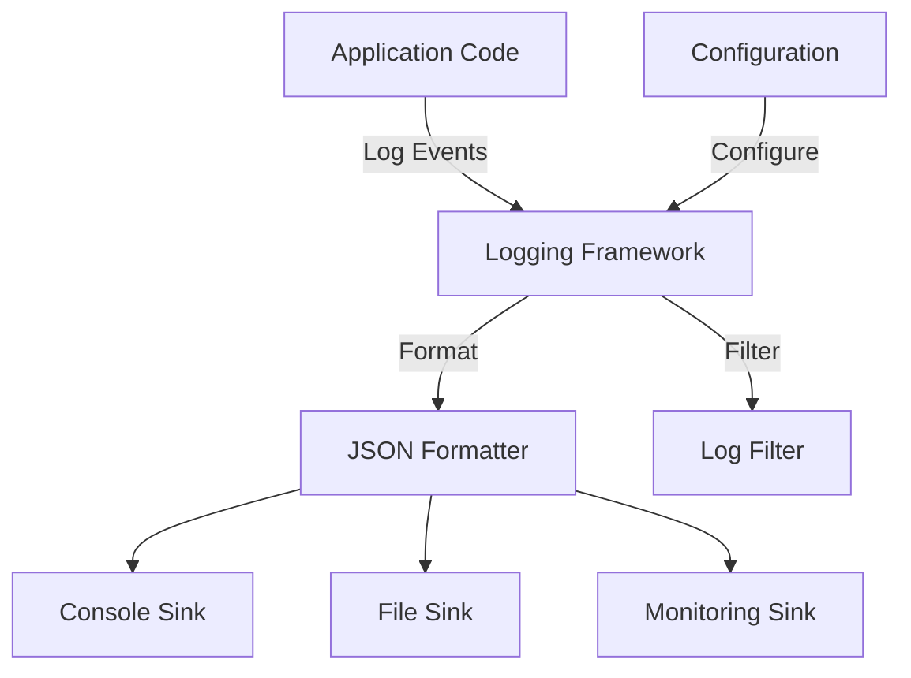

# Structured Logging Framework

## Overview

This document details the structured logging framework implemented across the Agent Orchestration Platform, providing consistent, searchable, and analyzable logs for monitoring, debugging, and audit purposes.

## Core Concepts



## Structured Log Format

```json
{
  "timestamp": "2023-06-15T12:34:56.789Z",
  "level": "INFO",
  "service": "memory_service",
  "trace_id": "a1b2c3d4e5f6g7h8i9j0",
  "span_id": "1a2b3c4d5e6f7g8h",
  "user_id": "user-123",
  "event": "memory_retrieved",
  "duration_ms": 45,
  "message": "Successfully retrieved memory",
  "context": {
    "memory_id": "mem-456",
    "query": "project planning",
    "result_count": 3
  }
}
```

## Logging Service Implementation

```python
import json
import logging
import sys
import time
import uuid
from datetime import datetime
from typing import Dict, Any, Optional, List
import threading
import contextvars
from functools import wraps

# Context variables for trace and span IDs
current_trace_id = contextvars.ContextVar('current_trace_id', default=None)
current_span_id = contextvars.ContextVar('current_span_id', default=None)
current_user_id = contextvars.ContextVar('current_user_id', default=None)
current_service = contextvars.ContextVar('current_service', default=None)

class StructuredLogRecord(logging.LogRecord):
    """Extended LogRecord with structured logging capabilities."""
    
    def __init__(self, *args, **kwargs):
        super().__init__(*args, **kwargs)
        
        # Add trace context
        self.trace_id = current_trace_id.get()
        self.span_id = current_span_id.get()
        self.user_id = current_user_id.get()
        self.service = current_service.get()
        
        # Initialize context and event
        self.context = {}
        self.event = None
        self.duration_ms = None

class StructuredLogger(logging.Logger):
    """Logger with structured logging capabilities."""
    
    def __init__(self, name, level=logging.NOTSET):
        super().__init__(name, level)
    
    def _log_structured(self, level, event=None, message=None, duration_ms=None, context=None, exc_info=None, stack_info=False, stacklevel=1, extra=None):
        """Log a structured log entry.
        
        Args:
            level: Log level
            event: Event name
            message: Log message
            duration_ms: Duration in milliseconds
            context: Additional context
            exc_info: Exception info
            stack_info: Whether to include stack info
            stacklevel: Stack level
            extra: Extra info
        """
        if self.isEnabledFor(level):
            # Create record
            record = self.makeRecord(
                self.name, level, "(unknown file)", 0, message, (), 
                exc_info, "(unknown func)", extra
            )
            
            # Add structured info
            record.event = event
            record.duration_ms = duration_ms
            record.context = context or {}
            
            # Add extra if provided
            if extra:
                for key, value in extra.items():
                    setattr(record, key, value)
            
            # Process and emit
            self.handle(record)
    
    def info_event(self, event, message=None, context=None, duration_ms=None, **kwargs):
        """Log an info-level event.
        
        Args:
            event: Event name
            message: Log message
            context: Additional context
            duration_ms: Duration in milliseconds
            **kwargs: Additional keyword arguments
        """
        self._log_structured(logging.INFO, event, message, duration_ms, context, **kwargs)
    
    def error_event(self, event, message=None, context=None, duration_ms=None, exc_info=None, **kwargs):
        """Log an error-level event.
        
        Args:
            event: Event name
            message: Log message
            context: Additional context
            duration_ms: Duration in milliseconds
            exc_info: Exception info
            **kwargs: Additional keyword arguments
        """
        self._log_structured(logging.ERROR, event, message, duration_ms, context, exc_info=exc_info, **kwargs)
    
    def warning_event(self, event, message=None, context=None, duration_ms=None, **kwargs):
        """Log a warning-level event.
        
        Args:
            event: Event name
            message: Log message
            context: Additional context
            duration_ms: Duration in milliseconds
            **kwargs: Additional keyword arguments
        """
        self._log_structured(logging.WARNING, event, message, duration_ms, context, **kwargs)
    
    def debug_event(self, event, message=None, context=None, duration_ms=None, **kwargs):
        """Log a debug-level event.
        
        Args:
            event: Event name
            message: Log message
            context: Additional context
            duration_ms: Duration in milliseconds
            **kwargs: Additional keyword arguments
        """
        self._log_structured(logging.DEBUG, event, message, duration_ms, context, **kwargs)

class JsonFormatter(logging.Formatter):
    """Formatter that outputs JSON strings."""
    
    def __init__(self, fmt=None, datefmt=None, style='%', sanitize=True):
        """Initialize the formatter.
        
        Args:
            fmt: Format string
            datefmt: Date format string
            style: Style string
            sanitize: Whether to sanitize sensitive data
        """
        super().__init__(fmt, datefmt, style)
        self.sanitize = sanitize
    
    def format(self, record):
        """Format the record as JSON.
        
        Args:
            record: Log record
            
        Returns:
            JSON string
        """
        # Create base log object
        log_object = {
            "timestamp": datetime.utcnow().isoformat() + "Z",
            "level": record.levelname,
            "message": record.getMessage(),
            "logger": record.name
        }
        
        # Add trace context if available
        if hasattr(record, 'trace_id') and record.trace_id:
            log_object["trace_id"] = record.trace_id
        
        if hasattr(record, 'span_id') and record.span_id:
            log_object["span_id"] = record.span_id
        
        if hasattr(record, 'user_id') and record.user_id:
            log_object["user_id"] = record.user_id
        
        if hasattr(record, 'service') and record.service:
            log_object["service"] = record.service
        
        # Add structured info if available
        if hasattr(record, 'event') and record.event:
            log_object["event"] = record.event
        
        if hasattr(record, 'duration_ms') and record.duration_ms is not None:
            log_object["duration_ms"] = record.duration_ms
        
        if hasattr(record, 'context') and record.context:
            # Sanitize context if needed
            context = record.context
            if self.sanitize:
                context = self._sanitize_data(context)
            
            log_object["context"] = context
        
        # Add exception info if available
        if record.exc_info:
            log_object["exception"] = {
                "type": record.exc_info[0].__name__,
                "message": str(record.exc_info[1]),
                "traceback": self.formatException(record.exc_info)
            }
        
        # Add any extra attributes
        for key, value in record.__dict__.items():
            if key not in ['args', 'asctime', 'created', 'exc_info', 'exc_text', 'filename',
                          'funcName', 'id', 'levelname', 'levelno', 'lineno', 'module',
                          'msecs', 'message', 'msg', 'name', 'pathname', 'process',
                          'processName', 'relativeCreated', 'stack_info', 'thread', 'threadName',
                          'trace_id', 'span_id', 'user_id', 'service', 'event', 'duration_ms', 'context']:
                log_object[key] = value
        
        return json.dumps(log_object)
    
    def _sanitize_data(self, data):
        """Sanitize sensitive data.
        
        Args:
            data: Data to sanitize
            
        Returns:
            Sanitized data
        """
        if not data:
            return data
            
        if isinstance(data, dict):
            sanitized = {}
            for key, value in data.items():
                # Check for sensitive keys
                if key.lower() in ['password', 'secret', 'token', 'api_key', 'credit_card', 'ssn']:
                    sanitized[key] = '[REDACTED]'
                else:
                    sanitized[key] = self._sanitize_data(value)
            return sanitized
            
        elif isinstance(data, list):
            return [self._sanitize_data(item) for item in data]
            
        else:
            return data

def configure_logging(service_name=None, log_level=logging.INFO, json_output=True, 
                     console_output=True, file_output=False, file_path=None):
    """Configure structured logging.
    
    Args:
        service_name: Name of the service
        log_level: Log level
        json_output: Whether to output JSON
        console_output: Whether to output to console
        file_output: Whether to output to file
        file_path: Path to log file
    """
    # Set service name in context var
    if service_name:
        current_service.set(service_name)
    
    # Replace logger class
    logging.setLoggerClass(StructuredLogger)
    
    # Configure root logger
    root_logger = logging.getLogger()
    root_logger.setLevel(log_level)
    
    # Clear existing handlers
    for handler in root_logger.handlers[:]:
        root_logger.removeHandler(handler)
    
    # Create formatter
    if json_output:
        formatter = JsonFormatter()
    else:
        formatter = logging.Formatter(
            '%(asctime)s [%(levelname)s] %(name)s: %(message)s - '
            'trace_id=%(trace_id)s span_id=%(span_id)s user_id=%(user_id)s'
        )
    
    # Add console handler
    if console_output:
        console_handler = logging.StreamHandler(sys.stdout)
        console_handler.setFormatter(formatter)
        root_logger.addHandler(console_handler)
    
    # Add file handler
    if file_output and file_path:
        file_handler = logging.FileHandler(file_path)
        file_handler.setFormatter(formatter)
        root_logger.addHandler(file_handler)
    
    return root_logger

class LoggingMiddleware:
    """Middleware for request logging and trace context."""
    
    def __init__(self, app, service_name):
        """Initialize the middleware.
        
        Args:
            app: FastAPI app
            service_name: Name of the service
        """
        self.app = app
        self.service_name = service_name
        self.logger = logging.getLogger("api")
    
    async def __call__(self, scope, receive, send):
        """Process a request with logging and trace context.
        
        Args:
            scope: ASGI scope
            receive: ASGI receive function
            send: ASGI send function
        """
        if scope["type"] != "http":
            return await self.app(scope, receive, send)
        
        # Extract request info
        method = scope.get("method", "UNKNOWN")
        path = scope.get("path", "UNKNOWN")
        
        # Get or generate trace ID and span ID
        headers = dict(scope.get("headers", []))
        trace_id = headers.get(b"x-trace-id", None)
        if trace_id:
            trace_id = trace_id.decode("utf-8")
        else:
            trace_id = str(uuid.uuid4())
        
        span_id = str(uuid.uuid4())
        
        # Set trace context
        current_trace_id.set(trace_id)
        current_span_id.set(span_id)
        current_service.set(self.service_name)
        
        # Extract user ID if available
        user_id = None
        for header_name, header_value in headers.items():
            if header_name.lower() == b"x-user-id":
                user_id = header_value.decode("utf-8")
                current_user_id.set(user_id)
                break
        
        # Log request start
        start_time = time.time()
        self.logger.info_event(
            event="http_request_start",
            message=f"{method} {path} started",
            context={
                "method": method,
                "path": path,
                "query_string": scope.get("query_string", b"").decode("utf-8"),
                "client_ip": scope.get("client", ("unknown", 0))[0]
            }
        )
        
        # Intercept the send function to capture response status
        response_status = [None]
        original_send = send
        
        async def send_wrapper(message):
            if message["type"] == "http.response.start":
                response_status[0] = message.get("status", 0)
            return await original_send(message)
        
        try:
            # Process the request
            await self.app(scope, receive, send_wrapper)
        except Exception as e:
            # Log uncaught exception
            self.logger.error_event(
                event="http_request_error",
                message=f"{method} {path} error: {str(e)}",
                exc_info=e,
                context={
                    "method": method,
                    "path": path
                }
            )
            raise
        finally:
            # Calculate duration
            duration_ms = round((time.time() - start_time) * 1000)
            
            # Log request completion
            self.logger.info_event(
                event="http_request_end",
                message=f"{method} {path} completed with status {response_status[0]}",
                duration_ms=duration_ms,
                context={
                    "method": method,
                    "path": path,
                    "status_code": response_status[0]
                }
            )
```

## Logging Decorators

```python
def log_function_call(logger=None):
    """Decorator to log function calls with timing.
    
    Args:
        logger: Logger to use (if None, gets logger with function's module name)
        
    Returns:
        Decorator function
    """
    def decorator(func):
        nonlocal logger
        
        if logger is None:
            logger = logging.getLogger(func.__module__)
        
        @wraps(func)
        def wrapper(*args, **kwargs):
            start_time = time.time()
            
            # Log call start
            logger.debug_event(
                event="function_call_start",
                message=f"Started {func.__name__}",
                context={
                    "function": func.__name__,
                    "args_count": len(args),
                    "kwargs_keys": list(kwargs.keys())
                }
            )
            
            try:
                # Call the function
                result = func(*args, **kwargs)
                
                # Calculate duration
                duration_ms = round((time.time() - start_time) * 1000)
                
                # Log success
                logger.debug_event(
                    event="function_call_end",
                    message=f"Completed {func.__name__}",
                    duration_ms=duration_ms,
                    context={
                        "function": func.__name__,
                        "success": True
                    }
                )
                
                return result
                
            except Exception as e:
                # Calculate duration
                duration_ms = round((time.time() - start_time) * 1000)
                
                # Log error
                logger.error_event(
                    event="function_call_error",
                    message=f"Error in {func.__name__}: {str(e)}",
                    duration_ms=duration_ms,
                    exc_info=e,
                    context={
                        "function": func.__name__,
                        "error_type": e.__class__.__name__
                    }
                )
                
                # Re-raise
                raise
        
        return wrapper
    
    return decorator

def log_async_function_call(logger=None):
    """Decorator to log async function calls with timing.
    
    Args:
        logger: Logger to use (if None, gets logger with function's module name)
        
    Returns:
        Decorator function
    """
    def decorator(func):
        nonlocal logger
        
        if logger is None:
            logger = logging.getLogger(func.__module__)
        
        @wraps(func)
        async def wrapper(*args, **kwargs):
            start_time = time.time()
            
            # Log call start
            logger.debug_event(
                event="function_call_start",
                message=f"Started {func.__name__}",
                context={
                    "function": func.__name__,
                    "args_count": len(args),
                    "kwargs_keys": list(kwargs.keys())
                }
            )
            
            try:
                # Call the function
                result = await func(*args, **kwargs)
                
                # Calculate duration
                duration_ms = round((time.time() - start_time) * 1000)
                
                # Log success
                logger.debug_event(
                    event="function_call_end",
                    message=f"Completed {func.__name__}",
                    duration_ms=duration_ms,
                    context={
                        "function": func.__name__,
                        "success": True
                    }
                )
                
                return result
                
            except Exception as e:
                # Calculate duration
                duration_ms = round((time.time() - start_time) * 1000)
                
                # Log error
                logger.error_event(
                    event="function_call_error",
                    message=f"Error in {func.__name__}: {str(e)}",
                    duration_ms=duration_ms,
                    exc_info=e,
                    context={
                        "function": func.__name__,
                        "error_type": e.__class__.__name__
                    }
                )
                
                # Re-raise
                raise
        
        return wrapper
    
    return decorator
```

## Integration with Trace Context

```python
class TraceContext:
    """Context manager for trace context."""
    
    def __init__(self, trace_id=None, span_id=None, user_id=None, service=None):
        """Initialize the trace context.
        
        Args:
            trace_id: Trace ID
            span_id: Span ID
            user_id: User ID
            service: Service name
        """
        self.trace_id = trace_id or str(uuid.uuid4())
        self.span_id = span_id or str(uuid.uuid4())
        self.user_id = user_id
        self.service = service
        
        # Store previous values
        self.prev_trace_id = None
        self.prev_span_id = None
        self.prev_user_id = None
        self.prev_service = None
    
    def __enter__(self):
        """Enter the context, setting trace context variables."""
        # Store previous values
        self.prev_trace_id = current_trace_id.get()
        self.prev_span_id = current_span_id.get()
        self.prev_user_id = current_user_id.get()
        self.prev_service = current_service.get()
        
        # Set new values
        current_trace_id.set(self.trace_id)
        current_span_id.set(self.span_id)
        
        if self.user_id is not None:
            current_user_id.set(self.user_id)
            
        if self.service is not None:
            current_service.set(self.service)
        
        return self
    
    def __exit__(self, exc_type, exc_val, exc_tb):
        """Exit the context, restoring previous trace context."""
        # Restore previous values
        current_trace_id.set(self.prev_trace_id)
        current_span_id.set(self.prev_span_id)
        current_user_id.set(self.prev_user_id)
        current_service.set(self.prev_service)

async def async_trace_context(trace_id=None, span_id=None, user_id=None, service=None):
    """Async context manager for trace context.
    
    Args:
        trace_id: Trace ID
        span_id: Span ID
        user_id: User ID
        service: Service name
        
    Returns:
        Async context manager
    """
    trace_id = trace_id or str(uuid.uuid4())
    span_id = span_id or str(uuid.uuid4())
    
    # Store previous values
    prev_trace_id = current_trace_id.get()
    prev_span_id = current_span_id.get()
    prev_user_id = current_user_id.get()
    prev_service = current_service.get()
    
    # Set new values
    current_trace_id.set(trace_id)
    current_span_id.set(span_id)
    
    if user_id is not None:
        current_user_id.set(user_id)
        
    if service is not None:
        current_service.set(service)
    
    try:
        yield {
            "trace_id": trace_id,
            "span_id": span_id,
            "user_id": user_id,
            "service": service
        }
    finally:
        # Restore previous values
        current_trace_id.set(prev_trace_id)
        current_span_id.set(prev_span_id)
        current_user_id.set(prev_user_id)
        current_service.set(prev_service)
```

## Usage Examples

### Basic Logging

```python
from agent_orchestration.logging import configure_logging

# Configure logging
logger = configure_logging(service_name="memory_service", log_level=logging.INFO)

# Get module logger
logger = logging.getLogger(__name__)

# Log events
logger.info_event(
    event="memory_created",
    message="Memory created successfully",
    context={
        "memory_id": "mem-123",
        "user_id": "user-456",
        "tags": ["important", "work"]
    }
)

# Log errors
try:
    # Some operation
    raise ValueError("Invalid memory format")
except Exception as e:
    logger.error_event(
        event="memory_creation_failed",
        message="Failed to create memory",
        exc_info=e,
        context={
            "user_id": "user-456",
            "content_length": 1024
        }
    )
```

### Using Trace Context

```python
from agent_orchestration.logging import TraceContext, log_function_call

logger = logging.getLogger(__name__)

@log_function_call()
def process_memory(memory_id, user_id):
    """Process a memory."""
    # This function call is logged with timing
    with TraceContext(user_id=user_id, service="memory_processor"):
        # All logs in this context will have the same trace context
        logger.info_event(
            event="memory_processing_started",
            message=f"Started processing memory {memory_id}",
            context={"memory_id": memory_id}
        )
        
        # Do processing
        result = memory_service.get_memory(memory_id)
        
        logger.info_event(
            event="memory_processing_completed",
            message=f"Completed processing memory {memory_id}",
            context={"memory_id": memory_id, "result_size": len(result)}
        )
        
        return result
```

### In FastAPI Endpoints

```python
from fastapi import FastAPI, Depends, HTTPException
from agent_orchestration.logging import LoggingMiddleware, log_async_function_call

app = FastAPI()

# Add logging middleware
app.add_middleware(LoggingMiddleware, service_name="api_service")

# Module logger
logger = logging.getLogger(__name__)

@app.post("/memories")
@log_async_function_call()
async def create_memory(request: MemoryRequest):
    """Create a new memory."""
    try:
        # This is automatically logged by the decorator
        memory_id = await memory_service.add_memory(
            content=request.content,
            user_id=request.user_id,
            tags=request.tags
        )
        
        # Log successful creation
        logger.info_event(
            event="memory_created_api",
            message="Memory created via API",
            context={
                "memory_id": memory_id,
                "user_id": request.user_id,
                "content_length": len(request.content)
            }
        )
        
        return {"memory_id": memory_id}
        
    except ValidationError as e:
        # Log validation error
        logger.warning_event(
            event="memory_validation_failed",
            message="Memory validation failed",
            context={
                "user_id": request.user_id,
                "validation_errors": e.field_errors
            }
        )
        
        raise HTTPException(status_code=400, detail=str(e))
```

## Log Aggregation and Analysis

Logs are aggregated and analyzed using:

1. **Log Aggregation**: Collected and centralized with tools like Elasticsearch, Logstash, and Kibana (ELK stack)
2. **Structured Querying**: Analyzed with JSON queries for specific event types, errors, or patterns
3. **Dashboards**: Visualized with Kibana dashboards for monitoring service health and error rates
4. **Alerts**: Monitored for specific error patterns or thresholds to trigger alerts

## Best Practices

1. **Use Structured Events**
   - Define specific event names for major operations
   - Include relevant context with each log
   - Use consistent event naming patterns (e.g., `entity_action`)

2. **Include Trace Context**
   - Always propagate trace IDs between services
   - Use span IDs for individual operations
   - Include user context when available

3. **Performance Considerations**
   - Log at appropriate levels (info for normal operations, debug for details)
   - Use sampled logging for high-volume debug logs
   - Consider asynchronous logging for high-throughput services

4. **Security and Privacy**
   - Always sanitize sensitive information
   - Never log credentials or personal data
   - Follow data retention policies for logs

5. **Monitoring and Alerting**
   - Set up alerts for unusual error rates
   - Monitor critical business operations
   - Track performance metrics from logs

6. **Integration with Other Systems**
   - Connect logs to monitoring systems
   - Integrate with error tracking services
   - Correlate logs with metrics and traces
