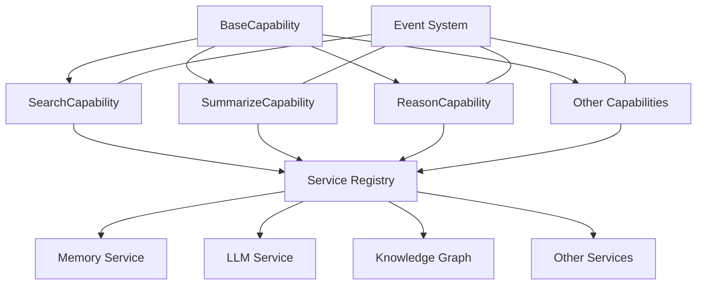

# Agent Capabilities Integration

## Overview

This document details how agent capabilities integrate with other system components. Capabilities are the functional units that define what an agent can do, with each capability following a standardized implementation pattern for consistent integration.

## Capability Architecture



## BaseCapability Implementation

All capabilities inherit from a common base class that provides standardized lifecycle management:

```python
from abc import ABC, abstractmethod
from pydantic import BaseModel
from typing import Any, Dict, Protocol, Optional, Type, TypeVar

T = TypeVar('T', bound=BaseModel)
R = TypeVar('R', bound=Dict[str, Any])

class EventPublisherProtocol(Protocol):
    """Protocol for event publishing."""
    
    async def publish(self, event_type: str, payload: Dict[str, Any]) -> None:
        """Publish an event."""
        ...

class BaseCapability(ABC):
    """Base class for all agent capabilities."""
    
    def __init__(self, service_registry):
        self.service_registry = service_registry
        self.event_publisher = service_registry.get("event_publisher")
        
    @abstractmethod
    async def execute(self, params: Any) -> Dict[str, Any]:
        """Execute the capability with given parameters."""
        pass
    
    def get_parameter_model(self) -> Optional[Type[BaseModel]]:
        """Get the Pydantic model for parameter validation."""
        return None
    
    async def execute_with_lifecycle(self, capability_id: str, params: Dict[str, Any]) -> Dict[str, Any]:
        """Execute capability with lifecycle event handling."""
        # Validate parameters if model exists
        param_model = self.get_parameter_model()
        if param_model:
            validated_params = param_model(**params)
            params = validated_params.dict()
        
        # Track execution metrics
        execution_id = str(uuid.uuid4())
        start_time = time.time()
        
        # Publish execution started event
        await self.event_publisher.publish(
            event_type="capability.execution.started", 
            payload={
                "execution_id": execution_id,
                "capability_id": capability_id,
                "params": self._sanitize_params(params),
                "timestamp": datetime.now().isoformat()
            }
        )
        
        try:
            # Execute capability
            result = await self.execute(params if not param_model else validated_params)
            
            # Calculate execution time
            execution_time = time.time() - start_time
            
            # Publish execution completed event
            await self.event_publisher.publish(
                event_type="capability.execution.completed",
                payload={
                    "execution_id": execution_id,
                    "capability_id": capability_id,
                    "execution_time": execution_time,
                    "result_summary": self._summarize_result(result),
                    "timestamp": datetime.now().isoformat()
                }
            )
            
            return result
            
        except Exception as e:
            # Calculate execution time
            execution_time = time.time() - start_time
            
            # Publish execution failed event
            await self.event_publisher.publish(
                event_type="capability.execution.failed",
                payload={
                    "execution_id": execution_id,
                    "capability_id": capability_id,
                    "execution_time": execution_time,
                    "error": str(e),
                    "error_type": type(e).__name__,
                    "timestamp": datetime.now().isoformat()
                }
            )
            
            # Re-raise with additional context
            raise CapabilityExecutionError(str(e), capability_id=capability_id) from e
    
    def _sanitize_params(self, params: Dict[str, Any]) -> Dict[str, Any]:
        """Remove sensitive information from parameters for event logging."""
        # Deep copy to avoid modifying original
        sanitized = copy.deepcopy(params)
        
        # Remove sensitive fields (customize based on capability needs)
        sensitive_fields = ["api_key", "password", "token", "secret"]
        return self._redact_sensitive_fields(sanitized, sensitive_fields)
    
    def _redact_sensitive_fields(self, obj: Any, sensitive_fields: list) -> Any:
        """Recursively redact sensitive fields."""
        if isinstance(obj, dict):
            for key in list(obj.keys()):
                if key.lower() in [f.lower() for f in sensitive_fields]:
                    obj[key] = "[REDACTED]"
                else:
                    obj[key] = self._redact_sensitive_fields(obj[key], sensitive_fields)
        elif isinstance(obj, list):
            for i, item in enumerate(obj):
                obj[i] = self._redact_sensitive_fields(item, sensitive_fields)
        
        return obj
    
    def _summarize_result(self, result: Dict[str, Any]) -> Dict[str, Any]:
        """Create a summary of the result for event logging."""
        # Default implementation - override for specific capabilities
        summary = {}
        
        # Include status if present
        if "status" in result:
            summary["status"] = result["status"]
        
        # Include count of items if present
        for key in ["count", "total", "items"]:
            if key in result and isinstance(result[key], (int, list)):
                summary[key] = len(result[key]) if isinstance(result[key], list) else result[key]
        
        return summary
```

## SearchCapability Implementation

Example of a fully integrated capability for searching:

```python
from pydantic import BaseModel, Field
from typing import List, Dict, Any, Optional

class SearchParams(BaseModel):
    """Parameters for search capability."""
    query: str = Field(..., description="The search query")
    user_id: Optional[str] = Field(None, description="User ID to filter results")
    agent_id: Optional[str] = Field(None, description="Agent ID to filter results")
    limit: int = Field(10, description="Maximum number of results to return")
    include_metadata: bool = Field(True, description="Whether to include metadata in results")

class SearchCapability(BaseCapability):
    """Capability for searching memories and knowledge."""
    
    def __init__(self, service_registry):
        super().__init__(service_registry)
        self.memory_service = service_registry.get("memory_service")
        self.knowledge_graph = service_registry.get("knowledge_graph_service")
        self.metrics_service = service_registry.get("metrics_service")
    
    def get_parameter_model(self) -> Type[BaseModel]:
        """Get the Pydantic model for parameter validation."""
        return SearchParams
    
    async def execute(self, params: SearchParams) -> Dict[str, Any]:
        """Execute the search capability."""
        search_start = time.time()
        
        # Create filters for memory search
        filters = {}
        if params.user_id:
            filters["user_id"] = params.user_id
        if params.agent_id:
            filters["agent_id"] = params.agent_id
        
        # Search memories
        memories = await self.memory_service.search_memories(
            query=params.query,
            filters=filters,
            limit=params.limit
        )
        
        # Search knowledge graph in parallel if available
        knowledge_results = []
        if self.knowledge_graph:
            try:
                knowledge_results = await self.knowledge_graph.search(
                    query=params.query,
                    filters=filters,
                    limit=params.limit
                )
            except Exception as e:
                # Log error but continue with memory results
                logger.error(f"Knowledge graph search failed: {e}")
        
        # Merge and rank results
        combined_results = self._merge_search_results(
            memories=memories,
            knowledge_results=knowledge_results,
            limit=params.limit
        )
        
        # Track metrics
        search_time = time.time() - search_start
        await self.metrics_service.record_metric(
            metric_name="search_execution_time",
            value=search_time,
            dimensions={
                "user_id": params.user_id,
                "agent_id": params.agent_id
            }
        )
        
        # Prepare response
        response = {
            "results": combined_results,
            "count": len(combined_results),
            "query": params.query,
            "execution_time": search_time
        }
        
        # Optionally filter out metadata
        if not params.include_metadata:
            for result in response["results"]:
                if "metadata" in result:
                    del result["metadata"]
        
        return response
    
    def _merge_search_results(self, memories, knowledge_results, limit):
        """Merge and rank results from multiple sources."""
        # Normalize result format
        normalized_memories = [{
            "id": m["memory_id"],
            "content": m["content"],
            "score": m["score"],
            "source": "memory",
            "metadata": m.get("metadata", {})
        } for m in memories]
        
        normalized_knowledge = [{
            "id": k["id"],
            "content": k["content"],
            "score": k["score"],
            "source": "knowledge_graph",
            "metadata": k.get("metadata", {})
        } for k in knowledge_results]
        
        # Combine and sort by score
        combined = normalized_memories + normalized_knowledge
        combined.sort(key=lambda x: x["score"], reverse=True)
        
        # Return top results up to limit
        return combined[:limit]
```

## SummarizeCapability Refactoring 

Example of refactoring a capability to align with integration standards:

```python
from pydantic import BaseModel, Field
from typing import List, Dict, Any, Optional

class SummarizeParams(BaseModel):
    """Parameters for summarize capability."""
    content: str = Field(..., description="The content to summarize")
    max_length: Optional[int] = Field(100, description="Maximum length of summary")
    format: str = Field("paragraph", description="Format of the summary (paragraph, bullets, etc.)")
    user_id: Optional[str] = Field(None, description="User ID for context")

class SummarizeCapability(BaseCapability):
    """Capability to summarize content."""
    
    def __init__(self, service_registry):
        super().__init__(service_registry)
        self.llm_service = service_registry.get("llm_service")
        self.metrics_service = service_registry.get("metrics_service")
        
    def get_parameter_model(self) -> Type[BaseModel]:
        """Get the Pydantic model for parameter validation."""
        return SummarizeParams
    
    async def execute(self, params: SummarizeParams) -> Dict[str, Any]:
        """Execute the summarize capability."""
        # For compatibility with existing tests, publish legacy events
        await self.event_publisher.publish(
            event_type="summarize_started",
            payload={
                "content_length": len(params.content),
                "format": params.format
            }
        )
        
        # Generate summary using LLM
        summary = await self.llm_service.summarize_text(
            text=params.content,
            max_length=params.max_length,
            format=params.format
        )
        
        # Track metrics
        await self.metrics_service.record_metric(
            metric_name="summarize_execution",
            value=1,
            dimensions={
                "content_length": len(params.content),
                "summary_length": len(summary),
                "format": params.format
            }
        )
        
        # For compatibility with existing tests, publish legacy event
        await self.event_publisher.publish(
            event_type="summarize_completed",
            payload={
                "content_length": len(params.content),
                "summary_length": len(summary),
                "format": params.format
            }
        )
        
        return {
            "summary": summary,
            "original_length": len(params.content),
            "summary_length": len(summary),
            "format": params.format
        }
```

## LLM Integration in Capabilities

Example showing how capabilities integrate with LLM services:

```python
class ReasonCapability(BaseCapability):
    """Capability for logical reasoning and analysis."""
    
    def __init__(self, service_registry):
        super().__init__(service_registry)
        self.llm_service = service_registry.get("llm_service")
        self.memory_service = service_registry.get("memory_service")
        self.cost_tracker = service_registry.get("cost_tracker")
    
    def get_parameter_model(self) -> Type[BaseModel]:
        """Get the Pydantic model for parameter validation."""
        return ReasonParams
    
    async def execute(self, params: ReasonParams) -> Dict[str, Any]:
        """Execute the reasoning capability."""
        # Start tracking costs
        cost_context = await self.cost_tracker.start_tracking(
            user_id=params.user_id,
            tracking_id=str(uuid.uuid4()),
            capability="reason"
        )
        
        try:
            # Build context from memories if needed
            context = ""
            if params.use_memories and params.user_id:
                memories = await self.memory_service.search_memories(
                    query=params.question,
                    filters={"user_id": params.user_id},
                    limit=5
                )
                
                if memories:
                    context = "Relevant context:\n" + "\n".join(
                        [f"- {m['content']}" for m in memories]
                    )
            
            # Prepare prompt
            prompt = self._build_reasoning_prompt(
                question=params.question,
                context=context,
                reasoning_type=params.reasoning_type
            )
            
            # Call LLM
            llm_response = await self.llm_service.generate_text(
                prompt=prompt,
                model=params.model or "default_reasoning_model",
                temperature=params.temperature or 0.2,
                max_tokens=params.max_tokens or 500,
                cost_context=cost_context
            )
            
            # Parse and structure the response
            structured_response = self._parse_reasoning_response(llm_response)
            
            # Optionally store as memory
            if params.store_result and params.user_id:
                await self.memory_service.add_memory(
                    content=f"Question: {params.question}\nReasoning: {structured_response['reasoning']}\nConclusion: {structured_response['conclusion']}",
                    filters={
                        "user_id": params.user_id,
                        "tags": ["reasoning", params.reasoning_type]
                    },
                    metadata={
                        "question": params.question,
                        "reasoning_type": params.reasoning_type
                    }
                )
            
            # Complete cost tracking
            await self.cost_tracker.complete_tracking(
                tracking_id=cost_context.tracking_id,
                status="success"
            )
            
            return {
                "question": params.question,
                "reasoning": structured_response["reasoning"],
                "conclusion": structured_response["conclusion"],
                "confidence": structured_response.get("confidence", 0.0),
                "model_used": params.model or "default_reasoning_model"
            }
            
        except Exception as e:
            # Record failure in cost tracking
            await self.cost_tracker.complete_tracking(
                tracking_id=cost_context.tracking_id,
                status="error",
                error=str(e)
            )
            
            # Re-raise the exception
            raise
```

## Testing Capability Integration

Example of testing capability integration:

```python
class TestSearchCapability:
    """Tests for search capability."""
    
    @pytest.fixture
    def service_registry(self):
        """Create a service registry with mocked services."""
        registry = ServiceRegistry()
        
        # Mock memory service
        memory_service = Mock()
        memory_service.search_memories.return_value = [
            {
                "memory_id": "mem_1",
                "content": "Test memory content",
                "score": 0.95,
                "metadata": {"user_id": "user_1"}
            }
        ]
        
        # Mock knowledge graph service
        knowledge_graph = Mock()
        knowledge_graph.search.return_value = [
            {
                "id": "node_1",
                "content": "Test knowledge content",
                "score": 0.85,
                "metadata": {"type": "concept"}
            }
        ]
        
        # Mock event publisher
        event_publisher = Mock()
        
        # Mock metrics service
        metrics_service = Mock()
        
        # Register services
        registry.register("memory_service", memory_service)
        registry.register("knowledge_graph_service", knowledge_graph)
        registry.register("event_publisher", event_publisher)
        registry.register("metrics_service", metrics_service)
        
        return registry
    
    async def test_search_capability_execution(self, service_registry):
        """Test search capability execution."""
        # Arrange
        capability = SearchCapability(service_registry)
        params = SearchParams(
            query="test query",
            user_id="user_1",
            limit=10
        )
        
        # Act
        result = await capability.execute(params)
        
        # Assert
        assert len(result["results"]) == 2
        assert result["count"] == 2
        assert result["query"] == "test query"
        
        # Verify memory service was called
        memory_service = service_registry.get("memory_service")
        memory_service.search_memories.assert_called_once_with(
            query="test query",
            filters={"user_id": "user_1"},
            limit=10
        )
        
        # Verify knowledge graph was called
        knowledge_graph = service_registry.get("knowledge_graph_service")
        knowledge_graph.search.assert_called_once()
        
        # Verify metrics were recorded
        metrics_service = service_registry.get("metrics_service")
        metrics_service.record_metric.assert_called_once()
    
    async def test_search_capability_with_lifecycle(self, service_registry):
        """Test search capability with lifecycle events."""
        # Arrange
        capability = SearchCapability(service_registry)
        params = {
            "query": "test query",
            "user_id": "user_1"
        }
        
        # Act
        result = await capability.execute_with_lifecycle("search", params)
        
        # Assert
        event_publisher = service_registry.get("event_publisher")
        
        # Verify start event was published
        assert event_publisher.publish.call_count == 2
        
        # Get call arguments for first call (start event)
        start_event_args = event_publisher.publish.call_args_list[0][1]
        assert start_event_args["event_type"] == "capability.execution.started"
        assert start_event_args["payload"]["capability_id"] == "search"
        
        # Get call arguments for second call (complete event)
        complete_event_args = event_publisher.publish.call_args_list[1][1]
        assert complete_event_args["event_type"] == "capability.execution.completed"
        assert complete_event_args["payload"]["capability_id"] == "search"
```

## Capability Registration and Routing

How capabilities are registered and routed to agents:

```python
class CapabilityRegistry:
    """Registry for available capabilities."""
    
    def __init__(self, service_registry):
        self.service_registry = service_registry
        self.capabilities = {}
        
    def register_capability(self, capability_id: str, capability_class: Type[BaseCapability]) -> None:
        """Register a capability class."""
        if capability_id in self.capabilities:
            raise ValueError(f"Capability {capability_id} already registered")
            
        self.capabilities[capability_id] = capability_class
        
    def get_capability(self, capability_id: str) -> BaseCapability:
        """Get an instance of a capability by ID."""
        if capability_id not in self.capabilities:
            raise KeyError(f"Capability {capability_id} not registered")
            
        capability_class = self.capabilities[capability_id]
        return capability_class(self.service_registry)
    
    def list_capabilities(self) -> List[str]:
        """List all registered capability IDs."""
        return list(self.capabilities.keys())
```

```python
class CapabilityRouter:
    """Routes capability requests to appropriate handlers."""
    
    def __init__(self, capability_registry, agent_service):
        self.capability_registry = capability_registry
        self.agent_service = agent_service
        
    async def route_capability_request(self, agent_id: str, capability_id: str, params: Dict[str, Any]) -> Dict[str, Any]:
        """Route a capability request to the appropriate handler."""
        # Check if agent exists
        agent = await self.agent_service.get_agent(agent_id)
        if not agent:
            raise EntityNotFoundError(f"Agent {agent_id} not found")
        
        # Check if agent has the capability
        if capability_id not in agent["capabilities"]:
            raise PermissionError(f"Agent {agent_id} does not have capability {capability_id}")
        
        # Get capability instance
        capability = self.capability_registry.get_capability(capability_id)
        
        # Get agent-specific capability configuration
        capability_config = agent["capabilities"][capability_id]
        
        # Merge params with agent-specific defaults
        if "default_params" in capability_config:
            merged_params = {**capability_config["default_params"], **params}
        else:
            merged_params = params
        
        # Execute capability with lifecycle handling
        return await capability.execute_with_lifecycle(capability_id, merged_params)
```

## Human-in-the-Loop Integration

Example of a capability with human approval:

```python
class ContentGenerationCapability(BaseCapability):
    """Capability for generating content with human approval."""
    
    def __init__(self, service_registry):
        super().__init__(service_registry)
        self.llm_service = service_registry.get("llm_service")
        self.approval_service = service_registry.get("approval_service")
        self.notification_service = service_registry.get("notification_service")
        
    def get_parameter_model(self) -> Type[BaseModel]:
        """Get the Pydantic model for parameter validation."""
        return ContentGenerationParams
    
    async def execute(self, params: ContentGenerationParams) -> Dict[str, Any]:
        """Execute the content generation capability."""
        # Generate content
        generated_content = await self.llm_service.generate_content(
            prompt=params.prompt,
            content_type=params.content_type,
            style=params.style,
            length=params.length
        )
        
        # If human approval is required
        if params.require_approval:
            # Create approval request
            approval_id = await self.approval_service.create_request(
                request_type="content_approval",
                content={
                    "generated_content": generated_content,
                    "prompt": params.prompt,
                    "content_type": params.content_type,
                    "style": params.style
                },
                requestor_id=params.user_id,
                expiration=datetime.now() + timedelta(hours=24)
            )
            
            # Notify approvers
            await self.notification_service.notify_approvers(
                notification_type="content_approval",
                content={
                    "approval_id": approval_id,
                    "content_type": params.content_type,
                    "prompt": params.prompt[:100] + "..." if len(params.prompt) > 100 else params.prompt
                }
            )
            
            return {
                "status": "pending_approval",
                "approval_id": approval_id,
                "preview": generated_content[:100] + "..." if len(generated_content) > 100 else generated_content
            }
        
        # No approval required
        return {
            "status": "completed",
            "content": generated_content
        }
```

## Performance Monitoring

How capabilities integrate with performance monitoring:

```python
class PerformanceMonitoringMiddleware:
    """Middleware to monitor capability performance."""
    
    def __init__(self, metrics_service, tracing_service):
        self.metrics_service = metrics_service
        self.tracing_service = tracing_service
        
    async def __call__(self, capability_id, params, next_handler):
        """Process a capability request with performance monitoring."""
        # Start timing and tracing
        start_time = time.time()
        with self.tracing_service.start_span(f"capability.{capability_id}") as span:
            # Add context to span
            span.set_attributes({
                "capability.id": capability_id,
                "params.keys": ",".join(params.keys())
            })
            
            try:
                # Execute capability
                result = await next_handler(params)
                
                # Record execution time
                execution_time = time.time() - start_time
                
                # Record metrics
                await self.metrics_service.record_metric(
                    name=f"capability.{capability_id}.execution_time",
                    value=execution_time,
                    unit="seconds",
                    attributes={
                        "success": True,
                        "result_size": len(str(result))
                    }
                )
                
                # Return result
                return result
                
            except Exception as e:
                # Record execution time
                execution_time = time.time() - start_time
                
                # Record error metric
                await self.metrics_service.record_metric(
                    name=f"capability.{capability_id}.error",
                    value=1,
                    unit="count",
                    attributes={
                        "error_type": type(e).__name__
                    }
                )
                
                # Record execution time for error case
                await self.metrics_service.record_metric(
                    name=f"capability.{capability_id}.execution_time",
                    value=execution_time,
                    unit="seconds",
                    attributes={
                        "success": False
                    }
                )
                
                # Re-raise exception
                raise
```
