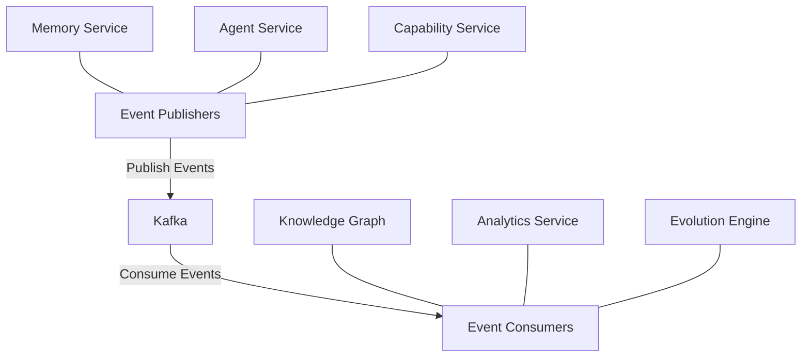

# Event-Driven Architecture

## Overview

This document outlines the event-driven architecture that connects all components within the Agent Orchestration Platform, providing loosely coupled communication and integration between services.

## Core Event System Architecture



## Event Schema and Standards

All events in the system follow a consistent schema:

```python
{
    "event_id": "evt_uuid",              # Unique event identifier
    "event_type": "domain.action.state", # Hierarchical event type
    "timestamp": "2025-03-17T08:45:23Z", # ISO 8601 timestamp
    "source_service": "memory_service",  # Service that generated the event
    "payload": {                         # Event-specific data
        # Event-specific fields
    },
    "metadata": {                        # Cross-cutting concerns
        "user_id": "user_123",           # Associated user if applicable
        "agent_id": "agent_456",         # Associated agent if applicable
        "correlation_id": "corr_789",    # For tracing related events
        "version": "1.0"                 # Schema version
    }
}
```

### Event Naming Convention

Event types follow the hierarchical pattern `domain.action.state`:

- **domain**: The functional area (memory, agent, capability, etc.)
- **action**: The operation being performed (create, update, search, etc.)
- **state**: The lifecycle state (started, completed, failed, etc.)

Examples:
- `memory.create.completed`
- `agent.capability.execution.started`
- `evolution.proposal.validated`

## Event Publisher Implementation

```python
from typing import Dict, Any, Optional
from aiokafka import AIOKafkaProducer
import json
import uuid
from datetime import datetime

class EventPublisher:
    """Service for publishing events to Kafka."""
    
    def __init__(self, bootstrap_servers: str, service_name: str):
        """Initialize the event publisher.
        
        Args:
            bootstrap_servers: Comma-separated list of Kafka bootstrap servers
            service_name: Name of the service publishing events
        """
        self.producer = AIOKafkaProducer(
            bootstrap_servers=bootstrap_servers,
            value_serializer=lambda v: json.dumps(v).encode('utf-8')
        )
        self.service_name = service_name
    
    async def start(self) -> None:
        """Start the event publisher."""
        await self.producer.start()
    
    async def stop(self) -> None:
        """Stop the event publisher."""
        await self.producer.stop()
    
    async def publish(
        self, 
        event_type: str, 
        payload: Dict[str, Any], 
        metadata: Optional[Dict[str, Any]] = None,
        correlation_id: Optional[str] = None
    ) -> str:
        """Publish an event to Kafka.
        
        Args:
            event_type: Type of the event following domain.action.state pattern
            payload: Event payload data
            metadata: Additional metadata for the event
            correlation_id: Optional ID to correlate related events
            
        Returns:
            The event ID
        """
        event_id = str(uuid.uuid4())
        
        event = {
            "event_id": event_id,
            "event_type": event_type,
            "timestamp": datetime.utcnow().isoformat() + "Z",
            "source_service": self.service_name,
            "payload": payload,
            "metadata": metadata or {}
        }
        
        # Add correlation ID if provided
        if correlation_id:
            event["metadata"]["correlation_id"] = correlation_id
        
        # Determine topic from event type (first segment)
        topic = event_type.split('.')[0]
        
        # Publish event
        await self.producer.send_and_wait(topic, event)
        
        return event_id
```

## Event Consumer Implementation

```python
from typing import Dict, Any, List, Callable, Awaitable
from aiokafka import AIOKafkaConsumer
import json
import logging
import asyncio

EventHandler = Callable[[Dict[str, Any]], Awaitable[None]]

class EventConsumer:
    """Service for consuming events from Kafka."""
    
    def __init__(self, bootstrap_servers: str, group_id: str):
        """Initialize the event consumer.
        
        Args:
            bootstrap_servers: Comma-separated list of Kafka bootstrap servers
            group_id: Consumer group ID for this consumer
        """
        self.bootstrap_servers = bootstrap_servers
        self.group_id = group_id
        self.consumer = None
        self.running = False
        self.handlers: Dict[str, List[EventHandler]] = {}
        self.logger = logging.getLogger(__name__)
    
    async def start(self, topics: List[str]) -> None:
        """Start the event consumer.
        
        Args:
            topics: List of topics to subscribe to
        """
        if self.running:
            return
            
        self.consumer = AIOKafkaConsumer(
            *topics,
            bootstrap_servers=self.bootstrap_servers,
            group_id=self.group_id,
            value_deserializer=lambda m: json.loads(m.decode('utf-8'))
        )
        
        await self.consumer.start()
        self.running = True
        
        # Start processing task
        asyncio.create_task(self._process_events())
    
    async def stop(self) -> None:
        """Stop the event consumer."""
        if self.running and self.consumer:
            self.running = False
            await self.consumer.stop()
    
    def register_handler(self, event_type: str, handler: EventHandler) -> None:
        """Register a handler for a specific event type.
        
        Args:
            event_type: Type of event to handle
            handler: Async function to handle the event
        """
        if event_type not in self.handlers:
            self.handlers[event_type] = []
            
        self.handlers[event_type].append(handler)
    
    async def _process_events(self) -> None:
        """Process events from Kafka."""
        try:
            async for message in self.consumer:
                try:
                    event = message.value
                    event_type = event.get("event_type")
                    
                    if not event_type:
                        self.logger.warning(f"Received event without event_type: {event}")
                        continue
                    
                    # Find handlers for this event type
                    handlers = self._get_matching_handlers(event_type)
                    
                    if not handlers:
                        self.logger.debug(f"No handlers registered for event type: {event_type}")
                        continue
                    
                    # Process event with all matching handlers
                    tasks = [handler(event) for handler in handlers]
                    await asyncio.gather(*tasks, return_exceptions=True)
                    
                except Exception as e:
                    self.logger.error(f"Error processing event: {e}")
        except Exception as e:
            if self.running:
                self.logger.error(f"Event processing loop error: {e}")
    
    def _get_matching_handlers(self, event_type: str) -> List[EventHandler]:
        """Get handlers that match the event type.
        
        Supports exact matches and wildcard subscriptions.
        
        Args:
            event_type: Type of event to find handlers for
            
        Returns:
            List of handlers that match the event type
        """
        handlers = []
        
        # Add exact match handlers
        if event_type in self.handlers:
            handlers.extend(self.handlers[event_type])
        
        # Add wildcard handlers
        parts = event_type.split('.')
        for i in range(len(parts)):
            wildcard = '.'.join(parts[:i]) + '.*'
            if wildcard in self.handlers:
                handlers.extend(self.handlers[wildcard])
        
        return handlers
```

## Event Registration Service

```python
from typing import Dict, Any, List, Callable, Awaitable
import logging

class EventRegistry:
    """Central registry for event schemas and validation."""
    
    def __init__(self):
        """Initialize the event registry."""
        self.schemas: Dict[str, Dict[str, Any]] = {}
        self.logger = logging.getLogger(__name__)
    
    def register_schema(self, event_type: str, schema: Dict[str, Any]) -> None:
        """Register a schema for an event type.
        
        Args:
            event_type: Type of event
            schema: JSON Schema for validating the event payload
        """
        self.schemas[event_type] = schema
        self.logger.info(f"Registered schema for event type: {event_type}")
    
    def get_schema(self, event_type: str) -> Dict[str, Any]:
        """Get the schema for an event type.
        
        Args:
            event_type: Type of event
            
        Returns:
            JSON Schema for the event type
        """
        # Try exact match
        if event_type in self.schemas:
            return self.schemas[event_type]
        
        # Try pattern match (for wildcards)
        for pattern, schema in self.schemas.items():
            if self._match_pattern(event_type, pattern):
                return schema
        
        # Return base schema if no specific schema found
        return self._get_base_schema()
    
    def _match_pattern(self, event_type: str, pattern: str) -> bool:
        """Check if an event type matches a pattern.
        
        Args:
            event_type: Type of event
            pattern: Pattern to match against
            
        Returns:
            True if the event type matches the pattern
        """
        if pattern == '*':
            return True
            
        pattern_parts = pattern.split('.')
        event_parts = event_type.split('.')
        
        if len(pattern_parts) != len(event_parts):
            return False
            
        for p, e in zip(pattern_parts, event_parts):
            if p != '*' and p != e:
                return False
                
        return True
    
    def _get_base_schema(self) -> Dict[str, Any]:
        """Get the base schema for all events.
        
        Returns:
            Base JSON Schema for all events
        """
        return {
            "type": "object",
            "required": ["event_id", "event_type", "timestamp", "source_service", "payload"],
            "properties": {
                "event_id": {"type": "string"},
                "event_type": {"type": "string"},
                "timestamp": {"type": "string", "format": "date-time"},
                "source_service": {"type": "string"},
                "payload": {"type": "object"},
                "metadata": {"type": "object"}
            }
        }
```

## Common Event Types

The platform defines several core event types used across multiple services:

### Memory Events

| Event Type | Description | Key Payload Fields |
|------------|-------------|-------------------|
| `memory.created` | New memory created | memory_id, content, filters |
| `memory.updated` | Existing memory updated | memory_id, updated_fields |
| `memory.searched` | Memory search performed | query, filters, result_count |
| `memory.entity.extracted` | Entities extracted from memory | memory_id, entities, relationships |

### Agent Events

| Event Type | Description | Key Payload Fields |
|------------|-------------|-------------------|
| `agent.created` | New agent created | agent_id, capabilities |
| `agent.updated` | Agent configuration updated | agent_id, updated_fields |
| `agent.capability.execution.started` | Agent starts executing capability | agent_id, capability_id, execution_id |
| `agent.capability.execution.completed` | Capability execution completed | agent_id, capability_id, execution_id, result_summary |
| `agent.capability.execution.failed` | Capability execution failed | agent_id, capability_id, execution_id, error |

### Evolution Events

| Event Type | Description | Key Payload Fields |
|------------|-------------|-------------------|
| `evolution.pattern.detected` | System detected a pattern | pattern_type, confidence, data_points |
| `evolution.proposal.generated` | Evolution proposal created | proposal_id, proposal_type, description |
| `evolution.proposal.validated` | Proposal validated | proposal_id, validation_result, score |
| `evolution.implementation.started` | Implementation of proposal started | proposal_id, implementation_id |
| `evolution.implementation.completed` | Implementation completed | proposal_id, implementation_id, changes |

## Integration Patterns with Events

### Circuit Breaker Pattern

```python
class ServiceCircuitBreaker:
    """Circuit breaker for service calls."""
    
    def __init__(self, service_name: str, event_publisher, failure_threshold: int = 5, 
                 reset_timeout: int = 60):
        """Initialize the circuit breaker.
        
        Args:
            service_name: Name of the service to protect
            event_publisher: Event publisher for circuit breaker events
            failure_threshold: Number of failures before opening circuit
            reset_timeout: Seconds to wait before attempting reset
        """
        self.service_name = service_name
        self.event_publisher = event_publisher
        self.failure_threshold = failure_threshold
        self.reset_timeout = reset_timeout
        
        self.failure_count = 0
        self.state = "CLOSED"  # CLOSED, OPEN, HALF_OPEN
        self.last_failure_time = 0
    
    async def execute(self, func, *args, **kwargs):
        """Execute a function with circuit breaker protection.
        
        Args:
            func: Function to execute
            *args: Arguments for the function
            **kwargs: Keyword arguments for the function
            
        Returns:
            Result of the function
            
        Raises:
            CircuitBreakerOpenError: If circuit is open
            Any exceptions from the function
        """
        if self.state == "OPEN":
            # Check if reset timeout has elapsed
            if time.time() - self.last_failure_time > self.reset_timeout:
                self.state = "HALF_OPEN"
                await self.event_publisher.publish(
                    event_type="circuit_breaker.state.changed",
                    payload={
                        "service_name": self.service_name,
                        "previous_state": "OPEN",
                        "current_state": "HALF_OPEN"
                    }
                )
            else:
                await self.event_publisher.publish(
                    event_type="circuit_breaker.call.rejected",
                    payload={
                        "service_name": self.service_name,
                        "state": self.state
                    }
                )
                raise CircuitBreakerOpenError(f"Circuit for {self.service_name} is OPEN")
        
        try:
            result = await func(*args, **kwargs)
            
            # Success - reset failure count if half-open
            if self.state == "HALF_OPEN":
                self.state = "CLOSED"
                self.failure_count = 0
                await self.event_publisher.publish(
                    event_type="circuit_breaker.state.changed",
                    payload={
                        "service_name": self.service_name,
                        "previous_state": "HALF_OPEN",
                        "current_state": "CLOSED"
                    }
                )
                
            return result
            
        except Exception as e:
            # Record failure
            self.failure_count += 1
            self.last_failure_time = time.time()
            
            # Publish failure event
            await self.event_publisher.publish(
                event_type="circuit_breaker.call.failed",
                payload={
                    "service_name": self.service_name,
                    "failure_count": self.failure_count,
                    "error": str(e)
                }
            )
            
            # Check if threshold reached
            if (self.state == "CLOSED" and self.failure_count >= self.failure_threshold) or \
               self.state == "HALF_OPEN":
                previous_state = self.state
                self.state = "OPEN"
                await self.event_publisher.publish(
                    event_type="circuit_breaker.state.changed",
                    payload={
                        "service_name": self.service_name,
                        "previous_state": previous_state,
                        "current_state": "OPEN",
                        "failure_count": self.failure_count
                    }
                )
            
            raise
```

### Outbox Pattern

The Outbox pattern ensures reliable event publishing even when database transactions fail:

```python
class EventOutbox:
    """Implementation of the outbox pattern for reliable event publishing."""
    
    def __init__(self, db_pool, event_publisher):
        """Initialize the event outbox.
        
        Args:
            db_pool: Database connection pool
            event_publisher: Event publisher for sending events
        """
        self.db_pool = db_pool
        self.event_publisher = event_publisher
    
    async def store_event(self, event_type: str, payload: Dict[str, Any], 
                         metadata: Dict[str, Any] = None) -> str:
        """Store an event in the outbox for reliable publishing.
        
        Args:
            event_type: Type of the event
            payload: Event payload
            metadata: Event metadata
            
        Returns:
            The event ID
        """
        event_id = str(uuid.uuid4())
        timestamp = datetime.utcnow().isoformat() + "Z"
        
        async with self.db_pool.acquire() as conn:
            async with conn.transaction():
                # Store event in outbox table
                await conn.execute(
                    """
                    INSERT INTO event_outbox 
                    (event_id, event_type, payload, metadata, timestamp, status)
                    VALUES ($1, $2, $3, $4, $5, $6)
                    """,
                    event_id,
                    event_type,
                    json.dumps(payload),
                    json.dumps(metadata or {}),
                    timestamp,
                    "pending"
                )
        
        return event_id
    
    async def process_outbox(self) -> int:
        """Process pending events in the outbox.
        
        Returns:
            Number of events processed
        """
        processed_count = 0
        
        async with self.db_pool.acquire() as conn:
            # Get pending events
            results = await conn.fetch(
                """
                SELECT event_id, event_type, payload, metadata, timestamp
                FROM event_outbox
                WHERE status = 'pending'
                ORDER BY timestamp
                LIMIT 100
                """
            )
            
            for row in results:
                try:
                    # Publish event
                    await self.event_publisher.publish(
                        event_type=row['event_type'],
                        payload=json.loads(row['payload']),
                        metadata=json.loads(row['metadata'])
                    )
                    
                    # Mark as published
                    await conn.execute(
                        """
                        UPDATE event_outbox
                        SET status = 'published', published_at = $1
                        WHERE event_id = $2
                        """,
                        datetime.utcnow().isoformat() + "Z",
                        row['event_id']
                    )
                    
                    processed_count += 1
                    
                except Exception as e:
                    # Mark as failed
                    await conn.execute(
                        """
                        UPDATE event_outbox
                        SET status = 'failed', error = $1, retry_count = retry_count + 1
                        WHERE event_id = $2
                        """,
                        str(e),
                        row['event_id']
                    )
        
        return processed_count
```

## Testing Event-Driven Integrations

Approaches for testing the event-driven architecture:

### Unit Testing Event Handlers

```python
async def test_memory_entity_extraction_handler():
    """Test the memory entity extraction event handler."""
    # Arrange
    mock_graph_repo = Mock()
    mock_graph_repo.upsert_entity.return_value = "entity_123"
    mock_graph_repo.find_entity_id.return_value = "entity_123"
    
    mock_publisher = Mock()
    
    knowledge_graph_service = KnowledgeGraphService(
        graph_repository=mock_graph_repo,
        event_publisher=mock_publisher
    )
    
    test_event = {
        "event_id": "evt_test",
        "event_type": "memory.entity.extracted",
        "memory_id": "mem_test",
        "entities": [
            {
                "name": "test_entity",
                "type": "test_type",
                "confidence": 0.95
            }
        ],
        "relationships": [
            {
                "source": "test_entity",
                "target": "other_entity",
                "type": "related_to",
                "confidence": 0.9
            }
        ]
    }
    
    # Act
    await knowledge_graph_service.handle_entity_extraction(test_event)
    
    # Assert
    mock_graph_repo.upsert_entity.assert_called_once()
    mock_graph_repo.find_entity_id.assert_called()
    mock_graph_repo.create_relationship.assert_called_once()
    mock_publisher.publish.assert_called_once()
```

### Integration Testing with In-Memory Event Bus

```python
class InMemoryEventBus:
    """In-memory event bus for testing event-driven integrations."""
    
    def __init__(self):
        """Initialize the in-memory event bus."""
        self.handlers = {}
        self.published_events = []
    
    async def publish(self, event_type, payload, metadata=None):
        """Publish an event to the bus.
        
        Args:
            event_type: Type of event
            payload: Event payload
            metadata: Optional metadata
        """
        event_id = str(uuid.uuid4())
        timestamp = datetime.utcnow().isoformat() + "Z"
        
        event = {
            "event_id": event_id,
            "event_type": event_type,
            "timestamp": timestamp,
            "source_service": "test",
            "payload": payload,
            "metadata": metadata or {}
        }
        
        self.published_events.append(event)
        
        # Dispatch to handlers
        for handler_event_type, handler_list in self.handlers.items():
            if self._matches_event_type(event_type, handler_event_type):
                for handler in handler_list:
                    await handler(event)
    
    def register_handler(self, event_type, handler):
        """Register a handler for an event type.
        
        Args:
            event_type: Type of event to handle
            handler: Async function to handle the event
        """
        if event_type not in self.handlers:
            self.handlers[event_type] = []
        
        self.handlers[event_type].append(handler)
    
    def _matches_event_type(self, actual, pattern):
        """Check if an event type matches a pattern.
        
        Args:
            actual: Actual event type
            pattern: Pattern to match against
            
        Returns:
            True if the event type matches the pattern
        """
        if pattern == actual:
            return True
            
        if '*' not in pattern:
            return False
            
        pattern_parts = pattern.split('.')
        actual_parts = actual.split('.')
        
        if len(pattern_parts) != len(actual_parts):
            return pattern.endswith('.*')
            
        for p, a in zip(pattern_parts, actual_parts):
            if p != '*' and p != a:
                return False
                
        return True

async def test_end_to_end_memory_to_knowledge_flow():
    """Test the end-to-end flow from memory creation to knowledge graph update."""
    # Arrange
    event_bus = InMemoryEventBus()
    
    # Set up memory service with the event bus
    memory_service = MemoryService(
        repository=Mock(),
        event_publisher=event_bus
    )
    
    # Set up entity extractor with the event bus
    entity_extractor = EntityExtractor(
        llm_service=Mock(),
        event_publisher=event_bus
    )
    entity_extractor.extract_entities = AsyncMock(return_value=[
        {
            "name": "John",
            "type": "person",
            "confidence": 0.95
        }
    ])
    
    # Register entity extractor to handle memory events
    event_bus.register_handler("memory.created", entity_extractor.handle_memory_created)
    
    # Set up knowledge graph with the event bus
    knowledge_graph = KnowledgeGraphService(
        graph_repository=Mock(),
        event_publisher=event_bus
    )
    
    # Register knowledge graph to handle entity extraction events
    event_bus.register_handler("memory.entity.extracted", knowledge_graph.handle_entity_extraction)
    
    # Act - create a memory, which should trigger the end-to-end flow
    await memory_service.add_memory(
        content="John visited Paris last summer.",
        filters={"user_id": "test_user"}
    )
    
    # Assert - check that all expected events were published
    event_types = [e["event_type"] for e in event_bus.published_events]
    
    assert "memory.created" in event_types
    assert "memory.entity.extracted" in event_types
    assert "knowledge_graph.updated" in event_types
    
    # Verify the correct sequence
    memory_created_idx = event_types.index("memory.created")
    entity_extracted_idx = event_types.index("memory.entity.extracted")
    knowledge_updated_idx = event_types.index("knowledge_graph.updated")
    
    assert memory_created_idx < entity_extracted_idx < knowledge_updated_idx
```

## Event-Driven Monitoring

```python
class EventMonitor:
    """Service for monitoring event flows and detecting anomalies."""
    
    def __init__(self, event_consumer, analytics_service, alert_service):
        """Initialize the event monitor.
        
        Args:
            event_consumer: Event consumer for subscribing to events
            analytics_service: Service for storing analytics data
            alert_service: Service for sending alerts
        """
        self.event_consumer = event_consumer
        self.analytics_service = analytics_service
        self.alert_service = alert_service
        
        # Event flow tracking
        self.flow_stats = {}
        self.event_counts = {}
        
    async def initialize(self):
        """Initialize the event monitor."""
        # Subscribe to all events
        self.event_consumer.register_handler("*", self.handle_event)
        await self.event_consumer.start(["*"])
    
    async def handle_event(self, event):
        """Handle an event for monitoring.
        
        Args:
            event: Event to monitor
        """
        event_type = event["event_type"]
        
        # Update event counts
        if event_type not in self.event_counts:
            self.event_counts[event_type] = 0
        self.event_counts[event_type] += 1
        
        # Track flow if event has correlation ID
        correlation_id = event.get("metadata", {}).get("correlation_id")
        if correlation_id:
            await self._track_flow(correlation_id, event)
        
        # Store event analytics
        await self.analytics_service.store_event_analytics(event)
        
        # Check for anomalies
        await self._check_for_anomalies(event_type)
    
    async def _track_flow(self, correlation_id, event):
        """Track an event flow using correlation ID.
        
        Args:
            correlation_id: Correlation ID for the flow
            event: Current event in the flow
        """
        if correlation_id not in self.flow_stats:
            self.flow_stats[correlation_id] = {
                "start_time": datetime.fromisoformat(event["timestamp"].rstrip("Z")),
                "events": []
            }
        
        self.flow_stats[correlation_id]["events"].append({
            "event_type": event["event_type"],
            "timestamp": event["timestamp"]
        })
        
        # If this is a completion event, finalize the flow stats
        if event["event_type"].endswith(".completed") or event["event_type"].endswith(".failed"):
            flow = self.flow_stats[correlation_id]
            end_time = datetime.fromisoformat(event["timestamp"].rstrip("Z"))
            duration = (end_time - flow["start_time"]).total_seconds()
            
            # Store flow completion analytics
            await self.analytics_service.store_flow_analytics(
                correlation_id=correlation_id,
                events=flow["events"],
                duration=duration,
                status="completed" if event["event_type"].endswith(".completed") else "failed"
            )
            
            # Check for slow flows
            if duration > 10.0:  # Threshold for slow flows
                await self.alert_service.send_alert(
                    alert_type="slow_event_flow",
                    severity="warning",
                    details={
                        "correlation_id": correlation_id,
                        "duration_seconds": duration,
                        "event_count": len(flow["events"]),
                        "final_event": event["event_type"]
                    }
                )
            
            # Remove from tracking
            del self.flow_stats[correlation_id]
    
    async def _check_for_anomalies(self, event_type):
        """Check for event anomalies.
        
        Args:
            event_type: Type of event to check
        """
        # Get event rate for this type
        event_rate = await self.analytics_service.get_event_rate(event_type, window_minutes=5)
        
        # Check for sudden spikes
        baseline_rate = await self.analytics_service.get_event_rate(event_type, window_minutes=60)
        
        if event_rate > baseline_rate * 3 and event_rate > 10:  # More than 3x baseline and at least 10 per minute
            await self.alert_service.send_alert(
                alert_type="event_rate_spike",
                severity="warning",
                details={
                    "event_type": event_type,
                    "current_rate": event_rate,
                    "baseline_rate": baseline_rate,
                    "increase_factor": event_rate / baseline_rate if baseline_rate > 0 else float('inf')
                }
            )
```
