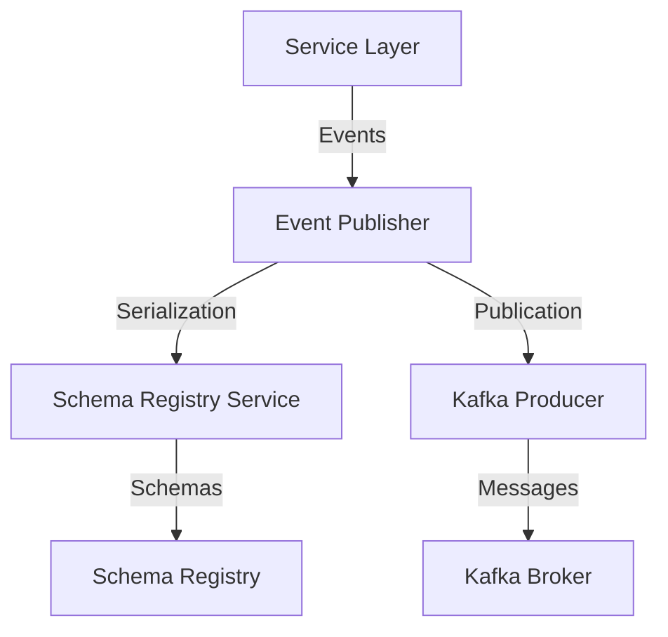

# Event Publisher Implementation

## Overview

This document details the implementation of the event publisher component within the Agent Orchestration Platform's event-driven architecture. The event publisher is responsible for serializing, validating, and publishing events to Kafka topics, ensuring proper integration with the Schema Registry.

## Architecture

The event publishing system consists of the following components:



## Core Components

### EventPublisher Interface

The `EventPublisher` interface defines the contract for all event publisher implementations:

```python
from abc import ABC, abstractmethod
from typing import Dict, Any, Optional

class EventPublisher(ABC):
    """Interface for event publishers."""
    
    @abstractmethod
    async def publish(
        self, 
        topic: str, 
        key: Optional[str], 
        value: Dict[str, Any], 
        headers: Optional[Dict[str, str]] = None
    ) -> None:
        """
        Publish an event to the specified topic.
        
        Args:
            topic: The topic to publish to
            key: The message key (can be None)
            value: The message value
            headers: Optional message headers
            
        Raises:
            SerializationError: If the message cannot be serialized
            PublishingError: If the message cannot be published
        """
        pass
    
    @abstractmethod
    async def publish_batch(
        self, 
        topic: str, 
        messages: list[Dict[str, Any]]
    ) -> None:
        """
        Publish a batch of messages to the specified topic.
        
        Args:
            topic: The topic to publish to
            messages: List of message dictionaries with keys: 'key', 'value', 'headers'
            
        Raises:
            SerializationError: If any message cannot be serialized
            PublishingError: If the messages cannot be published
        """
        pass
    
    @abstractmethod
    async def flush(self) -> None:
        """
        Flush any buffered messages.
        
        Raises:
            PublishingError: If the flush operation fails
        """
        pass
```

### KafkaEventPublisher Implementation

The `KafkaEventPublisher` is the primary implementation using Kafka:

```python
import logging
import uuid
from typing import Dict, Any, Optional, List
from confluent_kafka import Producer, KafkaException
from confluent_kafka.serialization import SerializationContext, MessageField
from agent_orchestration.infrastructure.errors import SerializationError, PublishingError
from agent_orchestration.integration.schema_registry import SchemaRegistryService
from agent_orchestration.infrastructure.logging_service import LoggingService

logger = logging.getLogger(__name__)

class KafkaEventPublisher(EventPublisher):
    """Kafka implementation of the EventPublisher interface."""
    
    def __init__(
        self, 
        producer_config: Dict[str, Any],
        schema_registry_service: SchemaRegistryService,
        logging_service: LoggingService
    ):
        """
        Initialize Kafka event publisher.
        
        Args:
            producer_config: Kafka producer configuration
            schema_registry_service: Schema Registry service
            logging_service: Logging service
        """
        self.producer = Producer(producer_config)
        self.schema_registry = schema_registry_service
        self.logging = logging_service
        self.default_headers = {
            "source": "agent-orchestration-platform",
            "version": "1.0.0"
        }
    
    async def publish(
        self, 
        topic: str, 
        key: Optional[str], 
        value: Dict[str, Any], 
        headers: Optional[Dict[str, str]] = None
    ) -> None:
        """
        Publish an event to Kafka.
        
        Args:
            topic: Kafka topic
            key: Message key
            value: Message value
            headers: Message headers
            
        Raises:
            SerializationError: If serialization fails
            PublishingError: If publishing fails
        """
        try:
            # Generate unique event ID if not provided
            if "event_id" not in value:
                value["event_id"] = str(uuid.uuid4())
            
            # Merge default headers with provided headers
            message_headers = {**self.default_headers}
            if headers:
                message_headers.update(headers)
            
            # Prepare Kafka headers format
            kafka_headers = [(k, v.encode('utf-8')) for k, v in message_headers.items()]
            
            # Determine key and value subjects
            key_subject = f"{topic}-key" if key is not None else None
            value_subject = f"{topic}-value"
            
            # Serialize key if present
            serialized_key = None
            if key is not None:
                key_context = SerializationContext(topic, MessageField.KEY)
                key_serializer = self.schema_registry.get_serializer(key_subject)
                serialized_key = key_serializer(key, key_context)
            
            # Serialize value
            value_context = SerializationContext(topic, MessageField.VALUE)
            value_serializer = self.schema_registry.get_serializer(value_subject)
            serialized_value = value_serializer(value, value_context)
            
            # Log before publishing
            self.logging.info(
                "Publishing event",
                extra={
                    "topic": topic,
                    "event_id": value["event_id"],
                    "event_type": value.get("type"),
                    "key": key
                }
            )
            
            # Publish to Kafka
            self.producer.produce(
                topic=topic,
                key=serialized_key,
                value=serialized_value,
                headers=kafka_headers,
                on_delivery=self._delivery_callback
            )
            
            # Trigger any available delivery callbacks
            self.producer.poll(0)
            
        except SerializationError as e:
            # Re-raise serialization errors
            self.logging.error(
                "Event serialization failed",
                extra={
                    "topic": topic,
                    "error": str(e)
                },
                exc_info=e
            )
            raise
            
        except KafkaException as e:
            # Convert Kafka exceptions to publishing errors
            self.logging.error(
                "Event publishing failed",
                extra={
                    "topic": topic,
                    "error": str(e)
                },
                exc_info=e
            )
            raise PublishingError(f"Failed to publish event to {topic}: {str(e)}") from e
            
        except Exception as e:
            # Handle unexpected errors
            self.logging.error(
                "Unexpected error during event publishing",
                extra={
                    "topic": topic,
                    "error": str(e)
                },
                exc_info=e
            )
            raise PublishingError(f"Unexpected error publishing to {topic}: {str(e)}") from e
    
    async def publish_batch(
        self, 
        topic: str, 
        messages: List[Dict[str, Any]]
    ) -> None:
        """
        Publish a batch of messages to Kafka.
        
        Args:
            topic: Kafka topic
            messages: List of message dictionaries
            
        Raises:
            SerializationError: If serialization fails
            PublishingError: If publishing fails
        """
        try:
            for message in messages:
                key = message.get("key")
                value = message["value"]
                headers = message.get("headers")
                
                await self.publish(topic, key, value, headers)
            
            # Ensure all messages are delivered
            await self.flush()
            
        except (SerializationError, PublishingError) as e:
            # Re-raise known errors
            raise
            
        except Exception as e:
            # Handle unexpected errors
            self.logging.error(
                "Unexpected error during batch publishing",
                extra={
                    "topic": topic,
                    "error": str(e)
                },
                exc_info=e
            )
            raise PublishingError(f"Unexpected error in batch publishing to {topic}: {str(e)}") from e
    
    async def flush(self) -> None:
        """
        Flush the producer to ensure delivery of all messages.
        
        Raises:
            PublishingError: If flush fails
        """
        try:
            self.producer.flush()
        except KafkaException as e:
            self.logging.error(
                "Failed to flush producer",
                extra={"error": str(e)},
                exc_info=e
            )
            raise PublishingError(f"Failed to flush producer: {str(e)}") from e
    
    def _delivery_callback(self, err, msg):
        """
        Callback for message delivery reports.
        
        Args:
            err: Error (if any)
            msg: Message
        """
        if err is not None:
            self.logging.error(
                "Message delivery failed",
                extra={
                    "topic": msg.topic(),
                    "error": str(err)
                }
            )
        else:
            self.logging.debug(
                "Message delivered",
                extra={
                    "topic": msg.topic(),
                    "partition": msg.partition(),
                    "offset": msg.offset()
                }
            )
```

## Specialized Event Publishers

### MCPEventPublisher

The `MCPEventPublisher` specializes in publishing MCP-related events:

```python
from typing import Dict, Any, Optional

class MCPEventPublisher:
    """Publisher for MCP-specific events."""
    
    def __init__(self, event_publisher: EventPublisher):
        """
        Initialize MCP event publisher.
        
        Args:
            event_publisher: Base event publisher
        """
        self.publisher = event_publisher
        self.topic_prefix = "mcp"
    
    async def publish_conversation_created(
        self, 
        conversation_id: str, 
        user_id: str, 
        agent_id: str, 
        metadata: Optional[Dict[str, Any]] = None
    ) -> None:
        """
        Publish conversation created event.
        
        Args:
            conversation_id: Conversation ID
            user_id: User ID
            agent_id: Agent ID
            metadata: Optional metadata
        """
        event = {
            "type": "conversation_created",
            "conversation_id": conversation_id,
            "user_id": user_id,
            "agent_id": agent_id,
            "timestamp": int(time.time() * 1000),
            "metadata": metadata or {}
        }
        
        await self.publisher.publish(
            topic=f"{self.topic_prefix}.conversations",
            key=conversation_id,
            value=event
        )
    
    async def publish_message_added(
        self, 
        conversation_id: str, 
        message_id: str, 
        content: str, 
        role: str
    ) -> None:
        """
        Publish message added event.
        
        Args:
            conversation_id: Conversation ID
            message_id: Message ID
            content: Message content
            role: Message role (user or assistant)
        """
        event = {
            "type": "message_added",
            "conversation_id": conversation_id,
            "message_id": message_id,
            "content": content,
            "role": role,
            "timestamp": int(time.time() * 1000)
        }
        
        await self.publisher.publish(
            topic=f"{self.topic_prefix}.messages",
            key=message_id,
            value=event
        )
    
    async def publish_response_generated(
        self, 
        conversation_id: str, 
        message_id: str, 
        model: str, 
        tokens: int, 
        latency: float
    ) -> None:
        """
        Publish response generated event.
        
        Args:
            conversation_id: Conversation ID
            message_id: Message ID
            model: Model used
            tokens: Number of tokens generated
            latency: Generation latency in seconds
        """
        event = {
            "type": "response_generated",
            "conversation_id": conversation_id,
            "message_id": message_id,
            "model": model,
            "tokens": tokens,
            "latency": latency,
            "timestamp": int(time.time() * 1000)
        }
        
        await self.publisher.publish(
            topic=f"{self.topic_prefix}.responses",
            key=message_id,
            value=event
        )
    
    async def publish_capability_invoked(
        self, 
        conversation_id: str, 
        capability_id: str, 
        capability_name: str, 
        parameters: Dict[str, Any]
    ) -> None:
        """
        Publish capability invoked event.
        
        Args:
            conversation_id: Conversation ID
            capability_id: Capability invocation ID
            capability_name: Capability name
            parameters: Capability parameters
        """
        event = {
            "type": "capability_invoked",
            "conversation_id": conversation_id,
            "capability_id": capability_id,
            "capability_name": capability_name,
            "parameters": parameters,
            "timestamp": int(time.time() * 1000)
        }
        
        await self.publisher.publish(
            topic=f"{self.topic_prefix}.capabilities",
            key=capability_id,
            value=event
        )
    
    async def publish_capability_completed(
        self, 
        conversation_id: str, 
        capability_id: str, 
        capability_name: str, 
        result: Dict[str, Any],
        duration: float
    ) -> None:
        """
        Publish capability completed event.
        
        Args:
            conversation_id: Conversation ID
            capability_id: Capability invocation ID
            capability_name: Capability name
            result: Capability result
            duration: Execution duration in seconds
        """
        event = {
            "type": "capability_completed",
            "conversation_id": conversation_id,
            "capability_id": capability_id,
            "capability_name": capability_name,
            "result": result,
            "duration": duration,
            "timestamp": int(time.time() * 1000)
        }
        
        await self.publisher.publish(
            topic=f"{self.topic_prefix}.capabilities",
            key=capability_id,
            value=event
        )
```

### EvolutionEventPublisher

The `EvolutionEventPublisher` specializes in evolution engine events, relating to the evolution documents you're currently working on:

```python
from typing import Dict, Any, List, Optional

class EvolutionEventPublisher:
    """Publisher for evolution engine events."""
    
    def __init__(self, event_publisher: EventPublisher):
        """
        Initialize evolution event publisher.
        
        Args:
            event_publisher: Base event publisher
        """
        self.publisher = event_publisher
        self.topic_prefix = "evolution"
    
    async def publish_evolution_proposal_created(
        self, 
        proposal_id: str, 
        agent_id: str, 
        target_system: str,
        proposal_content: Dict[str, Any]
    ) -> None:
        """
        Publish evolution proposal created event.
        
        Args:
            proposal_id: Proposal ID
            agent_id: Agent ID
            target_system: Target system for evolution
            proposal_content: Proposal content
        """
        event = {
            "type": "evolution_proposal_created",
            "proposal_id": proposal_id,
            "agent_id": agent_id,
            "target_system": target_system,
            "proposal_content": proposal_content,
            "timestamp": int(time.time() * 1000)
        }
        
        await self.publisher.publish(
            topic=f"{self.topic_prefix}.proposals",
            key=proposal_id,
            value=event
        )
    
    async def publish_evolution_validation_started(
        self, 
        proposal_id: str, 
        validation_id: str,
        validation_steps: List[Dict[str, Any]]
    ) -> None:
        """
        Publish evolution validation started event.
        
        Args:
            proposal_id: Proposal ID
            validation_id: Validation ID
            validation_steps: Validation steps to be performed
        """
        event = {
            "type": "evolution_validation_started",
            "proposal_id": proposal_id,
            "validation_id": validation_id,
            "validation_steps": validation_steps,
            "timestamp": int(time.time() * 1000)
        }
        
        await self.publisher.publish(
            topic=f"{self.topic_prefix}.validations",
            key=validation_id,
            value=event
        )
    
    async def publish_evolution_validation_completed(
        self, 
        proposal_id: str, 
        validation_id: str,
        result: Dict[str, Any],
        is_valid: bool
    ) -> None:
        """
        Publish evolution validation completed event.
        
        Args:
            proposal_id: Proposal ID
            validation_id: Validation ID
            result: Validation result
            is_valid: Whether the proposal is valid
        """
        event = {
            "type": "evolution_validation_completed",
            "proposal_id": proposal_id,
            "validation_id": validation_id,
            "result": result,
            "is_valid": is_valid,
            "timestamp": int(time.time() * 1000)
        }
        
        await self.publisher.publish(
            topic=f"{self.topic_prefix}.validations",
            key=validation_id,
            value=event
        )
    
    async def publish_evolution_applied(
        self, 
        proposal_id: str, 
        implementation_id: str,
        changes: List[Dict[str, Any]],
        affected_systems: List[str]
    ) -> None:
        """
        Publish evolution applied event.
        
        Args:
            proposal_id: Proposal ID
            implementation_id: Implementation ID
            changes: List of changes made
            affected_systems: List of affected systems
        """
        event = {
            "type": "evolution_applied",
            "proposal_id": proposal_id,
            "implementation_id": implementation_id,
            "changes": changes,
            "affected_systems": affected_systems,
            "timestamp": int(time.time() * 1000)
        }
        
        await self.publisher.publish(
            topic=f"{self.topic_prefix}.implementations",
            key=implementation_id,
            value=event
        )
```

## Integration with the Service Registry

```python
from agent_orchestration.infrastructure.service_registry import ServiceRegistry
from agent_orchestration.integration.schema_registry import SchemaRegistryService
from agent_orchestration.infrastructure.logging_service import LoggingService
from agent_orchestration.core.config_service import ConfigurationService

class EventPublisherFactory:
    """Factory for creating event publishers."""
    
    @staticmethod
    def create_kafka_event_publisher(service_registry: ServiceRegistry) -> KafkaEventPublisher:
        """
        Create a Kafka event publisher.
        
        Args:
            service_registry: Service registry
            
        Returns:
            Kafka event publisher
        """
        # Get required services
        config_service = service_registry.get_service(ConfigurationService)
        schema_registry_service = service_registry.get_service(SchemaRegistryService)
        logging_service = service_registry.get_service(LoggingService)
        
        # Get Kafka configuration
        kafka_config = config_service.get_config("kafka")
        producer_config = {
            "bootstrap.servers": kafka_config["bootstrap_servers"],
            "client.id": kafka_config["client_id"],
            "acks": "all",
            "retries": 3,
            "retry.backoff.ms": 500,
            "socket.keepalive.enable": True
        }
        
        # Add security configuration if needed
        if kafka_config.get("security_protocol"):
            producer_config["security.protocol"] = kafka_config["security_protocol"]
            
            if kafka_config["security_protocol"] == "SASL_SSL":
                producer_config["sasl.mechanisms"] = kafka_config["sasl_mechanism"]
                producer_config["sasl.username"] = kafka_config["sasl_username"]
                producer_config["sasl.password"] = kafka_config["sasl_password"]
                
            if kafka_config.get("ssl_ca_location"):
                producer_config["ssl.ca.location"] = kafka_config["ssl_ca_location"]
        
        # Create and return publisher
        return KafkaEventPublisher(
            producer_config=producer_config,
            schema_registry_service=schema_registry_service,
            logging_service=logging_service
        )
    
    @staticmethod
    def create_specialized_publishers(service_registry: ServiceRegistry):
        """
        Create specialized event publishers.
        
        Args:
            service_registry: Service registry
            
        Returns:
            Dictionary of specialized publishers
        """
        base_publisher = EventPublisherFactory.create_kafka_event_publisher(service_registry)
        
        # Register base publisher
        service_registry.register_service(EventPublisher, base_publisher)
        
        # Create specialized publishers
        mcp_publisher = MCPEventPublisher(base_publisher)
        evolution_publisher = EvolutionEventPublisher(base_publisher)
        
        # Register specialized publishers
        service_registry.register_service(MCPEventPublisher, mcp_publisher)
        service_registry.register_service(EvolutionEventPublisher, evolution_publisher)
        
        return {
            "base": base_publisher,
            "mcp": mcp_publisher,
            "evolution": evolution_publisher
        }
```

## Configuration Examples

### Kafka Producer Configuration

```yaml
# config/kafka.yaml
kafka:
  bootstrap_servers: "kafka:9092"
  client_id: "agent-orchestration-platform"
  security_protocol: "SASL_SSL"
  sasl_mechanism: "PLAIN"
  sasl_username: "${KAFKA_USERNAME}"
  sasl_password: "${KAFKA_PASSWORD}"
  ssl_ca_location: "/etc/ssl/certs/ca-certificates.crt"
  
  # Topic configuration
  topics:
    mcp:
      conversations: "mcp.conversations"
      messages: "mcp.messages"
      responses: "mcp.responses"
      capabilities: "mcp.capabilities"
    evolution:
      proposals: "evolution.proposals"
      validations: "evolution.validations"
      implementations: "evolution.implementations"
```

## Usage Examples

### Basic Event Publishing

```python
# Get event publisher from service registry
event_publisher = service_registry.get_service(EventPublisher)

# Publish a basic event
await event_publisher.publish(
    topic="platform.events",
    key="user-123",
    value={
        "type": "user_action",
        "user_id": "user-123",
        "action": "login",
        "timestamp": int(time.time() * 1000)
    },
    headers={
        "correlation_id": "corr-456",
        "origin": "web-app"
    }
)
```

### Using Specialized Publishers

```python
# Get MCP event publisher
mcp_publisher = service_registry.get_service(MCPEventPublisher)

# Publish conversation created event
await mcp_publisher.publish_conversation_created(
    conversation_id="conv-123",
    user_id="user-456",
    agent_id="agent-789",
    metadata={"source": "web-interface", "session_id": "sess-abc"}
)

# Get evolution event publisher
evolution_publisher = service_registry.get_service(EvolutionEventPublisher)

# Publish evolution proposal created event
await evolution_publisher.publish_evolution_proposal_created(
    proposal_id="prop-123",
    agent_id="agent-456",
    target_system="memory-service",
    proposal_content={
        "title": "Improve memory retrieval efficiency",
        "description": "Modify indexing strategy to improve retrieval speed",
        "estimated_impact": "High",
        "implementation_complexity": "Medium"
    }
)
```

## Error Handling

### Error Types

```python
class EventPublishingError(Exception):
    """Base exception for event publishing errors."""
    pass

class SerializationError(EventPublishingError):
    """Exception for serialization errors."""
    pass

class PublishingError(EventPublishingError):
    """Exception for message publishing errors."""
    pass

class SchemaValidationError(SerializationError):
    """Exception for schema validation errors."""
    pass
```

### Handling Publishing Errors

```python
try:
    await event_publisher.publish(
        topic="platform.events",
        key="user-123",
        value=event_data
    )
except SerializationError as e:
    # Handle serialization errors (e.g., schema validation failures)
    logging.error(f"Event serialization failed: {str(e)}")
    # Potential recovery: transform data to match schema
    
except PublishingError as e:
    # Handle publishing errors (e.g., Kafka connection issues)
    logging.error(f"Event publishing failed: {str(e)}")
    # Potential recovery: store event for later retry
    
except Exception as e:
    # Handle unexpected errors
    logging.error(f"Unexpected error during event publishing: {str(e)}")
    # Log detailed error information for debugging
```

## Testing the Event Publisher

```python
import pytest
from unittest.mock import MagicMock, patch
from confluent_kafka import KafkaException

class TestKafkaEventPublisher:
    """Test suite for Kafka event publisher."""
    
    @pytest.fixture
    def mock_producer(self):
        """Create mock Kafka producer."""
        return MagicMock()
    
    @pytest.fixture
    def mock_schema_registry(self):
        """Create mock Schema Registry service."""
        mock = MagicMock()
        
        # Mock serializer that just returns the input
        mock.get_serializer.return_value = lambda x, ctx: x
        
        return mock
    
    @pytest.fixture
    def mock_logging(self):
        """Create mock logging service."""
        return MagicMock()
    
    @pytest.fixture
    def publisher(self, mock_producer, mock_schema_registry, mock_logging):
        """Create publisher with mocks."""
        with patch("confluent_kafka.Producer", return_value=mock_producer):
            return KafkaEventPublisher(
                producer_config={},
                schema_registry_service=mock_schema_registry,
                logging_service=mock_logging
            )
    
    @pytest.mark.asyncio
    async def test_publish_success(self, publisher, mock_producer):
        """Test successful event publishing."""
        # Arrange
        topic = "test-topic"
        key = "test-key"
        value = {"type": "test", "data": "test-data"}
        
        # Act
        await publisher.publish(topic, key, value)
        
        # Assert
        mock_producer.produce.assert_called_once()
        call_args = mock_producer.produce.call_args[1]
        assert call_args["topic"] == topic
        
        # Verify poll was called
        mock_producer.poll.assert_called_once_with(0)
    
    @pytest.mark.asyncio
    async def test_publish_serialization_error(self, publisher, mock_schema_registry):
        """Test serialization error handling."""
        # Arrange
        mock_schema_registry.get_serializer.side_effect = SerializationError("Test error")
        
        # Act/Assert
        with pytest.raises(SerializationError):
            await publisher.publish("test-topic", "test-key", {"data": "test"})
    
    @pytest.mark.asyncio
    async def test_publish_kafka_error(self, publisher, mock_producer):
        """Test Kafka error handling."""
        # Arrange
        mock_producer.produce.side_effect = KafkaException("Test Kafka error")
        
        # Act/Assert
        with pytest.raises(PublishingError):
            await publisher.publish("test-topic", "test-key", {"data": "test"})
    
    @pytest.mark.asyncio
    async def test_flush(self, publisher, mock_producer):
        """Test flush operation."""
        # Act
        await publisher.flush()
        
        # Assert
        mock_producer.flush.assert_called_once()
```

## Best Practices

1. **Event Schema Design**
   - Define schemas with clear documentation
   - Follow naming conventions consistently
   - Make fields optional when possible to support evolution

2. **Error Handling**
   - Implement proper retry logic for transient failures
   - Log detailed error information for debugging
   - Use appropriate error types for different failure scenarios

3. **Testing**
   - Unit test with mocked dependencies
   - Integration test with embedded Kafka
   - End-to-end test with real Kafka in CI environment

4. **Monitoring and Observability**
   - Track event publishing rates and latencies
   - Monitor serialization errors for schema issues
   - Set up alerts for publishing failures

## Conclusion

The event publisher implementation provides a robust foundation for event-driven architecture in the Agent Orchestration Platform. By integrating with the Schema Registry and Kafka, it ensures reliable, schema-validated events while maintaining flexibility for different event types and use cases.
