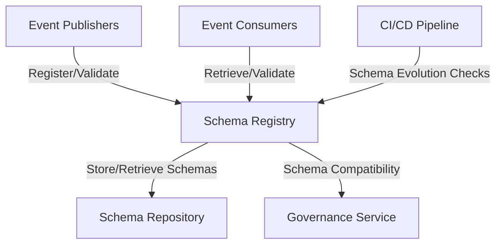

# Kafka Schema Registry Integration

## Overview

This document details how the Kafka Schema Registry integrates with the Agent Orchestration Platform, ensuring consistent, well-defined, and validated event schemas across all services.

## Schema Registry Architecture



## Core Concepts

The Kafka Schema Registry provides:

1. **Centralized schema management** for event-driven systems
2. **Runtime schema validation** for producers and consumers
3. **Schema evolution support** with compatibility checks
4. **Schema versioning** for backward and forward compatibility
5. **Integration with Kafka** for automatic schema retrieval

## Schema Registry Client Implementation

```python
from confluent_kafka.schema_registry import SchemaRegistryClient
from confluent_kafka.schema_registry.avro import AvroSerializer, AvroDeserializer
from confluent_kafka import SerializingProducer, DeserializingConsumer
from typing import Dict, Any, List, Optional, Callable
import avro
import uuid
import json

class SchemaRegistryService:
    """Service for interacting with Kafka Schema Registry."""
    
    def __init__(self, schema_registry_url: str, config: Dict[str, Any]):
        """Initialize the Schema Registry service.
        
        Args:
            schema_registry_url: URL of the Schema Registry
            config: Configuration for the service
        """
        self.schema_registry_client = SchemaRegistryClient({
            'url': schema_registry_url
        })
        self.config = config
        self.serializers = {}
        self.deserializers = {}
    
    def register_schema(self, topic: str, schema: str, schema_type: str = "AVRO") -> int:
        """Register a schema with the Schema Registry.
        
        Args:
            topic: Topic name (subject)
            schema: Schema definition as string
            schema_type: Type of schema (AVRO, JSON, PROTOBUF)
            
        Returns:
            Schema ID
        """
        # Register schema for value
        value_subject = f"{topic}-value"
        schema_id = self.schema_registry_client.register_schema(
            subject_name=value_subject,
            schema=schema,
            schema_type=schema_type
        )
        
        return schema_id
    
    def get_schema(self, topic: str, version: str = "latest") -> Dict[str, Any]:
        """Get a schema from the Schema Registry.
        
        Args:
            topic: Topic name (subject)
            version: Schema version or "latest"
            
        Returns:
            Schema information including ID and definition
        """
        value_subject = f"{topic}-value"
        
        if version == "latest":
            schema_metadata = self.schema_registry_client.get_latest_version(value_subject)
        else:
            schema_metadata = self.schema_registry_client.get_version(value_subject, int(version))
            
        return {
            "id": schema_metadata.schema_id,
            "version": schema_metadata.version,
            "schema": schema_metadata.schema.schema_str
        }
    
    def create_serializer(self, topic: str) -> AvroSerializer:
        """Create an Avro serializer for a topic.
        
        Args:
            topic: Topic name
            
        Returns:
            Avro serializer for the topic
        """
        if topic in self.serializers:
            return self.serializers[topic]
            
        value_subject = f"{topic}-value"
        latest = self.schema_registry_client.get_latest_version(value_subject)
        
        # Create serializer
        serializer = AvroSerializer(
            schema_registry_client=self.schema_registry_client,
            schema_str=latest.schema.schema_str,
            to_dict=self._avro_object_to_dict
        )
        
        self.serializers[topic] = serializer
        return serializer
    
    def create_deserializer(self, topic: str) -> AvroDeserializer:
        """Create an Avro deserializer for a topic.
        
        Args:
            topic: Topic name
            
        Returns:
            Avro deserializer for the topic
        """
        if topic in self.deserializers:
            return self.deserializers[topic]
            
        value_subject = f"{topic}-value"
        latest = self.schema_registry_client.get_latest_version(value_subject)
        
        # Create deserializer
        deserializer = AvroDeserializer(
            schema_registry_client=self.schema_registry_client,
            schema_str=latest.schema.schema_str,
            from_dict=self._dict_to_avro_object
        )
        
        self.deserializers[topic] = deserializer
        return deserializer
    
    def create_producer(self, topic: str) -> SerializingProducer:
        """Create a serializing producer for a topic.
        
        Args:
            topic: Topic name
            
        Returns:
            Serializing producer for the topic
        """
        serializer = self.create_serializer(topic)
        
        producer_config = {
            'bootstrap.servers': self.config['bootstrap.servers'],
            'value.serializer': serializer
        }
        
        return SerializingProducer(producer_config)
    
    def create_consumer(self, topic: str, group_id: str) -> DeserializingConsumer:
        """Create a deserializing consumer for a topic.
        
        Args:
            topic: Topic name
            group_id: Consumer group ID
            
        Returns:
            Deserializing consumer for the topic
        """
        deserializer = self.create_deserializer(topic)
        
        consumer_config = {
            'bootstrap.servers': self.config['bootstrap.servers'],
            'group.id': group_id,
            'auto.offset.reset': 'earliest',
            'value.deserializer': deserializer
        }
        
        return DeserializingConsumer(consumer_config)
    
    def _avro_object_to_dict(self, obj, ctx):
        """Convert an object to a dict for Avro serialization."""
        return obj
    
    def _dict_to_avro_object(self, dict_data, ctx):
        """Convert a dict to an object after Avro deserialization."""
        return dict_data
```

## Schema Definition and Management

### Event Schema Definition

Example of an Avro schema for memory events:

```python
MEMORY_CREATED_SCHEMA = {
    "type": "record",
    "namespace": "com.agent_orchestration.memory",
    "name": "MemoryCreated",
    "fields": [
        {"name": "event_id", "type": "string"},
        {"name": "event_type", "type": "string"},
        {"name": "timestamp", "type": "string"},
        {"name": "source_service", "type": "string"},
        {"name": "memory_id", "type": "string"},
        {"name": "user_id", "type": ["string", "null"]},
        {"name": "agent_id", "type": ["string", "null"]},
        {"name": "content_preview", "type": "string"},
        {"name": "metadata", "type": {
            "type": "map",
            "values": ["string", "int", "boolean", "null"]
        }}
    ]
}

EVENT_SCHEMAS = {
    "memory.created": MEMORY_CREATED_SCHEMA,
    # Other event schemas...
}
```

### Schema Evolution Management

Guidelines for schema evolution:

```python
class SchemaEvolutionManager:
    """Manager for schema evolution."""
    
    def __init__(self, schema_registry_service):
        """Initialize the schema evolution manager.
        
        Args:
            schema_registry_service: Schema Registry service
        """
        self.schema_registry = schema_registry_service
    
    async def check_compatibility(self, topic: str, new_schema: str) -> Dict[str, Any]:
        """Check if a new schema is compatible with the existing schema.
        
        Args:
            topic: Topic name
            new_schema: New schema to check
            
        Returns:
            Compatibility check result
        """
        value_subject = f"{topic}-value"
        
        try:
            # Check compatibility
            result = self.schema_registry.schema_registry_client.test_compatibility(
                subject=value_subject,
                schema=new_schema
            )
            
            return {
                "compatible": result,
                "subject": value_subject
            }
        except Exception as e:
            # New subject or other error
            return {
                "compatible": True,  # Assume compatible for new subjects
                "subject": value_subject,
                "is_new_subject": True
            }
    
    async def evolve_schema(self, topic: str, new_schema: str) -> Dict[str, Any]:
        """Evolve a schema with compatibility checks.
        
        Args:
            topic: Topic name
            new_schema: New schema
            
        Returns:
            Evolution result
        """
        # Check compatibility first
        compatibility = await self.check_compatibility(topic, new_schema)
        
        if not compatibility["compatible"]:
            raise ValueError(f"Schema for {topic} is not compatible with existing schema")
        
        # Register new schema
        schema_id = self.schema_registry.register_schema(topic, new_schema)
        
        return {
            "schema_id": schema_id,
            "topic": topic,
            "compatibility": compatibility
        }
    
    def get_evolution_guidelines(self) -> List[str]:
        """Get guidelines for schema evolution.
        
        Returns:
            List of guidelines
        """
        return [
            "Always add fields with default values",
            "Never remove fields or change field types",
            "Make new fields optional or provide defaults",
            "Use unions with null for optional fields",
            "Don't change the meaning of existing fields",
            "Add new versions of fields rather than changing existing ones",
            "Use the compatibility checker before registering new schemas"
        ]
```

## Integration with Event Publisher Service

How the Schema Registry integrates with the Event Publisher:

```python
class SchemaValidatedEventPublisher:
    """Event publisher with Schema Registry validation."""
    
    def __init__(self, schema_registry_service, service_name: str):
        """Initialize the publisher.
        
        Args:
            schema_registry_service: Schema Registry service
            service_name: Name of the service publishing events
        """
        self.schema_registry = schema_registry_service
        self.service_name = service_name
        self.producers = {}
    
    async def publish(self, topic: str, event_type: str, payload: Dict[str, Any], 
                    metadata: Optional[Dict[str, Any]] = None) -> str:
        """Publish an event with schema validation.
        
        Args:
            topic: Kafka topic
            event_type: Type of event
            payload: Event payload
            metadata: Additional metadata
            
        Returns:
            Event ID
        """
        # Get or create producer
        if topic not in self.producers:
            self.producers[topic] = self.schema_registry.create_producer(topic)
        
        producer = self.producers[topic]
        
        # Create event
        event_id = str(uuid.uuid4())
        timestamp = datetime.utcnow().isoformat() + "Z"
        
        event = {
            "event_id": event_id,
            "event_type": event_type,
            "timestamp": timestamp,
            "source_service": self.service_name,
            **payload
        }
        
        if metadata:
            event["metadata"] = metadata
        
        # Publish event (serialization and schema validation happens automatically)
        producer.produce(
            topic=topic,
            value=event,
            on_delivery=self._delivery_callback
        )
        
        # Flush to ensure delivery
        producer.flush()
        
        return event_id
    
    def _delivery_callback(self, err, msg):
        """Callback for message delivery results."""
        if err is not None:
            logger.error(f"Message delivery failed: {err}")
        else:
            logger.debug(f"Message delivered to {msg.topic()} [{msg.partition()}]")
```

## Integration with Event Consumer Service

How the Schema Registry integrates with the Event Consumer:

```python
class SchemaValidatedEventConsumer:
    """Event consumer with Schema Registry validation."""
    
    def __init__(self, schema_registry_service, group_id: str):
        """Initialize the consumer.
        
        Args:
            schema_registry_service: Schema Registry service
            group_id: Consumer group ID
        """
        self.schema_registry = schema_registry_service
        self.group_id = group_id
        self.consumers = {}
        self.handlers = {}
        self.running = False
        self.poll_threads = {}
    
    def register_handler(self, topic: str, event_type: str, handler: Callable) -> None:
        """Register a handler for a specific event type.
        
        Args:
            topic: Kafka topic
            event_type: Type of event to handle
            handler: Function to handle the event
        """
        if topic not in self.handlers:
            self.handlers[topic] = {}
            
        self.handlers[topic][event_type] = handler
    
    async def start(self, topics: List[str]) -> None:
        """Start consuming events from topics.
        
        Args:
            topics: List of topics to consume
        """
        if self.running:
            return
            
        self.running = True
        
        # Create consumers for each topic
        for topic in topics:
            if topic not in self.consumers:
                self.consumers[topic] = self.schema_registry.create_consumer(
                    topic=topic,
                    group_id=f"{self.group_id}-{topic}"
                )
                
                # Subscribe to topic
                self.consumers[topic].subscribe([topic])
                
                # Start polling thread
                self.poll_threads[topic] = threading.Thread(
                    target=self._poll_topic,
                    args=(topic,)
                )
                self.poll_threads[topic].daemon = True
                self.poll_threads[topic].start()
    
    async def stop(self) -> None:
        """Stop consuming events."""
        if not self.running:
            return
            
        self.running = False
        
        # Wait for threads to finish
        for topic, thread in self.poll_threads.items():
            thread.join(timeout=5.0)
            
        # Close consumers
        for consumer in self.consumers.values():
            consumer.close()
            
        self.consumers = {}
        self.poll_threads = {}
    
    def _poll_topic(self, topic: str) -> None:
        """Poll a topic for messages."""
        consumer = self.consumers[topic]
        
        while self.running:
            try:
                # Poll for messages
                msg = consumer.poll(1.0)
                
                if msg is None:
                    continue
                    
                if msg.error():
                    logger.error(f"Consumer error: {msg.error()}")
                    continue
                
                # Process message (already deserialized by the deserializer)
                self._process_message(topic, msg.value())
                
            except Exception as e:
                logger.error(f"Error processing message: {e}")
    
    def _process_message(self, topic: str, event: Dict[str, Any]) -> None:
        """Process a deserialized event."""
        try:
            event_type = event.get("event_type")
            
            if not event_type:
                logger.warning(f"Received event without event_type: {event}")
                return
                
            # Find handler for this event type
            if topic in self.handlers and event_type in self.handlers[topic]:
                handler = self.handlers[topic][event_type]
                
                # Call handler in executor to avoid blocking
                asyncio.run_coroutine_threadsafe(
                    handler(event),
                    asyncio.get_event_loop()
                )
            else:
                logger.debug(f"No handler for event type: {event_type} in topic: {topic}")
                
        except Exception as e:
            logger.error(f"Error dispatching event: {e}")
```

## Schema Compatibility Testing

Ensuring compatible schema evolution:

```python
async def test_schema_compatibility():
    """Test schema compatibility during evolution."""
    # Arrange
    schema_registry = SchemaRegistryService("http://schema-registry:8081", {
        'bootstrap.servers': 'kafka:9092'
    })
    
    evolution_manager = SchemaEvolutionManager(schema_registry)
    
    # Original schema
    original_schema = {
        "type": "record",
        "namespace": "com.agent_orchestration.test",
        "name": "TestEvent",
        "fields": [
            {"name": "event_id", "type": "string"},
            {"name": "value", "type": "string"}
        ]
    }
    
    # Compatible schema change (adding optional field)
    compatible_schema = {
        "type": "record",
        "namespace": "com.agent_orchestration.test",
        "name": "TestEvent",
        "fields": [
            {"name": "event_id", "type": "string"},
            {"name": "value", "type": "string"},
            {"name": "new_field", "type": ["null", "string"], "default": null}
        ]
    }
    
    # Incompatible schema change (removing field)
    incompatible_schema = {
        "type": "record",
        "namespace": "com.agent_orchestration.test",
        "name": "TestEvent",
        "fields": [
            {"name": "event_id", "type": "string"}
            # Removed "value" field
        ]
    }
    
    # Act & Assert
    # Register original schema
    test_topic = f"test-topic-{uuid.uuid4()}"
    schema_id = schema_registry.register_schema(test_topic, json.dumps(original_schema))
    
    # Test compatible change
    compat_result = await evolution_manager.check_compatibility(
        test_topic, 
        json.dumps(compatible_schema)
    )
    assert compat_result["compatible"] == True
    
    # Test incompatible change
    try:
        incompat_result = await evolution_manager.check_compatibility(
            test_topic,
            json.dumps(incompatible_schema)
        )
        assert incompat_result["compatible"] == False
    except Exception as e:
        # Some implementations raise an exception for incompatible schemas
        assert "compatibility" in str(e).lower()
```

## Schema Registry in CI/CD Pipeline

Integration with CI/CD for schema validation:

```python
# Example CI/CD script for schema validation

#!/usr/bin/env python3
import requests
import json
import sys
import os
import glob

def validate_schemas(schema_registry_url, schema_dir):
    """Validate all schemas in a directory against the Schema Registry."""
    # Find all schema files
    schema_files = glob.glob(f"{schema_dir}/**/*.avsc", recursive=True)
    
    # Track results
    results = {
        "compatible": 0,
        "incompatible": 0,
        "errors": 0
    }
    
    for schema_file in schema_files:
        try:
            # Extract topic from filename or path
            topic = os.path.basename(schema_file).replace(".avsc", "")
            
            # Read schema
            with open(schema_file, 'r') as f:
                schema = f.read()
            
            # Check compatibility
            subject = f"{topic}-value"
            url = f"{schema_registry_url}/compatibility/subjects/{subject}/versions/latest"
            
            response = requests.post(
                url=url,
                headers={"Content-Type": "application/vnd.schemaregistry.v1+json"},
                data=json.dumps({"schema": schema})
            )
            
            if response.status_code == 404:
                # New subject, consider it compatible
                print(f"New schema for topic {topic} (compatible)")
                results["compatible"] += 1
                continue
                
            # Check compatibility result
            result = response.json()
            is_compatible = result.get("is_compatible", False)
            
            if is_compatible:
                print(f"Schema for topic {topic} is compatible")
                results["compatible"] += 1
            else:
                print(f"ERROR: Schema for topic {topic} is NOT compatible")
                results["incompatible"] += 1
                
        except Exception as e:
            print(f"ERROR: Failed to validate schema {schema_file}: {e}")
            results["errors"] += 1
    
    # Print summary
    print("\nValidation Summary:")
    print(f"  Compatible schemas: {results['compatible']}")
    print(f"  Incompatible schemas: {results['incompatible']}")
    print(f"  Errors: {results['errors']}")
    
    # Fail if any incompatible schemas or errors
    if results["incompatible"] > 0 or results["errors"] > 0:
        return False
    
    return True

if __name__ == "__main__":
    if len(sys.argv) < 3:
        print("Usage: validate_schemas.py <schema_registry_url> <schema_dir>")
        sys.exit(1)
        
    schema_registry_url = sys.argv[1]
    schema_dir = sys.argv[2]
    
    if validate_schemas(schema_registry_url, schema_dir):
        print("All schemas are compatible!")
        sys.exit(0)
    else:
        print("Schema validation failed!")
        sys.exit(1)
```

## Schema Registry Best Practices

1. **Define Schema Evolution Strategy**
   - Prefer backward compatibility as a minimum
   - Consider full compatibility for critical systems
   - Document breaking changes and migration paths

2. **Schema Design Guidelines**
   - Use namespaces to organize schemas
   - Include version information in the schema itself
   - Document fields with clear descriptions
   - Use consistent naming conventions

3. **Schema Registry Operations**
   - Monitor registry performance and usage
   - Back up registry data regularly
   - Implement access controls for schema registration
   - Test schema changes in non-production environments first

4. **Integration Guidelines**
   - Always use schema validation in producers
   - Set up alerts for schema compatibility failures
   - Include schema registry checks in CI/CD pipelines
   - Plan for schema registry downtime in system design
