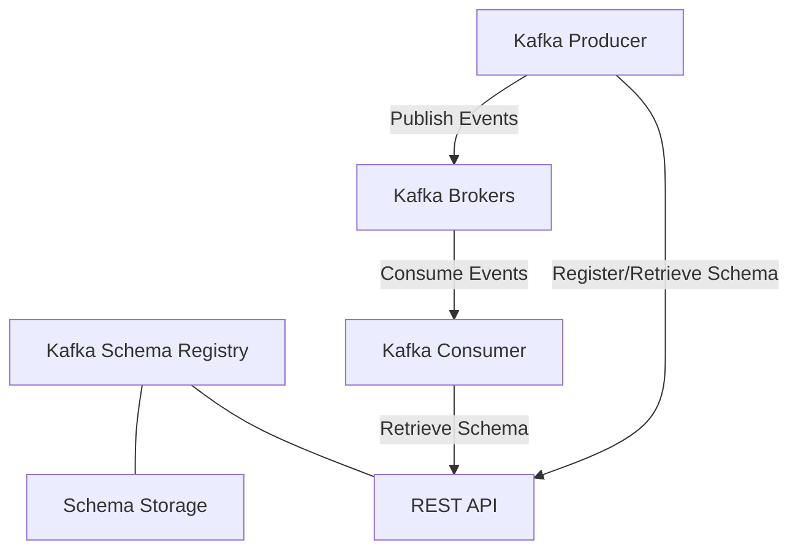

# Kafka Schema Registry - Core Concepts and Setup

## Overview

The Kafka Schema Registry provides a centralized schema management system for event-driven architectures. This document details how the Agent Orchestration Platform leverages the Kafka Schema Registry to ensure data consistency, type safety, and schema evolution across all platform components.

## Core Concepts

### Schema Registry Architecture



### Key Functionality

The Schema Registry provides:

1. **Schema Registration**: Centralized storage for schemas
2. **Schema Validation**: Ensures messages conform to registered schemas
3. **Schema Evolution**: Manages compatibility between schema versions
4. **Format Support**: Primarily Avro, but also supports JSON Schema and Protobuf

## Schema Registry Integration

### Installation and Configuration

1. **Docker-Compose Setup**:

```yaml
version: '3'
services:
  zookeeper:
    image: confluentinc/cp-zookeeper:7.3.0
    hostname: zookeeper
    container_name: zookeeper
    ports:
      - "2181:2181"
    environment:
      ZOOKEEPER_CLIENT_PORT: 2181
      ZOOKEEPER_TICK_TIME: 2000

  broker:
    image: confluentinc/cp-server:7.3.0
    hostname: broker
    container_name: broker
    depends_on:
      - zookeeper
    ports:
      - "9092:9092"
      - "9101:9101"
    environment:
      KAFKA_BROKER_ID: 1
      KAFKA_ZOOKEEPER_CONNECT: 'zookeeper:2181'
      KAFKA_LISTENER_SECURITY_PROTOCOL_MAP: PLAINTEXT:PLAINTEXT,PLAINTEXT_HOST:PLAINTEXT
      KAFKA_ADVERTISED_LISTENERS: PLAINTEXT://broker:29092,PLAINTEXT_HOST://localhost:9092
      KAFKA_OFFSETS_TOPIC_REPLICATION_FACTOR: 1
      KAFKA_GROUP_INITIAL_REBALANCE_DELAY_MS: 0
      KAFKA_CONFLUENT_LICENSE_TOPIC_REPLICATION_FACTOR: 1
      KAFKA_CONFLUENT_BALANCER_TOPIC_REPLICATION_FACTOR: 1
      KAFKA_TRANSACTION_STATE_LOG_MIN_ISR: 1
      KAFKA_TRANSACTION_STATE_LOG_REPLICATION_FACTOR: 1
      KAFKA_CONFLUENT_SCHEMA_REGISTRY_URL: http://schema-registry:8081

  schema-registry:
    image: confluentinc/cp-schema-registry:7.3.0
    hostname: schema-registry
    container_name: schema-registry
    depends_on:
      - broker
    ports:
      - "8081:8081"
    environment:
      SCHEMA_REGISTRY_HOST_NAME: schema-registry
      SCHEMA_REGISTRY_KAFKASTORE_BOOTSTRAP_SERVERS: 'broker:29092'
      SCHEMA_REGISTRY_LISTENERS: http://0.0.0.0:8081
```

2. **Schema Registry Client Configuration**:

```python
from confluent_kafka.schema_registry import SchemaRegistryClient
from pydantic import BaseModel, Field

class SchemaRegistryConfig(BaseModel):
    """Configuration for Schema Registry client."""
    
    url: str = Field(..., description="URL of the Schema Registry")
    basic_auth_user_info: str = Field(None, description="Optional basic auth credentials")
    ssl_config: dict = Field(default_factory=dict, description="SSL configuration")

def create_schema_registry_client(config: SchemaRegistryConfig) -> SchemaRegistryClient:
    """Create a Schema Registry client.
    
    Args:
        config: Schema Registry configuration
        
    Returns:
        Schema Registry client
    """
    client_config = {
        'url': config.url
    }
    
    # Add optional configurations
    if config.basic_auth_user_info:
        client_config['basic.auth.user.info'] = config.basic_auth_user_info
    
    # Add SSL configurations if provided
    for key, value in config.ssl_config.items():
        client_config[key] = value
    
    return SchemaRegistryClient(client_config)
```

## Schema Registry Service Implementation

```python
from typing import Dict, Any, Optional, List
import json
import asyncio
import logging
from confluent_kafka.schema_registry import SchemaRegistryClient
from confluent_kafka.schema_registry.avro import AvroSerializer, AvroDeserializer
from pydantic import BaseModel, Field
from agent_orchestration.core.service_base import ServiceBase
from agent_orchestration.config.models import SchemaRegistryConfig

logger = logging.getLogger(__name__)

class SchemaRegistryService(ServiceBase):
    """Service for interacting with the Kafka Schema Registry."""
    
    def __init__(self, config_service):
        """Initialize the Schema Registry service.
        
        Args:
            config_service: Configuration service for retrieving settings
        """
        self.config_service = config_service
        self.client = None
        self.serializers: Dict[str, AvroSerializer] = {}
        self.deserializers: Dict[str, AvroDeserializer] = {}
    
    async def start(self) -> None:
        """Start the Schema Registry service."""
        # Get configuration
        config = await self.config_service.get_validated_config("schema_registry", SchemaRegistryConfig)
        
        # Create client
        self.client = SchemaRegistryClient({
            'url': config.url,
            **({"basic.auth.user.info": config.basic_auth_user_info} if config.basic_auth_user_info else {}),
            **config.ssl_config
        })
        
        logger.info(f"Schema Registry service started with URL: {config.url}")
    
    async def stop(self) -> None:
        """Stop the Schema Registry service."""
        self.client = None
        self.serializers.clear()
        self.deserializers.clear()
        logger.info("Schema Registry service stopped")
    
    async def register_schema(self, subject: str, schema_str: str, schema_type: str = "AVRO") -> int:
        """Register a schema with the Schema Registry.
        
        Args:
            subject: Subject name (typically {topic}-{key/value})
            schema_str: Schema definition as string
            schema_type: Schema type (AVRO, JSON, PROTOBUF)
            
        Returns:
            Schema ID
            
        Raises:
            SchemaRegistryError: If registration fails
        """
        if not self.client:
            raise ValueError("Schema Registry service not started")
        
        try:
            # Run in executor to avoid blocking
            schema_id = await asyncio.to_thread(
                self.client.register_schema,
                subject,
                schema_str,
                schema_type
            )
            
            logger.info(f"Registered schema for subject {subject} with ID {schema_id}")
            return schema_id
            
        except Exception as e:
            logger.error(f"Failed to register schema for subject {subject}: {str(e)}")
            from agent_orchestration.errors.schema_errors import SchemaRegistrationError
            raise SchemaRegistrationError(f"Failed to register schema: {str(e)}")
    
    async def get_schema(self, schema_id: int) -> Optional[Dict[str, Any]]:
        """Get schema by ID.
        
        Args:
            schema_id: Schema ID
            
        Returns:
            Schema information or None if not found
            
        Raises:
            SchemaRegistryError: If retrieval fails
        """
        if not self.client:
            raise ValueError("Schema Registry service not started")
        
        try:
            # Run in executor to avoid blocking
            schema = await asyncio.to_thread(
                self.client.get_schema,
                schema_id
            )
            
            return {
                'id': schema.schema_id,
                'schema': schema.schema_str,
                'type': schema.schema_type
            }
            
        except Exception as e:
            logger.error(f"Failed to get schema with ID {schema_id}: {str(e)}")
            from agent_orchestration.errors.schema_errors import SchemaRetrievalError
            raise SchemaRetrievalError(f"Failed to get schema: {str(e)}")
    
    async def get_serializer(self, subject: str) -> AvroSerializer:
        """Get serializer for a subject.
        
        Args:
            subject: Subject name
            
        Returns:
            Avro serializer
            
        Raises:
            SchemaRegistryError: If serializer creation fails
        """
        if subject in self.serializers:
            return self.serializers[subject]
        
        try:
            # Get latest schema
            schema_id = await asyncio.to_thread(
                self.client.get_latest_version,
                subject
            )
            
            schema = await self.get_schema(schema_id.schema_id)
            
            # Create serializer
            serializer = AvroSerializer(
                self.client,
                schema['schema'],
                lambda obj, ctx: obj  # Simple to_dict conversion
            )
            
            self.serializers[subject] = serializer
            return serializer
            
        except Exception as e:
            logger.error(f"Failed to create serializer for subject {subject}: {str(e)}")
            from agent_orchestration.errors.schema_errors import SerializationError
            raise SerializationError(f"Failed to create serializer: {str(e)}")
    
    async def get_deserializer(self, subject: str) -> AvroDeserializer:
        """Get deserializer for a subject.
        
        Args:
            subject: Subject name
            
        Returns:
            Avro deserializer
            
        Raises:
            SchemaRegistryError: If deserializer creation fails
        """
        if subject in self.deserializers:
            return self.deserializers[subject]
        
        try:
            # Get latest schema
            schema_id = await asyncio.to_thread(
                self.client.get_latest_version,
                subject
            )
            
            schema = await self.get_schema(schema_id.schema_id)
            
            # Create deserializer
            deserializer = AvroDeserializer(
                self.client,
                schema['schema'],
                lambda obj, ctx: obj  # Simple from_dict conversion
            )
            
            self.deserializers[subject] = deserializer
            return deserializer
            
        except Exception as e:
            logger.error(f"Failed to create deserializer for subject {subject}: {str(e)}")
            from agent_orchestration.errors.schema_errors import DeserializationError
            raise DeserializationError(f"Failed to create deserializer: {str(e)}")
    
    async def serialize(self, subject: str, data: Dict[str, Any]) -> bytes:
        """Serialize data according to subject's schema.
        
        Args:
            subject: Subject name
            data: Data to serialize
            
        Returns:
            Serialized data
            
        Raises:
            SerializationError: If serialization fails
        """
        try:
            serializer = await self.get_serializer(subject)
            
            # Run in executor to avoid blocking
            serialized = await asyncio.to_thread(
                serializer,
                data,
                None  # Context
            )
            
            return serialized
            
        except Exception as e:
            logger.error(f"Failed to serialize data for subject {subject}: {str(e)}")
            from agent_orchestration.errors.schema_errors import SerializationError
            raise SerializationError(f"Failed to serialize data: {str(e)}")
    
    async def deserialize(self, subject: str, data: bytes) -> Dict[str, Any]:
        """Deserialize data according to subject's schema.
        
        Args:
            subject: Subject name
            data: Data to deserialize
            
        Returns:
            Deserialized data
            
        Raises:
            DeserializationError: If deserialization fails
        """
        try:
            deserializer = await self.get_deserializer(subject)
            
            # Run in executor to avoid blocking
            deserialized = await asyncio.to_thread(
                deserializer,
                data,
                None  # Context
            )
            
            return deserialized
            
        except Exception as e:
            logger.error(f"Failed to deserialize data for subject {subject}: {str(e)}")
            from agent_orchestration.errors.schema_errors import DeserializationError
            raise DeserializationError(f"Failed to deserialize data: {str(e)}")
    
    async def check_compatibility(self, subject: str, schema_str: str) -> bool:
        """Check if a schema is compatible with the latest version.
        
        Args:
            subject: Subject name
            schema_str: Schema to check
            
        Returns:
            True if compatible, False otherwise
        """
        if not self.client:
            raise ValueError("Schema Registry service not started")
        
        try:
            # Run in executor to avoid blocking
            result = await asyncio.to_thread(
                self.client.test_compatibility,
                subject,
                schema_str
            )
            
            return result
            
        except Exception as e:
            logger.error(f"Failed to check compatibility for subject {subject}: {str(e)}")
            return False
```

## Integration with Service Registry

To make the Schema Registry service available across the platform:

```python
from agent_orchestration.service_registry import ServiceRegistry
from agent_orchestration.schemas.schema_registry import SchemaRegistryService

# Register service
registry = ServiceRegistry()
registry.register(SchemaRegistryService, dependencies=["ConfigService"])

# Later, resolve service when needed
schema_registry = await registry.resolve("SchemaRegistryService")
```

## Best Practices

1. **Schema Naming Conventions**
   - Use consistent naming patterns for subjects: `{topic_name}-{key/value}`
   - Include namespace for Avro schemas matching the package structure

2. **Schema Design**
   - Include documentation in schemas
   - Design schemas for extensibility
   - Use optional fields for backward compatibility

3. **Schema Versioning**
   - Follow semantic versioning principles
   - Test compatibility before deployment
   - Set up CI/CD pipelines to validate schema changes

4. **Performance Considerations**
   - Cache serializers and deserializers
   - Implement subject name strategies for reusing schemas
   - Consider the impact of schema size on serialization performance

5. **Security**
   - Secure Schema Registry with authentication
   - Use SSL/TLS for encryption
   - Implement access control for schema management
