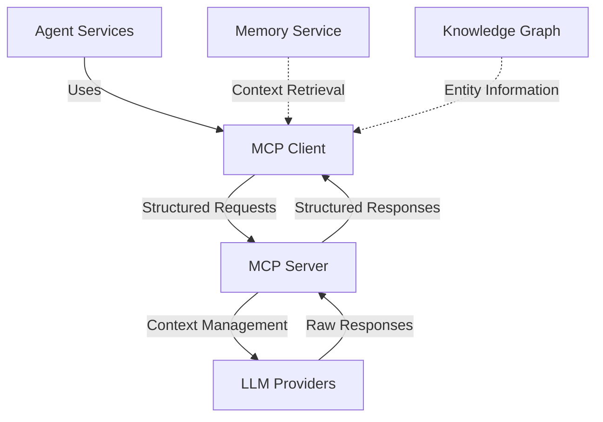

# Model Context Protocol (MCP) Integration

## Overview

This document details how the Model Context Protocol (MCP) integrates with the Agent Orchestration Platform, enabling standardized communication between agents and large language models (LLMs).

## MCP Architecture



## Core MCP Concepts

The Model Context Protocol provides a standardized way to:

1. **Structure requests to language models** with rich context management
2. **Manage conversation history** with automatic pruning and summarization
3. **Include external knowledge and memory** in conversational context
4. **Track and manage model usage** and associated costs
5. **Implement consistent prompt engineering patterns** across the platform

## MCP Client Implementation

```python
from mcp_sdk import MCPClient, Conversation, Message, MessageRole, ContextItem
from typing import Dict, Any, List, Optional

class MCPService:
    """Service for interacting with language models via the Model Context Protocol."""
    
    def __init__(self, mcp_endpoint: str, api_key: str, service_registry):
        """Initialize the MCP service.
        
        Args:
            mcp_endpoint: MCP server endpoint URL
            api_key: API key for authentication
            service_registry: Service registry for dependency injection
        """
        self.client = MCPClient(
            server_url=mcp_endpoint,
            api_key=api_key
        )
        self.service_registry = service_registry
        self.memory_service = service_registry.get("memory_service")
        self.knowledge_graph = service_registry.get("knowledge_graph_service")
        self.metrics_service = service_registry.get("metrics_service")
    
    async def create_conversation(self, user_id: str, agent_id: str, system_prompt: str, 
                                 metadata: Optional[Dict[str, Any]] = None) -> str:
        """Create a new conversation.
        
        Args:
            user_id: ID of the user
            agent_id: ID of the agent
            system_prompt: System prompt for the conversation
            metadata: Optional metadata for the conversation
            
        Returns:
            Conversation ID
        """
        # Initialize conversation
        conversation = Conversation(
            system_prompt=system_prompt,
            metadata={
                "user_id": user_id,
                "agent_id": agent_id,
                **(metadata or {})
            }
        )
        
        # Create conversation on MCP server
        conversation_id = await self.client.create_conversation(conversation)
        
        # Track metrics
        await self.metrics_service.record_metric(
            metric_name="mcp.conversation.created",
            value=1,
            dimensions={
                "user_id": user_id,
                "agent_id": agent_id
            }
        )
        
        return conversation_id
    
    async def add_message(self, conversation_id: str, content: str, role: str = "user",
                         include_memory: bool = True, memory_query: Optional[str] = None) -> str:
        """Add a message to a conversation.
        
        Args:
            conversation_id: ID of the conversation
            content: Message content
            role: Message role (user, assistant, system)
            include_memory: Whether to include relevant memories as context
            memory_query: Custom query for memory retrieval (defaults to content)
            
        Returns:
            Message ID
        """
        # Create message
        message = Message(
            role=MessageRole(role),
            content=content
        )
        
        # Add relevant context items from memory if requested
        if include_memory:
            context_items = await self._get_context_from_memory(
                conversation_id=conversation_id,
                query=memory_query or content
            )
            
            if context_items:
                message.context_items = context_items
        
        # Add message to conversation
        message_id = await self.client.add_message(conversation_id, message)
        
        return message_id
    
    async def generate_response(self, conversation_id: str, model: str = "default",
                              temperature: float = 0.7, max_tokens: int = 1000) -> Dict[str, Any]:
        """Generate a response in the conversation.
        
        Args:
            conversation_id: ID of the conversation
            model: Model to use for generation
            temperature: Temperature for generation
            max_tokens: Maximum number of tokens to generate
            
        Returns:
            Response containing the assistant's message
        """
        # Start tracking costs
        cost_context = await self._start_cost_tracking(conversation_id)
        
        try:
            # Generate response
            response = await self.client.generate_response(
                conversation_id=conversation_id,
                parameters={
                    "model": model,
                    "temperature": temperature,
                    "max_tokens": max_tokens
                }
            )
            
            # Capture costs
            if "usage" in response:
                await self._record_token_usage(
                    conversation_id=conversation_id,
                    input_tokens=response["usage"].get("prompt_tokens", 0),
                    output_tokens=response["usage"].get("completion_tokens", 0),
                    model=model
                )
            
            # Complete cost tracking
            await self._complete_cost_tracking(cost_context, "success")
            
            return response
            
        except Exception as e:
            # Record error in cost tracking
            await self._complete_cost_tracking(cost_context, "error", str(e))
            raise
    
    async def _get_context_from_memory(self, conversation_id: str, query: str) -> List[ContextItem]:
        """Get relevant context items from memory.
        
        Args:
            conversation_id: ID of the conversation
            query: Query for memory retrieval
            
        Returns:
            List of context items
        """
        # Get conversation metadata
        conversation = await self.client.get_conversation(conversation_id)
        user_id = conversation.metadata.get("user_id")
        
        if not user_id:
            return []
        
        # Search memories
        memories = await self.memory_service.search_memories(
            query=query,
            filters={"user_id": user_id},
            limit=5
        )
        
        # Convert to context items
        return [
            ContextItem(
                content=memory["content"],
                category="memory",
                metadata={
                    "memory_id": memory["memory_id"],
                    "score": memory["score"]
                }
            )
            for memory in memories
        ]
    
    async def _start_cost_tracking(self, conversation_id: str) -> Dict[str, Any]:
        """Start tracking costs for a model request.
        
        Args:
            conversation_id: ID of the conversation
            
        Returns:
            Cost tracking context
        """
        # Get conversation metadata
        conversation = await self.client.get_conversation(conversation_id)
        user_id = conversation.metadata.get("user_id")
        agent_id = conversation.metadata.get("agent_id")
        
        # Generate tracking ID
        tracking_id = str(uuid.uuid4())
        
        # Create cost context
        cost_context = {
            "tracking_id": tracking_id,
            "conversation_id": conversation_id,
            "user_id": user_id,
            "agent_id": agent_id,
            "start_time": time.time()
        }
        
        return cost_context
    
    async def _complete_cost_tracking(self, cost_context: Dict[str, Any], status: str, error: str = None):
        """Complete cost tracking for a model request.
        
        Args:
            cost_context: Cost tracking context
            status: Status of the request
            error: Error message if any
        """
        cost_tracker = self.service_registry.get("cost_tracker")
        
        await cost_tracker.record_completion(
            tracking_id=cost_context["tracking_id"],
            status=status,
            execution_time=time.time() - cost_context["start_time"],
            error=error
        )
    
    async def _record_token_usage(self, conversation_id: str, input_tokens: int, 
                                output_tokens: int, model: str):
        """Record token usage for cost tracking.
        
        Args:
            conversation_id: ID of the conversation
            input_tokens: Number of input tokens
            output_tokens: Number of output tokens
            model: Model used
        """
        # Get conversation metadata
        conversation = await self.client.get_conversation(conversation_id)
        user_id = conversation.metadata.get("user_id")
        agent_id = conversation.metadata.get("agent_id")
        
        cost_tracker = self.service_registry.get("cost_tracker")
        
        await cost_tracker.record_token_usage(
            user_id=user_id,
            agent_id=agent_id,
            model=model,
            input_tokens=input_tokens,
            output_tokens=output_tokens,
            conversation_id=conversation_id
        )
```

## MCP Integration with Agent Capabilities

Example of a capability using MCP:

```python
class ConversationalCapability(BaseCapability):
    """Capability for conversational interactions."""
    
    def __init__(self, service_registry):
        super().__init__(service_registry)
        self.mcp_service = service_registry.get("mcp_service")
        
    def get_parameter_model(self) -> Type[BaseModel]:
        """Get the Pydantic model for parameter validation."""
        return ConversationalParams
    
    async def execute(self, params: ConversationalParams) -> Dict[str, Any]:
        """Execute the conversational capability."""
        # Get or create conversation
        conversation_id = params.conversation_id
        if not conversation_id:
            # Get agent's system prompt
            agent_service = self.service_registry.get("agent_service")
            agent = await agent_service.get_agent(params.agent_id)
            system_prompt = agent["configuration"]["system_prompt"]
            
            # Create new conversation
            conversation_id = await self.mcp_service.create_conversation(
                user_id=params.user_id,
                agent_id=params.agent_id,
                system_prompt=system_prompt
            )
        
        # Add user message to conversation
        message_id = await self.mcp_service.add_message(
            conversation_id=conversation_id,
            content=params.message,
            role="user",
            include_memory=params.include_memory
        )
        
        # Generate response
        response = await self.mcp_service.generate_response(
            conversation_id=conversation_id,
            model=params.model or agent["configuration"]["default_model"],
            temperature=params.temperature or 0.7,
            max_tokens=params.max_tokens or 1000
        )
        
        # Extract assistant message
        assistant_message = response["message"]["content"]
        
        # Optionally store conversation in memory
        if params.store_in_memory:
            memory_service = self.service_registry.get("memory_service")
            await memory_service.add_memory(
                content=f"User: {params.message}\nAssistant: {assistant_message}",
                filters={
                    "user_id": params.user_id,
                    "agent_id": params.agent_id,
                    "tags": ["conversation"]
                },
                metadata={
                    "conversation_id": conversation_id,
                    "message_id": message_id
                }
            )
        
        return {
            "conversation_id": conversation_id,
            "message": assistant_message,
            "usage": response.get("usage")
        }
```

## Tool Integration with MCP

The MCP protocol supports tool use by LLMs:

```python
from mcp_sdk import Tool, ToolCall, ToolResponse

class ToolRegistry:
    """Registry for tools available to MCP conversations."""
    
    def __init__(self):
        """Initialize the tool registry."""
        self.tools = {}
    
    def register_tool(self, tool_id: str, tool_definition: Dict[str, Any], handler: Callable):
        """Register a tool.
        
        Args:
            tool_id: ID of the tool
            tool_definition: OpenAPI-compatible tool definition
            handler: Function to handle tool calls
        """
        self.tools[tool_id] = {
            "definition": tool_definition,
            "handler": handler
        }
    
    def get_tool_definitions(self) -> List[Dict[str, Any]]:
        """Get all tool definitions.
        
        Returns:
            List of tool definitions
        """
        return [tool["definition"] for tool in self.tools.values()]
    
    async def handle_tool_call(self, tool_call: ToolCall) -> ToolResponse:
        """Handle a tool call.
        
        Args:
            tool_call: Tool call from the MCP server
            
        Returns:
            Tool response
        """
        tool_id = tool_call.tool_id
        if tool_id not in self.tools:
            return ToolResponse(
                tool_call_id=tool_call.id,
                content=json.dumps({"error": f"Tool {tool_id} not found"}),
                status="error"
            )
        
        try:
            # Call the tool handler
            handler = self.tools[tool_id]["handler"]
            result = await handler(tool_call.parameters)
            
            return ToolResponse(
                tool_call_id=tool_call.id,
                content=json.dumps(result),
                status="success"
            )
            
        except Exception as e:
            return ToolResponse(
                tool_call_id=tool_call.id,
                content=json.dumps({"error": str(e)}),
                status="error"
            )
```

## MCP Event Integration

Events related to MCP operations:

```python
# Example MCP events published to Kafka
EXAMPLE_MCP_EVENTS = {
    "mcp.conversation.created": {
        "conversation_id": "conv_123abc",
        "user_id": "user_456def",
        "agent_id": "agent_789ghi",
        "timestamp": "2025-03-16T09:00:00Z"
    },
    
    "mcp.message.added": {
        "conversation_id": "conv_123abc",
        "message_id": "msg_456def",
        "role": "user",
        "content_preview": "How do I configure...",
        "timestamp": "2025-03-16T09:01:00Z"
    },
    
    "mcp.response.generated": {
        "conversation_id": "conv_123abc",
        "message_id": "msg_789ghi",
        "model": "gpt-4",
        "tokens": {
            "input": 250,
            "output": 150
        },
        "execution_time": 1.5,
        "timestamp": "2025-03-16T09:01:30Z"
    },
    
    "mcp.tool.called": {
        "conversation_id": "conv_123abc",
        "message_id": "msg_789ghi",
        "tool_id": "search_knowledge_base",
        "tool_call_id": "tc_012jkl",
        "parameters": {
            "query": "configuration options",
            "limit": 5
        },
        "timestamp": "2025-03-16T09:01:15Z"
    }
}
```

## MCP Exception Handling

```python
class MCPError(Exception):
    """Base class for MCP-related errors."""
    pass

class MCPConnectionError(MCPError):
    """Error connecting to MCP server."""
    pass

class MCPAuthenticationError(MCPError):
    """Error authenticating with MCP server."""
    pass

class MCPConversationError(MCPError):
    """Error with MCP conversation operations."""
    pass

class MCPTokenLimitError(MCPError):
    """Error when token limit is exceeded."""
    pass

class MCPToolError(MCPError):
    """Error with MCP tool operations."""
    pass

def handle_mcp_error(error):
    """Handle MCP errors with appropriate responses and logging."""
    error_mapping = {
        MCPConnectionError: {
            "status_code": 503,
            "error_code": "MCP_CONNECTION_ERROR",
            "message": "Unable to connect to language model service",
            "log_level": "error"
        },
        MCPAuthenticationError: {
            "status_code": 401,
            "error_code": "MCP_AUTH_ERROR",
            "message": "Authentication with language model service failed",
            "log_level": "error"
        },
        MCPConversationError: {
            "status_code": 400,
            "error_code": "MCP_CONVERSATION_ERROR",
            "message": "Error with conversation operation",
            "log_level": "warning"
        },
        MCPTokenLimitError: {
            "status_code": 400,
            "error_code": "MCP_TOKEN_LIMIT_ERROR",
            "message": "Token limit exceeded",
            "log_level": "warning"
        },
        MCPToolError: {
            "status_code": 400,
            "error_code": "MCP_TOOL_ERROR",
            "message": "Error with tool operation",
            "log_level": "warning"
        }
    }
    
    # Find most specific error type match
    for error_type, error_info in error_mapping.items():
        if isinstance(error, error_type):
            return error_info
    
    # Default for unrecognized errors
    return {
        "status_code": 500,
        "error_code": "MCP_UNKNOWN_ERROR",
        "message": "Unknown error with language model service",
        "log_level": "error"
    }
```

## Testing MCP Integration

Examples of testing MCP integration:

```python
async def test_mcp_service_conversation_flow():
    """Test the full conversation flow with MCP service."""
    # Arrange
    # Create mock MCP client
    mock_mcp_client = Mock()
    mock_mcp_client.create_conversation.return_value = "conv_test"
    mock_mcp_client.add_message.return_value = "msg_test"
    mock_mcp_client.generate_response.return_value = {
        "message": {
            "content": "This is a test response"
        },
        "usage": {
            "prompt_tokens": 100,
            "completion_tokens": 50
        }
    }
    
    # Create mock service registry with required services
    registry = create_mock_service_registry()
    
    # Create MCPService with mock client
    mcp_service = MCPService("http://mcp-server", "test-api-key", registry)
    mcp_service.client = mock_mcp_client
    
    # Act - test full conversation flow
    conversation_id = await mcp_service.create_conversation(
        user_id="user_test",
        agent_id="agent_test",
        system_prompt="You are a test assistant"
    )
    
    message_id = await mcp_service.add_message(
        conversation_id=conversation_id,
        content="This is a test message",
        include_memory=True
    )
    
    response = await mcp_service.generate_response(
        conversation_id=conversation_id,
        model="test-model",
        temperature=0.5,
        max_tokens=100
    )
    
    # Assert
    assert conversation_id == "conv_test"
    assert message_id == "msg_test"
    assert response["message"]["content"] == "This is a test response"
    assert response["usage"]["prompt_tokens"] == 100
    assert response["usage"]["completion_tokens"] == 50
    
    # Verify cost tracking was done
    cost_tracker = registry.get("cost_tracker")
    cost_tracker.record_completion.assert_called_once()
    cost_tracker.record_token_usage.assert_called_once_with(
        user_id="user_test",
        agent_id="agent_test",
        model="test-model",
        input_tokens=100,
        output_tokens=50,
        conversation_id="conv_test"
    )
```
