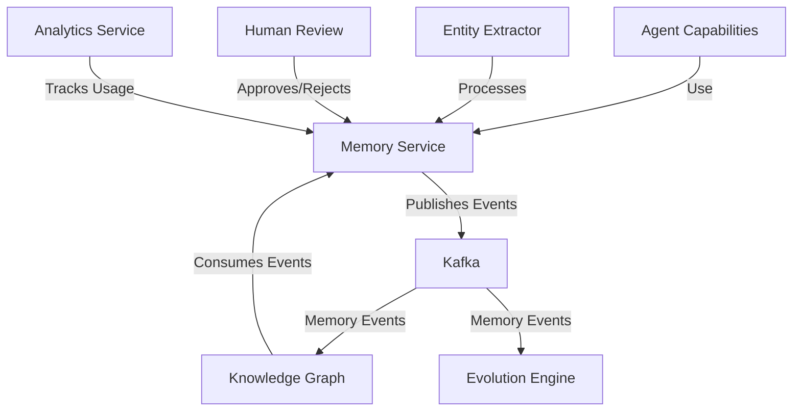

# Memory Service Integration

## Overview

This document explains how the Memory Service integrates with other components in the Agent Orchestration Platform, including practical code examples of the integration points.

## Memory Service Integration Map



## Direct Service Integration

### Agent Capability Integration

Agent capabilities access the Memory Service for storing and retrieving information:

```python
class UserPreferenceCapability(BaseCapability):
    """Capability to manage user preferences."""
    
    def __init__(self, service_registry):
        super().__init__(service_registry)
        self.memory_service = service_registry.get("memory_service")
    
    async def execute(self, params: PreferenceParams) -> Dict[str, Any]:
        """Execute the capability with given parameters."""
        if params.action == "store":
            # Store user preference in memory
            memory_content = f"User preference: {params.preference_type} = {params.preference_value}"
            
            # Store in memory system
            memory = await self.memory_service.add_memory(
                content=memory_content,
                filters={"user_id": params.user_id, "tags": ["preference"]},
                metadata={
                    "preference_type": params.preference_type, 
                    "preference_value": params.preference_value
                }
            )
            
            return {
                "status": "stored",
                "memory_id": memory["memory_id"]
            }
            
        elif params.action == "retrieve":
            # Retrieve user preference from memory
            query = f"{params.preference_type} preference"
            
            memories = await self.memory_service.search_memories(
                query=query,
                filters={"user_id": params.user_id, "tags": ["preference"]},
                limit=1
            )
            
            if memories:
                return {
                    "status": "found",
                    "preference": extract_preference_from_memory(memories[0])
                }
            else:
                return {
                    "status": "not_found"
                }
```

### Task Manager Integration

Task management services use memory to track context across tasks:

```python
class TaskManager:
    """Manages agent tasks and their context."""
    
    def __init__(self, service_registry):
        self.memory_service = service_registry.get("memory_service")
        self.agent_service = service_registry.get("agent_service")
    
    async def create_task_with_context(self, task_data, user_id):
        """Create a task with relevant context from memory."""
        # Retrieve relevant memories for task context
        relevant_memories = await self.memory_service.search_memories(
            query=task_data["description"],
            filters={"user_id": user_id},
            limit=5
        )
        
        # Format context from memories
        context = [
            {
                "content": memory["content"],
                "relevance": memory["score"],
                "source": "memory",
                "memory_id": memory["memory_id"]
            }
            for memory in relevant_memories
        ]
        
        # Create task with context
        task = await self.create_task({
            **task_data,
            "context": context,
            "user_id": user_id
        })
        
        # Store task creation as a memory
        await self.memory_service.add_memory(
            content=f"Created task: {task_data['title']}",
            filters={"user_id": user_id, "tags": ["task"]},
            metadata={
                "task_id": task["id"],
                "task_title": task["title"]
            }
        )
        
        return task
```

## Event-Based Integration

### Memory Event Schema

Memory events follow standardized schemas for integration:

```python
# memory.created event
{
    "event_id": "evt_123abc",
    "event_type": "memory.created",
    "timestamp": "2025-03-16T09:30:00Z",
    "memory_id": "mem_456def",
    "user_id": "user_789ghi",
    "agent_id": "agent_012jkl",
    "content_preview": "User prefers dark mode in all applications...",
    "metadata": {
        "source": "conversation",
        "importance": "high",
        "tags": ["preference", "ui"]
    }
}

# memory.entity.extracted event
{
    "event_id": "evt_345mno",
    "event_type": "memory.entity.extracted", 
    "timestamp": "2025-03-16T09:30:05Z",
    "memory_id": "mem_456def",
    "entities": [
        {
            "name": "dark mode",
            "type": "preference",
            "confidence": 0.95
        },
        {
            "name": "applications",
            "type": "software",
            "confidence": 0.87
        }
    ],
    "relationships": [
        {
            "source": "dark mode",
            "target": "applications",
            "type": "applies_to",
            "confidence": 0.92
        }
    ]
}
```

### Knowledge Graph Integration

The Knowledge Graph consumes memory events to build a connected graph of entities:

```python
class KnowledgeGraphService:
    """Service for managing the knowledge graph."""
    
    def __init__(self, graph_repository, event_consumer, event_publisher):
        self.graph_repository = graph_repository
        self.event_consumer = event_consumer
        self.event_publisher = event_publisher
        
    async def initialize(self):
        """Initialize the service and set up event listeners."""
        # Register event handlers
        self.event_consumer.register_handler(
            topic="memory.entity.extracted",
            handler=self.handle_entity_extraction
        )
        
        await self.event_consumer.start()
    
    async def handle_entity_extraction(self, event):
        """Handle memory.entity.extracted events."""
        memory_id = event["memory_id"]
        entities = event["entities"]
        relationships = event.get("relationships", [])
        
        # Process entities
        for entity in entities:
            # Create or update entity in graph
            entity_id = await self.graph_repository.upsert_entity(
                name=entity["name"],
                entity_type=entity["type"],
                properties={
                    "confidence": entity["confidence"],
                    "source_memory_id": memory_id
                }
            )
        
        # Process relationships
        for relationship in relationships:
            # Find or create source and target entities
            source_id = await self.graph_repository.find_entity_id(
                name=relationship["source"]
            )
            
            target_id = await self.graph_repository.find_entity_id(
                name=relationship["target"]
            )
            
            if source_id and target_id:
                # Create relationship
                await self.graph_repository.create_relationship(
                    source_id=source_id,
                    target_id=target_id,
                    relationship_type=relationship["type"],
                    properties={
                        "confidence": relationship["confidence"],
                        "source_memory_id": memory_id
                    }
                )
        
        # Publish knowledge graph updated event
        await self.event_publisher.publish(
            topic="knowledge_graph.updated",
            event={
                "memory_id": memory_id,
                "entity_count": len(entities),
                "relationship_count": len(relationships)
            }
        )
```

### Evolution Engine Integration

The Evolution Engine uses memory patterns to suggest agent improvements:

```python
class MemoryPatternAnalyzer:
    """Analyzes memory patterns for agent evolution."""
    
    def __init__(self, memory_service, evolution_service):
        self.memory_service = memory_service
        self.evolution_service = evolution_service
    
    async def analyze_agent_memories(self, agent_id, time_period=7*24*60*60):
        """Analyze agent memories for patterns that could improve performance."""
        # Get recent memories
        memories = await self.memory_service.search_memories(
            query="",
            filters={
                "agent_id": agent_id,
                "created_after": (datetime.now() - timedelta(seconds=time_period)).isoformat()
            },
            limit=100
        )
        
        # Identify memory patterns
        patterns = await self._identify_patterns(memories)
        
        # Generate evolution proposals based on patterns
        for pattern in patterns:
            if pattern["confidence"] > 0.7:
                proposal = await self._generate_proposal(agent_id, pattern)
                
                # Submit evolution proposal
                await self.evolution_service.submit_proposal(proposal)
        
        return {
            "analyzed_memories": len(memories),
            "patterns_found": len(patterns),
            "proposals_generated": sum(1 for p in patterns if p["confidence"] > 0.7)
        }
```

## Human Review Integration

The Memory System integrates with human review workflows:

```python
class MemoryReviewService:
    """Service for managing human review of memories."""
    
    def __init__(self, memory_service, notification_service, event_publisher):
        self.memory_service = memory_service
        self.notification_service = notification_service
        self.event_publisher = event_publisher
    
    async def flag_for_review(self, memory_id, reason):
        """Flag a memory for human review."""
        # Update memory metadata
        await self.memory_service.update_memory_metadata(
            memory_id=memory_id,
            metadata_updates={
                "review_status": "pending",
                "review_reason": reason,
                "flagged_at": datetime.now().isoformat()
            }
        )
        
        # Get memory details
        memory = await self.memory_service.get_memory(memory_id)
        
        # Create review request
        review_id = await self._create_review_request(memory, reason)
        
        # Notify reviewers
        await self.notification_service.notify_reviewers(
            notification_type="memory_review",
            content={
                "memory_id": memory_id,
                "review_id": review_id,
                "reason": reason,
                "content_preview": memory["content"][:100]
            }
        )
        
        # Publish event
        await self.event_publisher.publish(
            topic="memory.review.requested",
            event={
                "memory_id": memory_id,
                "review_id": review_id,
                "reason": reason
            }
        )
        
        return review_id
    
    async def process_review_decision(self, review_id, decision, reviewer_id, comments=None):
        """Process a review decision."""
        # Get review request
        review = await self._get_review_request(review_id)
        memory_id = review["memory_id"]
        
        # Update memory metadata
        await self.memory_service.update_memory_metadata(
            memory_id=memory_id,
            metadata_updates={
                "review_status": decision,
                "reviewed_by": reviewer_id,
                "reviewed_at": datetime.now().isoformat(),
                "review_comments": comments
            }
        )
        
        # If rejected, mark memory as invalid
        if decision == "rejected":
            await self.memory_service.update_memory_metadata(
                memory_id=memory_id,
                metadata_updates={"valid": False}
            )
        
        # Publish event
        await self.event_publisher.publish(
            topic="memory.review.completed",
            event={
                "memory_id": memory_id,
                "review_id": review_id,
                "decision": decision,
                "reviewer_id": reviewer_id
            }
        )
        
        return {
            "memory_id": memory_id,
            "review_id": review_id,
            "status": "completed",
            "decision": decision
        }
```

## Analytics Integration

The Memory System provides usage metrics for analytics:

```python
class MemoryAnalyticsCollector:
    """Collects analytics data for memory operations."""
    
    def __init__(self, event_consumer, analytics_service):
        self.event_consumer = event_consumer
        self.analytics_service = analytics_service
    
    async def initialize(self):
        """Initialize the collector and set up event listeners."""
        # Register event handlers for memory events
        for topic in ["memory.created", "memory.searched", "memory.updated", "memory.deleted"]:
            self.event_consumer.register_handler(
                topic=topic,
                handler=self.handle_memory_event
            )
        
        await self.event_consumer.start()
    
    async def handle_memory_event(self, event):
        """Handle memory events for analytics."""
        # Extract event data
        event_type = event["event_type"]
        timestamp = event["timestamp"]
        user_id = event.get("user_id")
        agent_id = event.get("agent_id")
        
        # Create analytics entry
        analytics_data = {
            "event_type": event_type,
            "timestamp": timestamp,
            "user_id": user_id,
            "agent_id": agent_id
        }
        
        # Add event-specific metrics
        if event_type == "memory.searched":
            analytics_data.update({
                "query": event.get("query"),
                "result_count": event.get("result_count"),
                "latency_ms": event.get("latency_ms")
            })
        
        # Record analytics
        await self.analytics_service.record_event(analytics_data)
        
        # Update aggregated metrics
        if user_id:
            await self._update_user_metrics(user_id, event_type)
            
        if agent_id:
            await self._update_agent_metrics(agent_id, event_type)
```

## Testing Memory Integration

Example of an integration test for memory and knowledge graph:

```python
async def test_memory_to_knowledge_graph_integration():
    """Test the integration between memory and knowledge graph services."""
    # Set up test environment
    memory_service, knowledge_graph, event_bus = setup_test_services()
    
    # Create a memory with entities
    memory = await memory_service.add_memory(
        content="Alex enjoys hiking in the mountains with his dog Max.",
        filters={"user_id": "test_user", "agent_id": "test_agent"}
    )
    
    # Wait for entity extraction and knowledge graph update (events are async)
    await asyncio.sleep(1)  # In real tests, use a more robust waiting strategy
    
    # Query knowledge graph for entities
    entities = await knowledge_graph.get_entities_by_memory(memory["memory_id"])
    
    # Verify entities were extracted and added to graph
    assert len(entities) >= 3  # Should have extracted at least Alex, mountains, and Max
    
    # Check for specific entities
    entity_names = [e["name"] for e in entities]
    assert "Alex" in entity_names
    assert "mountains" in entity_names
    assert "Max" in entity_names
    
    # Check for relationships
    relationships = await knowledge_graph.get_relationships_by_memory(memory["memory_id"])
    assert len(relationships) >= 2  # Should have extracted at least 2 relationships
    
    # Verify specific relationship
    has_ownership_rel = any(
        r["source_name"] == "Alex" and 
        r["target_name"] == "Max" and 
        r["type"] == "owns"
        for r in relationships
    )
    assert has_ownership_rel
```
