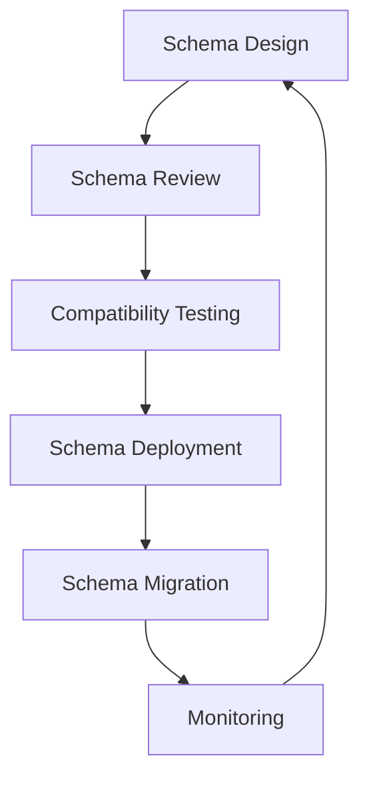

# Schema Evolution Management

## Overview

This document outlines the strategy and best practices for managing schema evolution in the Agent Orchestration Platform. Schema evolution is critical for maintaining compatibility as the platform evolves while ensuring reliable communication between services.

## Schema Evolution Principles



## Compatibility Types

The Kafka Schema Registry supports several compatibility types:

1. **BACKWARD**: New schema can read data written with old schema
2. **FORWARD**: Old schema can read data written with new schema
3. **FULL**: Both backward and forward compatible
4. **NONE**: No compatibility checking
5. **BACKWARD_TRANSITIVE**: Backward compatibility with all previous versions
6. **FORWARD_TRANSITIVE**: Forward compatibility with all previous versions
7. **FULL_TRANSITIVE**: Both backward and forward compatibility with all previous versions

## Compatibility Strategy

The Agent Orchestration Platform adopts the following compatibility strategy:

| Subject Pattern | Default Compatibility | Rationale |
|-----------------|----------------------|-----------|
| `*-key` | FULL | Keys require strict compatibility to ensure proper routing |
| `*-value` | BACKWARD | Allows adding new optional fields while ensuring consumers can read new data |
| `mcp.*-value` | BACKWARD_TRANSITIVE | MCP events require compatibility with all historical versions |
| `metrics.*-value` | FORWARD | Metrics consumers may not be updated as frequently |

## Schema Evolution Guidelines

### 1. Compatible Changes

These changes maintain backward compatibility:

- Adding new optional fields with default values
- Removing optional fields (if using FORWARD compatibility)
- Adding enum values (if consumers handle unknown values)
- Changing field doc attribute
- Changing field order attribute

### 2. Breaking Changes

These changes break compatibility and require careful migration:

- Removing required fields
- Adding required fields without defaults
- Changing field types (e.g., int to string)
- Renaming fields
- Changing field namespace

### 3. Schema Evolution Patterns

#### Adding New Fields

```diff
{
  "type": "record",
  "name": "User",
  "fields": [
    {"name": "id", "type": "string"},
    {"name": "name", "type": "string"},
+   {"name": "email", "type": ["null", "string"], "default": null}
  ]
}
```

#### Renaming Fields (with compatibility bridge)

```diff
{
  "type": "record",
  "name": "User",
  "fields": [
-   {"name": "name", "type": "string"}
+   {"name": "full_name", "type": "string"},
+   {"name": "name", "type": "string", "doc": "DEPRECATED: Use full_name instead"}
  ]
}
```

#### Changing Field Types (with compatibility bridge)

```diff
{
  "type": "record",
  "name": "User",
  "fields": [
-   {"name": "age", "type": "int"}
+   {"name": "age", "type": ["int", "string"]},
+   {"name": "age_string", "type": ["null", "string"], "default": null}
  ]
}
```

## Schema Evolution Management Process

### Schema Testing Framework

```python
import json
import pytest
from confluent_kafka.schema_registry import SchemaRegistryClient
from agent_orchestration.schemas.testing import SchemaValidator

class TestSchemaEvolution:
    """Test suite for schema evolution."""
    
    @pytest.fixture
    def schema_registry_client(self):
        """Create Schema Registry client for testing."""
        return SchemaRegistryClient({'url': 'http://localhost:8081'})
    
    @pytest.fixture
    def schema_validator(self, schema_registry_client):
        """Create schema validator."""
        return SchemaValidator(schema_registry_client)
    
    def test_schema_backward_compatibility(self, schema_validator):
        """Test backward compatibility of schema changes."""
        # Load the old and new schemas
        with open('schemas/old/user.avsc', 'r') as f:
            old_schema = json.load(f)
        
        with open('schemas/new/user.avsc', 'r') as f:
            new_schema = json.load(f)
        
        # Check backward compatibility
        result = schema_validator.check_backward_compatibility(
            subject='user-value',
            old_schema=json.dumps(old_schema),
            new_schema=json.dumps(new_schema)
        )
        
        assert result.is_compatible, f"Schema is not backward compatible: {result.errors}"
    
    def test_data_compatibility(self, schema_validator):
        """Test that old data can be read with new schema."""
        # Load the old and new schemas
        with open('schemas/old/user.avsc', 'r') as f:
            old_schema = json.load(f)
        
        with open('schemas/new/user.avsc', 'r') as f:
            new_schema = json.load(f)
        
        # Load sample data
        with open('samples/user.json', 'r') as f:
            sample_data = json.load(f)
        
        # Validate data can be read with both schemas
        result = schema_validator.validate_data_compatibility(
            old_schema=json.dumps(old_schema),
            new_schema=json.dumps(new_schema),
            data=sample_data
        )
        
        assert result.is_compatible, f"Data compatibility issue: {result.errors}"
```

### Schema Evolution Validator Implementation

```python
import json
from typing import Dict, Any, List, NamedTuple, Optional
from confluent_kafka.schema_registry import SchemaRegistryClient
from confluent_kafka.schema_registry.avro import AvroSerializer, AvroDeserializer

class CompatibilityResult(NamedTuple):
    """Result of compatibility check."""
    
    is_compatible: bool
    errors: List[str]

class SchemaValidator:
    """Validator for schema compatibility."""
    
    def __init__(self, schema_registry_client: SchemaRegistryClient):
        """Initialize schema validator.
        
        Args:
            schema_registry_client: Schema Registry client
        """
        self.client = schema_registry_client
    
    def check_compatibility(self, subject: str, schema: str) -> CompatibilityResult:
        """Check compatibility with Schema Registry.
        
        Args:
            subject: Subject name
            schema: Schema to check
            
        Returns:
            Compatibility result
        """
        try:
            # Check compatibility with Schema Registry
            is_compatible = self.client.test_compatibility(subject, schema)
            
            if is_compatible:
                return CompatibilityResult(True, [])
            else:
                return CompatibilityResult(False, ["Schema is not compatible with registry"])
                
        except Exception as e:
            return CompatibilityResult(False, [str(e)])
    
    def check_backward_compatibility(
        self, subject: str, old_schema: str, new_schema: str
    ) -> CompatibilityResult:
        """Check backward compatibility between two schemas.
        
        Args:
            subject: Subject name
            old_schema: Old schema
            new_schema: New schema
            
        Returns:
            Compatibility result
        """
        try:
            # Register temporary schema version
            schema_id = self.client.register_schema(f"{subject}-temp", old_schema)
            
            try:
                # Check compatibility
                is_compatible = self.client.test_compatibility(f"{subject}-temp", new_schema)
                
                if is_compatible:
                    return CompatibilityResult(True, [])
                else:
                    return CompatibilityResult(False, ["New schema is not backward compatible"])
                    
            finally:
                # Clean up temporary schema
                # Note: Schema Registry doesn't support deleting schemas in standard API
                # In practice, use separate test Schema Registry
                pass
                
        except Exception as e:
            return CompatibilityResult(False, [str(e)])
    
    def validate_data_compatibility(
        self, old_schema: str, new_schema: str, data: Dict[str, Any]
    ) -> CompatibilityResult:
        """Validate data compatibility with both schemas.
        
        Args:
            old_schema: Old schema
            new_schema: New schema
            data: Sample data
            
        Returns:
            Compatibility result
        """
        errors = []
        
        # Check serialization with old schema
        try:
            old_serializer = AvroSerializer(self.client, old_schema)
            old_serialized = old_serializer(data, None)
        except Exception as e:
            errors.append(f"Cannot serialize with old schema: {str(e)}")
        
        # Check serialization with new schema
        try:
            new_serializer = AvroSerializer(self.client, new_schema)
            new_serialized = new_serializer(data, None)
        except Exception as e:
            errors.append(f"Cannot serialize with new schema: {str(e)}")
        
        # If serialization successful, check deserialization
        if len(errors) == 0:
            try:
                # Check old data with new schema
                new_deserializer = AvroDeserializer(self.client, new_schema)
                old_data_new_schema = new_deserializer(old_serialized, None)
                
                # Check data equality (simplistic)
                missing_fields = []
                for key, value in data.items():
                    if key not in old_data_new_schema:
                        missing_fields.append(key)
                
                if missing_fields:
                    errors.append(f"Fields missing after deserialization: {missing_fields}")
                    
            except Exception as e:
                errors.append(f"Cannot deserialize old data with new schema: {str(e)}")
        
        return CompatibilityResult(len(errors) == 0, errors)
```

## Schema Migration Strategies

### 1. Add Before Read Pattern

For backward-compatible changes, follow this sequence:

1. **Deploy Updated Consumer**: Deploy consumers that understand both old and new schemas
2. **Update Schema**: Register new schema version in Schema Registry
3. **Deploy Updated Producer**: Deploy producers that write with new schema

### 2. Dual-Write Pattern

For breaking changes:

1. **Create New Topic**: Create a new topic with the new schema
2. **Implement Dual-Write**: Producers write to both old and new topics
3. **Migrate Consumers**: Update consumers to read from new topic
4. **Remove Old Support**: Once all consumers are migrated, remove dual-write and old topic

### 3. Schema Migration Coordinator

```python
import asyncio
import logging
from typing import Dict, Any, List, Optional
from pydantic import BaseModel
from agent_orchestration.core.service_base import ServiceBase

logger = logging.getLogger(__name__)

class MigrationStep(BaseModel):
    """Step in a schema migration plan."""
    
    id: str
    description: str
    executed: bool = False
    execution_time: Optional[int] = None
    dependencies: List[str] = []

class MigrationPlan(BaseModel):
    """Plan for schema migration."""
    
    id: str
    name: str
    description: str
    steps: List[MigrationStep]
    started: bool = False
    completed: bool = False
    current_step: Optional[str] = None

class SchemaMigrationService(ServiceBase):
    """Service for coordinating schema migrations."""
    
    def __init__(self, config_service, schema_registry_service, event_publisher):
        """Initialize schema migration service.
        
        Args:
            config_service: Configuration service
            schema_registry_service: Schema Registry service
            event_publisher: Event publisher
        """
        self.config_service = config_service
        self.schema_registry = schema_registry_service
        self.event_publisher = event_publisher
        self.active_migrations: Dict[str, MigrationPlan] = {}
    
    async def create_migration_plan(self, plan: MigrationPlan) -> str:
        """Create a new migration plan.
        
        Args:
            plan: Migration plan
            
        Returns:
            Plan ID
        """
        self.active_migrations[plan.id] = plan
        return plan.id
    
    async def execute_migration(self, plan_id: str) -> bool:
        """Execute a migration plan.
        
        Args:
            plan_id: Plan ID
            
        Returns:
            True if successful, False otherwise
        """
        if plan_id not in self.active_migrations:
            raise ValueError(f"Migration plan {plan_id} not found")
        
        plan = self.active_migrations[plan_id]
        plan.started = True
        
        # Build execution order based on dependencies
        execution_order = self._build_execution_order(plan.steps)
        
        # Execute steps
        for step in execution_order:
            plan.current_step = step.id
            
            logger.info(f"Executing migration step: {step.id} - {step.description}")
            
            # Execute step-specific logic
            success = await self._execute_step(plan_id, step.id)
            
            if not success:
                logger.error(f"Migration step {step.id} failed")
                return False
            
            step.executed = True
        
        plan.completed = True
        plan.current_step = None
        
        logger.info(f"Migration plan {plan_id} completed successfully")
        return True
    
    def _build_execution_order(self, steps: List[MigrationStep]) -> List[MigrationStep]:
        """Build execution order based on dependencies.
        
        Args:
            steps: Migration steps
            
        Returns:
            Ordered steps
        """
        # Simple topological sort
        result = []
        visited = set()
        temp_marks = set()
        
        # Convert to map for easier access
        step_map = {step.id: step for step in steps}
        
        def visit(step_id):
            if step_id in temp_marks:
                raise ValueError(f"Circular dependency detected in migration steps: {step_id}")
            
            if step_id not in visited:
                temp_marks.add(step_id)
                
                step = step_map[step_id]
                for dep_id in step.dependencies:
                    visit(dep_id)
                
                temp_marks.remove(step_id)
                visited.add(step_id)
                result.append(step)
        
        # Visit all nodes
        for step in steps:
            if step.id not in visited:
                visit(step.id)
        
        return result
    
    async def _execute_step(self, plan_id: str, step_id: str) -> bool:
        """Execute a migration step.
        
        Args:
            plan_id: Plan ID
            step_id: Step ID
            
        Returns:
            True if successful, False otherwise
        """
        # Get plan and step
        plan = self.active_migrations[plan_id]
        step = next((s for s in plan.steps if s.id == step_id), None)
        
        if not step:
            return False
        
        try:
            # Step-specific logic based on step ID
            if step_id.startswith("register_schema_"):
                # Register new schema version
                await self._register_schema_step(step_id)
            elif step_id.startswith("update_config_"):
                # Update configuration
                await self._update_config_step(step_id)
            elif step_id.startswith("notify_service_"):
                # Notify service of schema change
                await self._notify_service_step(step_id)
            else:
                # Custom step implementation
                logger.warning(f"Unknown step type: {step_id}")
            
            return True
            
        except Exception as e:
            logger.error(f"Error executing step {step_id}: {str(e)}")
            return False
    
    async def _register_schema_step(self, step_id: str) -> None:
        """Execute register schema step.
        
        Args:
            step_id: Step ID
        """
        # Example implementation - would be customized for each step
        parts = step_id.split("_")
        subject = parts[-1]
        
        # Load schema from file
        schema_path = f"schemas/{subject}.avsc"
        with open(schema_path, 'r') as f:
            schema_str = f.read()
        
        # Register schema
        await self.schema_registry.register_schema(subject, schema_str)
    
    async def _update_config_step(self, step_id: str) -> None:
        """Execute update config step.
        
        Args:
            step_id: Step ID
        """
        # Example implementation
        parts = step_id.split("_")
        config_key = parts[-1]
        
        # Update configuration
        await self.config_service.update_config(config_key, {"schema_version": "new"})
    
    async def _notify_service_step(self, step_id: str) -> None:
        """Execute notify service step.
        
        Args:
            step_id: Step ID
        """
        # Example implementation
        parts = step_id.split("_")
        service_name = parts[-1]
        
        # Publish notification event
        await self.event_publisher.publish(
            topic="platform.schema.events",
            key=service_name,
            value={"type": "schema_updated", "service": service_name}
        )
```

## CI/CD Integration

### Schema Validation Pipeline

```yaml
# .github/workflows/schema-validation.yml
name: Schema Validation

on:
  pull_request:
    paths:
      - 'schemas/**/*.avsc'
      - 'src/main/avro/**/*.avsc'

jobs:
  validate-schemas:
    runs-on: ubuntu-latest
    
    services:
      schema-registry:
        image: confluentinc/cp-schema-registry:7.3.0
        env:
          SCHEMA_REGISTRY_HOST_NAME: schema-registry
          SCHEMA_REGISTRY_KAFKASTORE_BOOTSTRAP_SERVERS: PLAINTEXT://kafka:9092
          SCHEMA_REGISTRY_LISTENERS: http://0.0.0.0:8081
        ports:
          - 8081:8081
      
      kafka:
        image: confluentinc/cp-kafka:7.3.0
        env:
          KAFKA_BROKER_ID: 1
          KAFKA_ZOOKEEPER_CONNECT: zookeeper:2181
          KAFKA_ADVERTISED_LISTENERS: PLAINTEXT://kafka:9092
          KAFKA_OFFSETS_TOPIC_REPLICATION_FACTOR: 1
        ports:
          - 9092:9092
      
      zookeeper:
        image: confluentinc/cp-zookeeper:7.3.0
        env:
          ZOOKEEPER_CLIENT_PORT: 2181
          ZOOKEEPER_TICK_TIME: 2000

    steps:
      - uses: actions/checkout@v3
      
      - name: Set up Python
        uses: actions/setup-python@v4
        with:
          python-version: '3.10'
      
      - name: Install dependencies
        run: |
          python -m pip install --upgrade pip
          pip install confluent-kafka avro pytest
      
      - name: Register existing schemas
        run: |
          python tools/register_existing_schemas.py
      
      - name: Run schema validation tests
        run: |
          pytest tests/schema/
      
      - name: Check compatibility
        run: |
          python tools/check_schema_compatibility.py
```

### Schema Registry Deployment Pipeline

```yaml
# .github/workflows/deploy-schemas.yml
name: Deploy Schemas

on:
  push:
    branches:
      - main
    paths:
      - 'schemas/**/*.avsc'

jobs:
  deploy-schemas:
    runs-on: ubuntu-latest
    
    steps:
      - uses: actions/checkout@v3
      
      - name: Set up Python
        uses: actions/setup-python@v4
        with:
          python-version: '3.10'
      
      - name: Install dependencies
        run: |
          python -m pip install --upgrade pip
          pip install confluent-kafka requests
      
      - name: Deploy schemas to development
        if: github.ref == 'refs/heads/main'
        run: |
          python tools/deploy_schemas.py --env development
      
      - name: Create schema migration plan
        if: github.ref == 'refs/heads/main'
        run: |
          python tools/create_migration_plan.py
      
      - name: Notify team of schema changes
        run: |
          curl -X POST ${{ secrets.SLACK_WEBHOOK }} \
            -H 'Content-Type: application/json' \
            -d '{"text":"New schema changes deployed to development"}'
```

## Monitoring Schema Evolution

### Metrics to Track

1. **Schema Version Count**: Number of schema versions per subject
2. **Schema Compatibility Failures**: Count of compatibility check failures
3. **Schema Size**: Size of each schema version
4. **Serialization Errors**: Count of serialization errors by schema version
5. **Deserialization Errors**: Count of deserialization errors by schema version

### Monitoring Dashboard

```python
from agent_orchestration.monitoring.metrics import MetricsService

class SchemaMetricsCollector:
    """Collector for schema-related metrics."""
    
    def __init__(self, metrics_service: MetricsService, schema_registry_service):
        """Initialize schema metrics collector.
        
        Args:
            metrics_service: Metrics service
            schema_registry_service: Schema Registry service
        """
        self.metrics = metrics_service
        self.schema_registry = schema_registry_service
    
    async def collect_metrics(self):
        """Collect schema-related metrics."""
        # Track schema versions
        subjects = await self.schema_registry.get_subjects()
        
        for subject in subjects:
            versions = await self.schema_registry.get_versions(subject)
            
            # Record version count
            self.metrics.gauge(
                name="schema_registry.versions.count",
                value=len(versions),
                tags={"subject": subject}
            )
            
            # Record latest version
            self.metrics.gauge(
                name="schema_registry.versions.latest",
                value=max(versions),
                tags={"subject": subject}
            )
        
        # Track serialization errors
        error_count = self.schema_registry.get_error_count()
        
        self.metrics.gauge(
            name="schema_registry.errors.serialization",
            value=error_count.get("serialization", 0)
        )
        
        self.metrics.gauge(
            name="schema_registry.errors.deserialization",
            value=error_count.get("deserialization", 0)
        )
```

## Schema Evolution Checklist

### Before Making Schema Changes

- [ ] Document the reason for the schema change
- [ ] Determine if the change is backward compatible
- [ ] Design a migration strategy for incompatible changes
- [ ] Write tests for the new schema
- [ ] Update affected consumers and producers

### During Schema Deployment

- [ ] Register new schema in development environment
- [ ] Test compatibility with existing data
- [ ] Deploy updated consumers
- [ ] Register new schema in production
- [ ] Deploy updated producers
- [ ] Monitor for errors

### After Schema Deployment

- [ ] Verify all services are using the new schema
- [ ] Clean up any temporary migration code
- [ ] Document the schema change in the schema registry
- [ ] Update schema documentation
