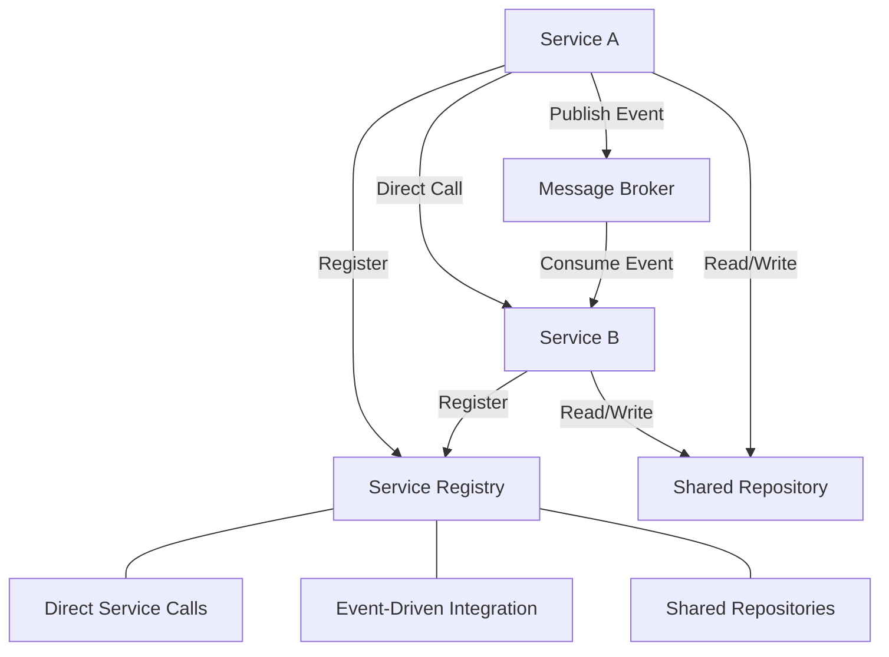

# Service Integration Architecture

## Overview

This document outlines how services in the Agent Orchestration Platform communicate and integrate. The platform uses a combination of direct service calls, event-driven communication, and shared data repositories to create a cohesive but loosely coupled system.

## Core Integration Patterns



## Service Registry

The Service Registry pattern provides a central point for service discovery and dependency management:

```python
class ServiceRegistry:
    """Central registry for all platform services."""
    
    def __init__(self):
        self._services = {}
        self._lock = threading.RLock()
        
    def register(self, service_name: str, service_instance: Any) -> None:
        """Register a service instance with a name."""
        with self._lock:
            if service_name in self._services:
                raise ValueError(f"Service {service_name} already registered")
            self._services[service_name] = service_instance
            
    def get(self, service_name: str) -> Any:
        """Get a registered service by name."""
        with self._lock:
            if service_name not in self._services:
                raise KeyError(f"Service {service_name} not registered")
            return self._services[service_name]
    
    def has_service(self, service_name: str) -> bool:
        """Check if a service is registered."""
        with self._lock:
            return service_name in self._services
```

### Using the Service Registry

```python
# Application startup
registry = ServiceRegistry()
registry.register("agent_service", AgentService(...))
registry.register("capability_service", CapabilityService(...))
registry.register("memory_service", MemoryService(...))

# In a capability class
class SearchCapability(BaseCapability):
    def __init__(self, service_registry):
        self.memory_service = service_registry.get("memory_service")
        self.knowledge_graph = service_registry.get("knowledge_graph")
```

## Event-Driven Integration

Services communicate asynchronously via a message broker (Kafka):

### Event Publisher

```python
class EventPublisher:
    """Publishes events to Kafka topics."""
    
    def __init__(self, bootstrap_servers):
        self.producer = KafkaProducer(
            bootstrap_servers=bootstrap_servers,
            value_serializer=lambda v: json.dumps(v).encode('utf-8')
        )
        
    async def publish(self, topic: str, event: dict) -> None:
        """Publish an event to a topic."""
        # Add metadata
        event_with_metadata = {
            **event,
            "event_id": str(uuid.uuid4()),
            "timestamp": datetime.now().isoformat()
        }
        
        # Publish asynchronously
        future = self.producer.send(topic, event_with_metadata)
        await asyncio.wrap_future(future)
```

### Event Consumer

```python
class EventConsumer:
    """Consumes events from Kafka topics."""
    
    def __init__(self, bootstrap_servers, group_id, topics):
        self.consumer = AIOKafkaConsumer(
            *topics,
            bootstrap_servers=bootstrap_servers,
            group_id=group_id,
            value_deserializer=lambda m: json.loads(m.decode('utf-8'))
        )
        self.running = False
        self.handlers = {}
        
    def register_handler(self, topic: str, handler_func: Callable) -> None:
        """Register a handler for a topic."""
        if topic not in self.handlers:
            self.handlers[topic] = []
        self.handlers[topic].append(handler_func)
        
    async def start(self) -> None:
        """Start consuming events."""
        await self.consumer.start()
        self.running = True
        asyncio.create_task(self._consume())
        
    async def _consume(self) -> None:
        """Consume messages and dispatch to handlers."""
        while self.running:
            try:
                async for message in self.consumer:
                    topic = message.topic
                    if topic in self.handlers:
                        for handler in self.handlers[topic]:
                            asyncio.create_task(handler(message.value))
            except Exception as e:
                logger.error(f"Error consuming messages: {e}")
                await asyncio.sleep(1)  # Prevent tight error loop
```

### Event Integration Example

```python
# Producer side (Memory Service)
async def add_memory(self, content, filters, metadata=None):
    # Business logic...
    
    # Publish event
    await self.event_publisher.publish(
        topic="memory.created",
        event={
            "memory_id": memory_id,
            "filters": filters,
            "content_preview": content[:100],
            "metadata": metadata
        }
    )
    
    return memory

# Consumer side (Entity Extractor)
async def setup(self):
    # Register event handler
    self.event_consumer.register_handler(
        topic="memory.created",
        handler_func=self.handle_memory_created
    )
    await self.event_consumer.start()
    
async def handle_memory_created(self, event):
    """Handle memory.created event."""
    memory_id = event["memory_id"]
    
    # Get full memory content
    memory = await self.memory_service.get_memory(memory_id)
    
    # Process for entity extraction
    entities = await self.extract_entities(memory["content"])
    
    # Update knowledge graph
    await self.knowledge_graph.add_entities(memory_id, entities)
    
    # Publish follow-up event
    await self.event_publisher.publish(
        topic="memory.entity.extracted",
        event={
            "memory_id": memory_id,
            "entities": entities
        }
    )
```

## Repository Pattern Integration

Services share data through repositories with well-defined interfaces:

```python
class AgentRepositoryProtocol(Protocol):
    """Protocol for agent repository operations."""
    
    async def get_agent(self, agent_id: str) -> Dict[str, Any]:
        """Get an agent by ID."""
        ...
    
    async def create_agent(self, agent_data: Dict[str, Any]) -> str:
        """Create a new agent."""
        ...
    
    async def update_agent(self, agent_id: str, updates: Dict[str, Any]) -> bool:
        """Update an existing agent."""
        ...
    
    async def delete_agent(self, agent_id: str) -> bool:
        """Delete an agent."""
        ...
    
    async def list_agents(self, filters: Dict[str, Any] = None) -> List[Dict[str, Any]]:
        """List agents matching filters."""
        ...
    
    async def get_agent_version_history(self, agent_id: str) -> List[Dict[str, Any]]:
        """Get version history for an agent."""
        ...
    
    async def revert_to_version(self, agent_id: str, version: str) -> bool:
        """Revert an agent to a previous version."""
        ...
```

### Repository Implementation

```python
class PostgresAgentRepository:
    """Postgres implementation of agent repository."""
    
    def __init__(self, connection_pool):
        self.pool = connection_pool
        
    async def get_agent(self, agent_id: str) -> Dict[str, Any]:
        """Get an agent by ID."""
        async with self.pool.acquire() as conn:
            query = """
                SELECT id, name, description, version, created_at, updated_at, 
                       configuration, capabilities, prompt_templates
                FROM agents
                WHERE id = $1 AND deleted_at IS NULL
            """
            row = await conn.fetchrow(query, agent_id)
            
            if not row:
                raise EntityNotFoundError(f"Agent {agent_id} not found")
                
            return dict(row)
```

### Shared Repository Usage

```python
# In AgentService
class AgentService:
    def __init__(self, agent_repository, event_publisher):
        self.agent_repository = agent_repository
        self.event_publisher = event_publisher
        
    async def create_agent(self, agent_data):
        # Validate agent data
        validate_agent_data(agent_data)
        
        # Create agent in repository
        agent_id = await self.agent_repository.create_agent(agent_data)
        
        # Publish event
        await self.event_publisher.publish(
            topic="agent.created",
            event={
                "agent_id": agent_id,
                "name": agent_data["name"]
            }
        )
        
        return agent_id

# In CapabilityService
class CapabilityService:
    def __init__(self, agent_repository, capability_repository):
        self.agent_repository = agent_repository
        self.capability_repository = capability_repository
        
    async def add_capability_to_agent(self, agent_id, capability_id, configuration):
        # Verify agent exists
        agent = await self.agent_repository.get_agent(agent_id)
        
        # Verify capability exists
        capability = await self.capability_repository.get_capability(capability_id)
        
        # Update agent capabilities
        agent["capabilities"][capability_id] = configuration
        
        # Update agent
        await self.agent_repository.update_agent(
            agent_id=agent_id,
            updates={"capabilities": agent["capabilities"]}
        )
```

## API Gateway Integration

Services expose functionality through a unified API Gateway:

```python
# FastAPI routes for service integration
app = FastAPI()

@app.post("/api/agents")
async def create_agent(
    agent_data: AgentCreateSchema,
    agent_service: AgentService = Depends(get_agent_service)
):
    """Create a new agent."""
    agent_id = await agent_service.create_agent(agent_data.dict())
    return {"agent_id": agent_id}

@app.get("/api/agents/{agent_id}")
async def get_agent(
    agent_id: str,
    agent_service: AgentService = Depends(get_agent_service)
):
    """Get an agent by ID."""
    agent = await agent_service.get_agent(agent_id)
    return agent

@app.post("/api/agents/{agent_id}/capabilities/{capability_id}")
async def add_capability(
    agent_id: str,
    capability_id: str,
    configuration: CapabilityConfigSchema,
    capability_service: CapabilityService = Depends(get_capability_service)
):
    """Add a capability to an agent."""
    await capability_service.add_capability_to_agent(
        agent_id=agent_id,
        capability_id=capability_id,
        configuration=configuration.dict()
    )
    return {"status": "success"}
```

## Dependency Injection

Services use dependency injection for flexible configuration:

```python
# Dependency provider functions
async def get_service_registry():
    """Get the service registry."""
    return app.state.service_registry

async def get_agent_service(registry = Depends(get_service_registry)):
    """Get the agent service."""
    return registry.get("agent_service")

async def get_capability_service(registry = Depends(get_service_registry)):
    """Get the capability service."""
    return registry.get("capability_service")

async def get_memory_service(registry = Depends(get_service_registry)):
    """Get the memory service."""
    return registry.get("memory_service")

# Application startup
@app.on_startup
async def startup():
    # Create service registry
    registry = ServiceRegistry()
    
    # Create shared connections
    db_pool = await create_database_pool()
    kafka_producer = create_kafka_producer()
    
    # Create repositories
    agent_repo = PostgresAgentRepository(db_pool)
    capability_repo = PostgresCapabilityRepository(db_pool)
    memory_repo = PostgresMemoryRepository(db_pool)
    
    # Create event publisher
    event_publisher = EventPublisher(kafka_producer)
    
    # Create services
    agent_service = AgentService(agent_repo, event_publisher)
    capability_service = CapabilityService(capability_repo, agent_repo)
    memory_service = MemoryService(memory_repo, event_publisher)
    
    # Register services
    registry.register("agent_service", agent_service)
    registry.register("capability_service", capability_service)
    registry.register("memory_service", memory_service)
    
    # Store registry
    app.state.service_registry = registry
```

## Integration Testing

```python
async def test_service_integration():
    """Test integration between services."""
    # Set up test database
    db_pool = await create_test_db_pool()
    
    # Create repositories with test database
    agent_repo = PostgresAgentRepository(db_pool)
    memory_repo = PostgresMemoryRepository(db_pool)
    
    # Mock event publisher
    event_publisher = MockEventPublisher()
    
    # Create services
    agent_service = AgentService(agent_repo, event_publisher)
    memory_service = MemoryService(memory_repo, event_publisher)
    
    # Create test agent
    agent_data = {
        "name": "Test Agent",
        "description": "Agent for integration testing",
        "capabilities": {}
    }
    agent_id = await agent_service.create_agent(agent_data)
    
    # Add memory for agent
    memory_data = {
        "content": "Test memory content",
        "filters": {"agent_id": agent_id}
    }
    memory = await memory_service.add_memory(**memory_data)
    
    # Verify event was published
    assert len(event_publisher.published_events) == 2
    assert event_publisher.published_events[0]["topic"] == "agent.created"
    assert event_publisher.published_events[1]["topic"] == "memory.created"
    
    # Verify memory was associated with agent
    agent_memories = await memory_service.get_memories_for_agent(agent_id)
    assert len(agent_memories) == 1
    assert agent_memories[0]["memory_id"] == memory["memory_id"]
    
    # Clean up
    await db_pool.close()
```
